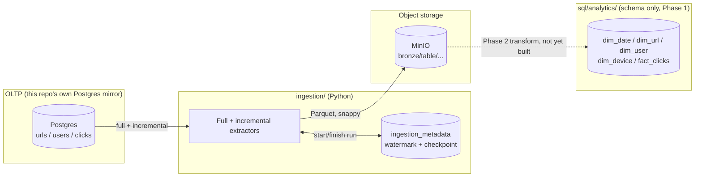

# url-shortener-analytics-platform

A production-oriented analytics platform built on top of an existing
[url-shortener](../url-shortener) OLTP application — extracting its data
into an object-storage-based analytics foundation, batch-first, without
Kafka/Spark/Airflow/Kubernetes until the design explicitly earns them.

This is **Phase 1** of a 4-phase, pre-Kafka analytics engineering project.
One repository evolves across all four phases; later phases build directly
on the code, schemas, and infrastructure created here.

## Architecture (Phase 1)



Full write-up, with every diagram and design decision: **[`docs/analytics-engineering-guide.md`](docs/analytics-engineering-guide.md)**.

## Technology stack

Python 3.12+, SQLAlchemy, Postgres 16, MinIO (S3-compatible), Apache
Parquet (via PyArrow), pytest, Docker Compose. See ADR-004 and ADR-008 in
the guide for why Kafka/Spark/Airflow are deliberately not here yet.

## Repository structure

| Path | Purpose |
|---|---|
| `docs/analytics-engineering-guide.md` | The learning guide — concepts, architecture, ADRs, labs, interview prep. Start here. |
| `ingestion/` | The Phase 1 ingestion package, its tests, and its config. |
| `schemas/source/`, `sql/source/` | The real (and clearly-labeled hypothetical) source schema this platform extracts from. |
| `schemas/analytics/`, `sql/analytics/` | The analytical (star schema) model — `dim_date`/`dim_url`/`dim_user`/`dim_device`/`fact_clicks`. Schema only; Phase 2 populates it. |
| `contracts/` | Formal, machine-checked data contracts for the source tables — `make validate-contracts`. |
| `scripts/` | One-off operator scripts (e.g. `seed_sample_data.py`), not part of the ingestion package itself. |
| `benchmarks/` | Executable performance benchmarks (Parquet vs CSV, partitioned vs not). |
| `sample_data/` | Convention-only landing spot for locally generated files; nothing here is committed. |
| `tests/` | Reserved for cross-phase end-to-end tests (empty in Phase 1 — see `ingestion/tests/` for what exists now). |

## Prerequisites

- Python 3.12+
- Docker + Docker Compose

## Quick start

```bash
git clone <this-repo>
cd url-shortener-analytics-platform
cp .env.example .env

make venv && source .venv/bin/activate
make install

make up              # starts Postgres (mirrors the real urls schema) + MinIO
make seed            # seeds reproducible synthetic urls/users/clicks

make ingest           # runs urls, users full load + clicks incremental load -> Bronze
make ingest-full      # override: force a full load of every table (backfills/rebuilds)

make create-analytics-schema   # applies the star schema DDL (dim_*, fact_clicks) -- schema only, Phase 2 populates it
make validate-contracts        # checks contracts/source/*.yaml against the real database
```

## Testing

```bash
make test              # unit tests -- SQLite + mocked S3, no Docker required
make test-integration   # requires `make up` first -- real Postgres + MinIO
```

## Benchmarking

Not yet populated in this increment — see `benchmarks/README.md` and the
guide's "Parquet" / "Partitioning" sections for what lands here next.

## Documentation

The complete Phase 1 learning material — architecture diagrams, OLTP vs
OLAP, data modeling, ingestion design, ADRs, hands-on labs, failure
scenarios, and interview questions — lives in one place:

**[`docs/analytics-engineering-guide.md`](docs/analytics-engineering-guide.md)**

## Current phase

**Phase 1: Analytics Foundation & Batch Ingestion** — in progress. See the
guide's Phase 1 Completion Checklist for exactly what's done and what
remains.

## Future phases

| Phase | Focus |
|---|---|
| 2 | Data Lake, Transformation & Data Quality (Spark, Bronze/Silver/Gold, SCD) |
| 3 | Analytical Serving, Orchestration & Observability |
| 4 | Production Hardening, Performance, Governance & Principal-Level Design |

Kafka/CDC/streaming are introduced only after Phase 4, once batch has
genuinely earned an upgrade — see the guide's Scale Design section for the
reasoning.
