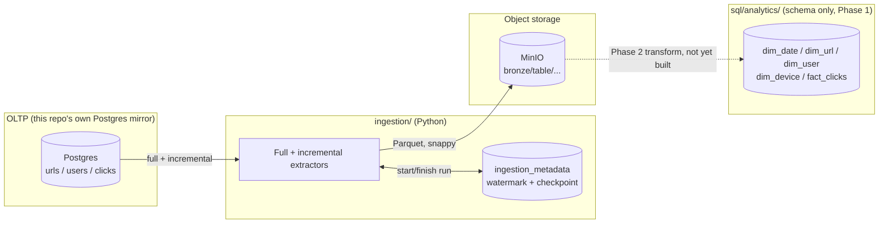

# url-shortener-analytics-platform

A production-oriented analytics platform built on top of an existing
[url-shortener](../url-shortener) OLTP application — extracting its data
into an object-storage-based analytics foundation, batch-first, without
Kafka/Spark/Airflow/Kubernetes until the design explicitly earns them.

This is **Phase 1** of a 4-phase, pre-Kafka analytics engineering project.
One repository evolves across all four phases; later phases build directly
on the code, schemas, and infrastructure created here.

## Architecture (Phase 1)


```mermaid
flowchart LR
    subgraph OLTP["OLTP (this repo's own Postgres mirror)"]
        PG[(Postgres<br/>urls / users / clicks)]
    end
    subgraph Ingestion["ingestion/ (Python)"]
        EX[Full + incremental extractors]
        MD[(ingestion_metadata<br/>watermark + checkpoint)]
    end
    subgraph Storage["Object storage"]
        MI[(MinIO<br/>bronze/table/...)]
    end
    subgraph Analytical["sql/analytics/ (schema only, Phase 1)"]
        DM[(dim_date / dim_url / dim_user<br/>dim_device / fact_clicks)]
    end

    PG -->|full + incremental| EX
    EX -->|Parquet, snappy| MI
    EX <-->|start/finish run| MD
    MI -.->|Phase 2 transform, not yet built| DM
```

Full write-up, with every diagram and design decision: **[`docs/analytics-engineering-guide.md`](docs/analytics-engineering-guide.md)**.

## Technology stack

Python 3.12+, SQLAlchemy, Postgres 16, MinIO (S3-compatible), Apache
Parquet (via PyArrow), pytest, Docker Compose. See ADR-004 and ADR-008 in
the guide for why Kafka/Spark/Airflow are deliberately not here yet.

## Repository structure

| Path | Purpose |
|---|---|
| `docs/analytics-engineering-guide.md` | The learning guide — concepts, architecture, ADRs, labs, interview prep. Start here. |
| `ingestion/` | The Phase 1 ingestion package, its tests, and its config. |
| `transformations/` | The Phase 2 transformation package (`analytics_transform`) — Bronze → Silver → Gold, on Spark. See `transformations/README.md`. |
| `schemas/source/`, `sql/source/` | The real (and clearly-labeled hypothetical) source schema this platform extracts from. |
| `schemas/analytics/`, `sql/analytics/` | The analytical (star schema) model — `dim_date`/`dim_url`/`dim_user`/`dim_device`/`fact_clicks`. Schema only; Phase 2 populates it. |
| `contracts/` | Formal, machine-checked data contracts for the source tables — `make validate-contracts`. |
| `scripts/` | One-off operator scripts (e.g. `seed_sample_data.py`, `write_local_bronze_clicks.py`), not part of either package itself. |
| `benchmarks/` | Executable performance benchmarks (Parquet vs CSV/JSON; query performance and extraction time at scale). See `benchmarks/README.md`. |
| `sample_data/` | Convention-only landing spot for locally generated files; nothing here is committed. |
| `data/` | Local Bronze/Silver/Gold data lake root, Phase 2 only — this environment has no real MinIO/S3 (see ADR-016), so transformations read/write Parquet here instead of a bucket. Gitignored. |
| `tests/` | Reserved for cross-phase end-to-end tests (empty in Phase 1 — see `ingestion/tests/` for what exists now). |

## Prerequisites

- Python 3.12+
- Docker + Docker Compose

## Quick start

```bash
git clone <this-repo>
cd url-shortener-analytics-platform
cp .env.example .env

make venv && source .venv/bin/activate
make install

make up              # starts Postgres (mirrors the real urls schema) + MinIO
make seed            # seeds reproducible synthetic urls/users/clicks

make ingest           # runs urls, users full load + clicks incremental load -> Bronze
make ingest-full      # override: force a full load of every table (backfills/rebuilds)

make create-analytics-schema   # applies the star schema DDL (dim_*, fact_clicks) -- schema only, Phase 2 populates it
make validate-contracts        # checks contracts/source/*.yaml against the real database

# --- Phase 2 (optional; pulls in pyspark) ---
make install-transform            # pip install -e ".[dev,transform]"
make write-local-bronze-clicks    # real Bronze clicks Parquet snapshot, written locally -- see ADR-016
make transform-silver-clicks      # Bronze clicks -> Silver clicks (Spark)
```

## Testing

```bash
make test              # unit tests -- SQLite + mocked S3, no Docker required
make test-integration   # requires `make up` first -- real Postgres + MinIO
make test-transform     # Phase 2 -- real local[1] SparkSession, no Docker required
make coverage           # unit-test coverage report -- measured, not gated yet
```

## Benchmarking

```bash
make benchmark-parquet               # Parquet vs CSV vs JSON, real or synthetic data
make benchmark-query-performance     # Section 7.1's metrics catalog, timed at scale
make benchmark-extraction-time       # extract_full / extract_incremental, timed at scale
```

All three are genuinely run against real Postgres, results captured in
the guide's "Parquet" and "Performance" sections — see `benchmarks/README.md`
for what each one measures and how to run it at a different scale.

## Documentation

The complete Phase 1 learning material — architecture diagrams, OLTP vs
OLAP, data modeling, ingestion design, ADRs, hands-on labs, failure
scenarios, and interview questions — lives in one place:

**[`docs/analytics-engineering-guide.md`](docs/analytics-engineering-guide.md)**

## Current phase

**Phase 1: Analytics Foundation & Batch Ingestion** — complete. Every
section of the guide has real content, 15 architecture decisions are
recorded, and a five-axis scale-design review has been run against real
benchmark data. See the guide's Phase 1 Summary and Completion Checklist
for the full close-out, including the specific, named gaps (not every
item is "finished" — each remaining one is stated explicitly, not
implied away) that carry into Phase 2.

**Phase 2: Data Lake, Transformation & Data Quality** — in progress. The
first component is built and genuinely run: Bronze `clicks` → Silver
`clicks` on real local Spark, reading a real Bronze snapshot pulled from
the real (locally-running) Postgres. See `docs/analytics-engineering-guide.md`,
Phase 2, Section 38, and `transformations/README.md`. Later milestones
(SCD, the full data-quality/quarantine framework, Gold dimensional joins,
and the rest of Phase 2's topics) are not yet built — each is named,
not implied, in the guide's Phase 2 table of contents.

## Future phases

| Phase | Focus |
|---|---|
| 3 | Analytical Serving, Orchestration & Observability |
| 4 | Production Hardening, Performance, Governance & Principal-Level Design |

Kafka/CDC/streaming are introduced only after Phase 4, once batch has
genuinely earned an upgrade — see the guide's Scale Design section for the
reasoning.
