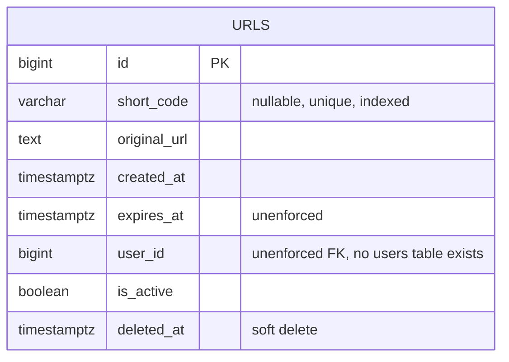
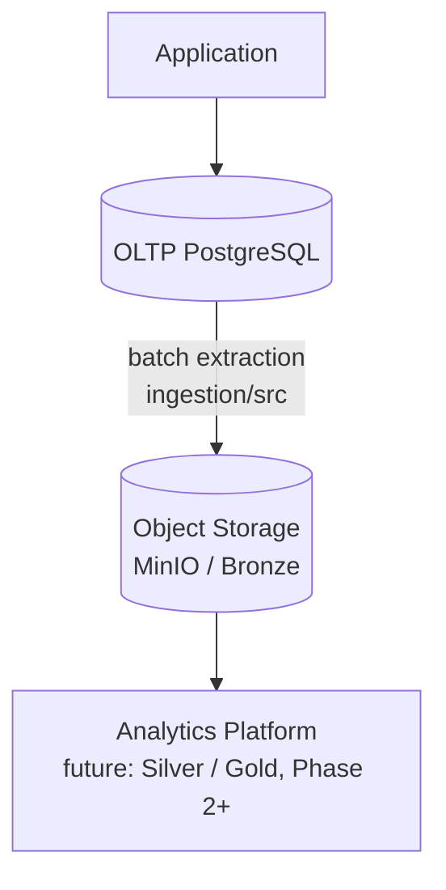
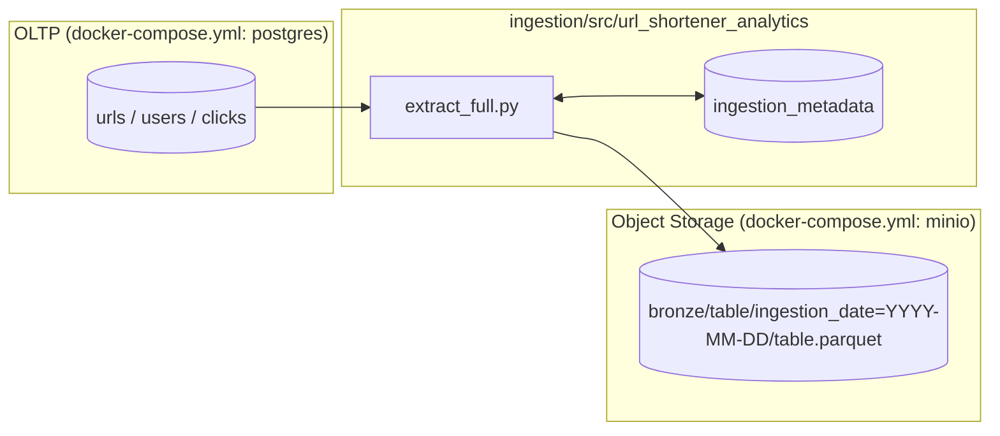
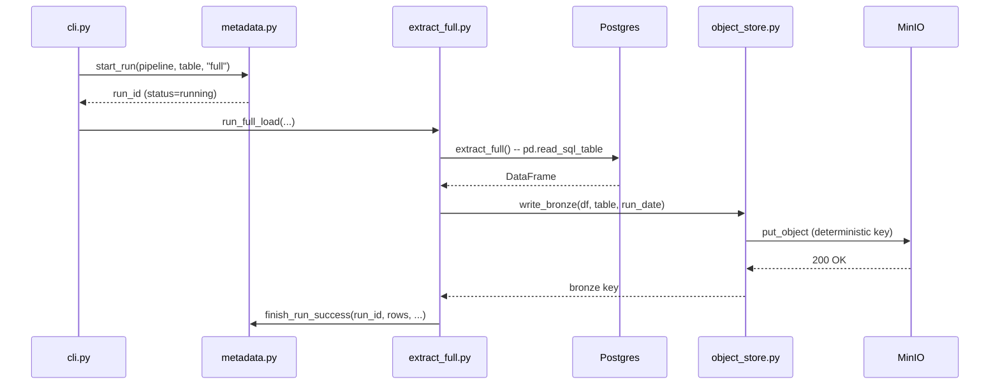

# Analytics Engineering Guide

**This is the single learning, architecture, and reference document for the
`url-shortener-analytics-platform` repository.** It is meant to be opened
once now and reopened months from now to re-derive the whole system: every
concept is explained from first principles, every design decision is
recorded as an ADR, and every claim about "how this works" points at a real
file in this repository rather than duplicating it.

**How this document works:** concepts are explained here; implementation
lives in the repository. When you see a reference like
`ingestion/src/url_shortener_analytics/extract_full.py`, that file is the
real, current, executable implementation — this guide explains *why* it's
built the way it is and *how to run it*, not a copy of its source.

**Status of this document:** Phase 1 is in progress and this guide grows
with it. Sections are marked ✅ (implemented and documented) or ⏳ (planned,
not yet built) in the table of contents below — an honest, current map of
the project, not a promise of what will eventually exist.

---

## Table of Contents

**Foundations**
1. [Existing URL Shortener — Architecture & Schema](#1-existing-url-shortener--architecture--schema) ✅
2. [OLTP vs OLAP](#2-oltp-vs-olap) ✅
3. [Phase 1 Architecture](#3-phase-1-architecture) ✅
4. [Project Structure](#4-project-structure) ✅
5. [Git Workflow](#5-git-workflow) ✅
6. [Environment Setup](#6-environment-setup) ✅

**Data Modeling** ⏳ *(next increments)*
7. Analytics Requirements & Business Metrics
8. Data Grain
9. Source Data Model (formalized data contracts)
10. Analytical Data Model (fact/dimension design)
11. Star Schema vs. Normalized Model
12. Data Contracts

**Ingestion**
13. [Batch Ingestion Design](#13-batch-ingestion-design) ✅
14. [Full Load Ingestion](#14-full-load-ingestion) ✅
15. Incremental Load & Watermarks ⏳
16. Checkpointing ⏳ *(the mechanism exists — see [Section 13.3](#133-checkpointing-and-watermark-mechanism-already-built) — this section will teach it in depth once incremental load makes checkpoint *recovery* observable)*
17. Idempotency ⏳ *(the mechanism exists — see [Section 14](#14-full-load-ingestion) — deep-dive lands with LAB 4/5)*

**Storage**
18. Object Storage Fundamentals ⏳
19. Parquet ⏳
20. Partitioning ⏳
21. File Layout ⏳
22. Ingestion Metadata (deep-dive) ⏳

**Quality & Operations**
23. PII and Security ⏳
24. Testing (deep-dive) ⏳ *(tests exist now — see [Section 14.6](#146-how-to-test)*)
25. Failure Scenarios (all 10) ⏳ *(one is demonstrated now — see [Section 14.7](#147-failure-scenario)*)
26. Performance ⏳
27. Scale Design ⏳

**Reference**
28. [Architectural Principles](#28-architectural-principles) ✅ *(introduced now, extended as more are demonstrated)*
29. [Architecture Decision Records](#29-architecture-decision-records) ✅
30. Hands-on Labs (index) ⏳ *(LAB 1 exists — see [Section 14.5](#145-hands-on-exercise)*)
31. Interview Questions (consolidated, all categories) ⏳ *(Category C questions exist now — see [Section 14.9](#149-principal-engineer-interview-questions)*)
32. Principal-Level Scenarios ⏳
33. [Phase 1 Summary](#33-phase-1-summary-so-far) (running, updated each increment)
34. [Phase 1 Completion Checklist](#34-phase-1-completion-checklist)
35. [Git Repository Review](#35-git-repository-review)
36. What Phase 2 Will Add ⏳

---

## 1. Existing URL Shortener — Architecture & Schema

### Concept

Before designing anything new, we read the real system. Every fact in this
section came from directly reading files in the `url-shortener` repository
on **2026-09-19** — nothing here is inferred or assumed.

### Why does this matter?

Inventing a plausible-looking source schema is a common shortcut, and it's
the wrong one: a portfolio project built against an imaginary schema
teaches you to design against your own assumptions, not against a real
system's actual constraints. The gap discovered in Section 1.5 below —
there is no `users` table and no click-tracking anywhere — is exactly the
kind of finding that would be invisible if the schema had been designed
from the requirements doc instead of read from the code.

### 1.1 Existing architecture


Stack, confirmed from `pyproject.toml` and `docker-compose.yml`: FastAPI,
SQLAlchemy 2.0 + Alembic, PostgreSQL 16, Redis (cache-aside), pydantic-settings
for config, pytest for tests, Docker Compose for local orchestration.
Kubernetes and Kafka are explicitly deferred in that project too (see its
own `docker-compose.yml` header comment) — the same "earn complexity, don't
front-load it" discipline this platform follows.

### 1.2 Existing database ER diagram



One table. That's the entire persisted schema of the real application as
of this reading.

### 1.3 Important source tables and fields

| Table | Purpose | Analytics-relevant fields | Notes |
|---|---|---|---|
| `urls` | The only table. Maps a short code to a destination URL. | `id`, `short_code`, `created_at`, `user_id` | Full field-by-field documentation: [`schemas/source/urls.md`](../schemas/source/urls.md) |

### 1.4 Missing fields / capabilities, relative to an analytics use case

- No event/click table of any kind — `GET /{short_code}` in
  `app/api/urls.py` resolves and 302-redirects without writing anything.
- No `users` table, despite `urls.user_id` existing as a column with no FK
  constraint enforcing it.
- No geographic or device information captured anywhere.

### 1.5 The honest mismatch, stated plainly

`docs/01-requirements.md` in the source repository lists, as an explicit
v1 functional requirement:

> "Basic analytics: click count, timestamp, coarse geo/device info per
> short code"

This requirement is **not yet implemented** in the application. It's a
stated goal, not a built capability. An analytics platform needs something
to extract, so this platform builds two additional tables —
**`users`** and **`clicks`** — clearly and repeatedly labeled as
**hypothetical** everywhere they appear (`COMMENT ON TABLE` in the SQL
itself, this guide, every docstring that touches them). They exist to give
this platform's ingestion pipeline real rows to extract, standing in for a
capability the source application has declared as a goal but not built.
See [ADR-008](#adr-008-hypothetical-users-and-clicks-tables-clearly-labeled)
for the reasoning, and
[`sql/source/002_hypothetical_users_and_clicks.sql`](../sql/source/002_hypothetical_users_and_clicks.sql)
for the schema itself.

### 1.6 Recommended minimal changes (to the real application, not implemented here)

Not implemented by this platform — these belong to the `url-shortener`
repository's own roadmap (its README already lists "Phase 10 — Analytics"
as a planned phase):

1. Add a `clicks` (or equivalent event) table and write to it from the
   redirect handler — ideally decoupled from the request/response cycle
   (a background task, or eventually a queue) so click logging never adds
   latency to the redirect's hot path.
2. Add a real `users` table if user accounts become in-scope, with a
   foreign key from `urls.user_id`.
3. Either enforce `expires_at` (a scheduled job, or a check in the
   redirect path) or remove the column — an unenforced column that looks
   load-bearing is a common source of production confusion.

---

## 2. OLTP vs OLAP

### Concept

**OLTP** (Online Transaction Processing) systems are built to handle many
small, fast read/write operations on individual rows — "create this URL",
"look up this one short code" — with strong consistency guarantees. **OLAP**
(Online Analytical Processing) systems are built to scan and aggregate
large numbers of rows — "how many clicks happened per day last month" —
prioritizing scan throughput over single-row latency.

### Why does this exist?

These are different workloads with conflicting resource needs. An OLTP
database is tuned around indexes that make single-row lookups fast and
transactions that guarantee correctness under concurrent writes. Running a
query that scans millions of rows against that same database competes for
the same buffer cache, connection pool, and I/O bandwidth that the
production redirect path depends on.

### URL Shortener example

```
Application
    |
    v
PostgreSQL
    |
    +---- application traffic  (redirects: the hot path, ~1,200 reads/sec peak
    |      per the source project's own capacity estimate in docs/01-requirements.md)
    |
    +---- analytics queries    (an aggregate scan competing for the same
           buffer cache, connection pool, and disk I/O)
```

A single expensive analytical query — "count clicks per URL for the last
90 days" — run directly against this Postgres instance has a real chance
of evicting hot pages from the buffer cache that the redirect path depends
on, degrading redirect latency for actual users. At this project's stated
scale (a 10:1 read:write ratio, redirects being the explicit hot path),
that's not a hypothetical risk — it's the exact failure mode the source
project's own `docs/01-requirements.md` is written to avoid.

### Architecture: separating the two



`OLTP PostgreSQL` keeps serving application traffic, untouched by
analytical query load. `Batch Extraction` (this repository's `ingestion/`
package) reads from it on a schedule, not on every request. `Object
Storage` holds the extracted data independently, so any number of
analytical engines can read from it later without going back to OLTP at
all.

### When is querying OLTP directly still acceptable?

Not every analytics need justifies a whole pipeline. Direct OLTP querying
remains reasonable when: query volume is low and infrequent (an
engineer checking one number by hand), the query is naturally
narrow (filtered by an indexed key, not a full scan), or a read replica
absorbs the load so it never touches the primary at all. The line is
crossed once queries become frequent, unpredictable in shape, or wide
(scanning large fractions of a table) — at that point, the buffer-cache
contention risk above stops being theoretical.

### Principal Engineer Interview Questions

**Q: "Why not just add a read replica and run analytics queries against
that, instead of building a whole ingestion pipeline?"**

A read replica solves the *contention* problem (analytics load no longer
competes with the primary for resources) but not the *shape* problem: a
replica has the exact same normalized, row-oriented OLTP schema as the
primary, which is a poor fit for aggregation-heavy analytical queries —
every "clicks per day per URL" query still needs a full scan and a
GROUP BY against row-oriented storage with no columnar pruning or
pre-aggregation. A replica is a reasonable stopgap for light, occasional
analytical load; it doesn't replace a real analytics platform once query
volume or complexity grows, which is exactly why this project builds one
instead of stopping at "just add a replica."

---

## 3. Phase 1 Architecture

### 3.1 Proposed architecture



**Deliberately excluded from Phase 1**, and why: Kafka/Debezium (no
event stream exists yet to consume — see Section 1.5), Spark (row counts
here don't remotely justify distributed processing), Airflow (one Python
CLI command is simpler to operate and debug than a scheduler at this
scale), Kubernetes (Docker Compose is sufficient for a single-host batch
job). Each is introduced later only once a specific, named limitation of
the simpler tool is actually hit — see [Section 29 ADR-004](#adr-004-batch-ingestion-before-cdcstreaming)
and the future Scale Design section.

### 3.2 In simple language

Every night (or on demand, right now — there's no scheduler yet), a small
Python program connects to the OLTP database, reads an entire table, and
writes it as a compressed file into object storage. It writes down what it
did — which table, how many rows, whether it succeeded — in a separate
bookkeeping table, so the next run (or a human debugging a problem) can
tell what happened without guessing.

---

## 4. Project Structure

| Path | Purpose |
|---|---|
| `docs/analytics-engineering-guide.md` | This file. The single learning/reference document. |
| `ingestion/src/url_shortener_analytics/` | The importable Python package: all pipeline logic. |
| `ingestion/tests/unit/` | Fast tests against SQLite + a mocked S3 client. No Docker required. |
| `ingestion/tests/integration/` | Tests against the real Postgres + MinIO from `docker-compose.yml`. |
| `ingestion/configs/pipelines.yaml` | Which tables the pipeline extracts, and how — config, not code. |
| `schemas/source/`, `sql/source/` | Documentation and DDL for the source schema (real + clearly-labeled hypothetical tables). |
| `schemas/analytics/`, `sql/analytics/` | Reserved for the dimensional model — not yet populated. |
| `scripts/` | One-off operator scripts (`seed_sample_data.py`). Not imported by the pipeline. |
| `benchmarks/` | Reserved for executable performance benchmarks. |
| `sample_data/` | Convention-only landing spot for local generated files; nothing here is committed. |
| `tests/` (root) | Reserved for cross-phase end-to-end tests, once more than one phase's components exist. |

**Why both `ingestion/tests/` and a root `tests/`?** `ingestion/tests/` is
scoped to one package and owned by whoever owns that package. The root
`tests/` is reserved for tests that span multiple components once they
exist (e.g., a future Bronze → Silver → Gold end-to-end test) — keeping
that distinction from day one avoids a later, disruptive reorganization.

**Why does `scripts/seed_sample_data.py` live outside `ingestion/src/`?**
It's an operator convenience for local development, not something the
production pipeline imports or depends on. Mixing the two would make it
unclear, a year from now, whether `seed_sample_data` is part of the
pipeline's runtime behavior — it isn't.

---

## 5. Git Workflow

### What belongs in Git

Source code, tests, SQL, configuration templates (`.env.example`, not
`.env`), documentation, and this guide. Everything needed to reproduce the
system from a clean clone plus `docker compose up -d`.

### What must never be committed

- `.env` (real environment values — `.env.example` is the checked-in
  template)
- Generated data: `pg_data/`, `minio_data/` (docker compose volumes),
  anything under `sample_data/generated/` or `benchmarks/results/`
- Local caches/artifacts: `.venv/`, `__pycache__/`, `.pytest_cache/`,
  `.ruff_cache/`, `*.egg-info/`
- Credentials or secrets of any kind, real or accidentally-real-looking

See [`.gitignore`](../.gitignore) for the enforced list.

### Expected workflow

```bash
git checkout -b feature/incremental-load
# implement in ingestion/src/, tests in ingestion/tests/
pytest                                   # unit tests must pass locally
ruff check . && ruff format .
git add ingestion/ docs/analytics-engineering-guide.md
git commit -m "Add watermark-based incremental load for clicks"
git push -u origin feature/incremental-load
# open a pull request; guide + code + tests reviewed together, not code alone
```

Documentation changes ship in the *same* commit/PR as the code they
describe — a stale guide is worse than no guide, because it's actively
misleading.

---

## 6. Environment Setup

### Prerequisites

| Requirement | Why |
|---|---|
| Python 3.12+ | Matches the source `url-shortener` project's own requirement, for consistency across the two repos. |
| Docker + Docker Compose | Runs this repo's own Postgres (schema-mirror) and MinIO. |

### Setup

```bash
git clone <this-repo>
cd url-shortener-analytics-platform
cp .env.example .env

make venv
source .venv/bin/activate
make install          # pip install -e ".[dev]"

make up                # starts Postgres (port 5433) + MinIO (9000/9001) + createbuckets
docker compose ps       # confirm postgres and minio show (healthy)

make seed              # seeds reproducible synthetic urls/users/clicks (Faker, seed=42)
```

MinIO's web console: `http://localhost:9001` (`labadmin` / `labpassword`
by default — see `.env.example`). Postgres is deliberately on host port
**5433**, not 5432, so it doesn't collide with a `url-shortener` Postgres
that might already be running on the same machine.

**A note on the MinIO image:** as of September 2026, Docker Hub no longer
serves `minio/minio` or `minio/mc` at all (both repositories were pulled).
This repo's `docker-compose.yml` pulls from `quay.io/minio/minio` and
`quay.io/minio/mc` instead, pinned to specific release tags rather than
`:latest`, both verified against MinIO's own GitHub release history.

---

## 13. Batch Ingestion Design

### Concept

**Batch ingestion** extracts data on a schedule or on demand, in discrete
runs, rather than reacting to each individual change as it happens
(streaming) or capturing every database write from the transaction log
(CDC). Each run reads a defined slice of the source (everything, for a
full load) and produces a complete, independent output.

### Why batch, and why first?

Three reasons, in order of how much they matter for this specific project
right now:

1. **There's no event stream to consume yet.** Section 1.5 established
   that the source application doesn't even write click events
   synchronously, let alone publish them anywhere. Kafka needs a producer;
   there isn't one.
2. **The data volume doesn't justify streaming's complexity.** Streaming
   infrastructure earns its keep when near-real-time freshness has real
   business value and batch genuinely can't deliver it. Neither is true
   yet at this project's scale.
3. **Batch is easier to reason about and debug.** A batch run either fully
   succeeded or didn't — there's no partial consumer state, no rebalancing,
   no "which offset was I at when it crashed" question. That simplicity is
   worth deliberately keeping for as long as it's sufficient.

### 13.1 What Phase 1 batch ingestion does NOT include

Explicitly out of scope for Phase 1, by design, not by oversight: Kafka,
Debezium/CDC, Apache Flink, Spark Structured Streaming, Kubernetes,
Airflow. See [ADR-004](#adr-004-batch-ingestion-before-cdcstreaming) for
the full reasoning and the conditions under which each would get
introduced.

### 13.2 Full load vs. incremental load vs. CDC

| | Full load | Incremental load | CDC |
|---|---|---|---|
| Reads | Entire table, every run | Only rows changed since last run | Every row-level write, via the database's transaction log |
| Needs | Nothing beyond table access | A reliable "what changed" signal (a watermark) | Log access (e.g. Postgres logical replication) |
| This repo, Phase 1 | ✅ Implemented — [Section 14](#14-full-load-ingestion) | ⏳ Planned — Section 15 | Not planned before Phase 5 (post-Phase-4, see repository-level plan) |

### 13.3 Checkpointing and watermark mechanism (already built)

Full load doesn't strictly need a watermark (it always reads everything),
but this repo's `ingestion_metadata` table and
`ingestion/src/url_shortener_analytics/metadata.py` module were built to
support **both** full and incremental load from day one — see
[Section 14.2](#142-architecture) for why, and
[`sql/source/003_ingestion_metadata.sql`](../sql/source/003_ingestion_metadata.sql)
for the schema. This is a deliberate case of building the metadata layer
once, correctly, rather than retrofitting it when incremental load
(Section 15) needs it.

---

## 14. Full Load Ingestion

### 14.1 Concept

A full load re-extracts an entire source table on every run and writes the
whole result as one snapshot — no matter what changed since the last run.
It's the simplest ingestion pattern that can possibly work: the query is
`SELECT * FROM table`.

### Why does this exist?

A full load is correct by construction (no watermark to get wrong, no row
that can be silently missed) and is the fallback every more sophisticated
pipeline eventually needs — when an incremental pipeline's state gets
corrupted, the standard fix is "run a full load and rebuild from there."
Small, slowly-changing tables (`users` here, at 200 rows) can legitimately
stay on full load forever; re-extracting 200 rows every run costs nothing.

### 14.2 Architecture



On any failure between `start_run` and `finish_run_success`,
`extract_full.run_full_load` catches the exception, calls
`finish_run_failure` (so the run is never left `running` forever), and
re-raises — see [Section 14.7](#147-failure-scenario).

### 14.3 URL Shortener example

This pipeline runs the same full-load logic against all three configured
tables (`ingestion/configs/pipelines.yaml`): `urls` (real schema), `users`
and `clicks` (hypothetical, per Section 1.5). Each table gets its own
`ingestion_metadata` row per run and its own Bronze object.

### 14.4 Implementation

| What | File |
|---|---|
| Pure extraction logic | [`ingestion/src/url_shortener_analytics/extract_full.py`](../ingestion/src/url_shortener_analytics/extract_full.py) — `extract_full()` |
| End-to-end orchestration (checkpoint → extract → write → checkpoint) | same file — `run_full_load()` |
| Deterministic Bronze key + Parquet write + retry | [`ingestion/src/url_shortener_analytics/object_store.py`](../ingestion/src/url_shortener_analytics/object_store.py) |
| Watermark / checkpoint / run history | [`ingestion/src/url_shortener_analytics/metadata.py`](../ingestion/src/url_shortener_analytics/metadata.py) |
| CLI entrypoint | [`ingestion/src/url_shortener_analytics/cli.py`](../ingestion/src/url_shortener_analytics/cli.py) |
| Which tables, which load type | [`ingestion/configs/pipelines.yaml`](../ingestion/configs/pipelines.yaml) |

A short excerpt — the idempotency mechanism, the part worth actually
reading rather than just pointing at:

```python
# ingestion/src/url_shortener_analytics/object_store.py
def build_bronze_key(table_name: str, run_date: datetime) -> str:
    return f"bronze/{table_name}/ingestion_date={run_date:%Y-%m-%d}/{table_name}.parquet"
```

No run id, no timestamp-to-the-second — deliberately. Two full loads of
`urls` on the same calendar day write to the *same* key, so a rerun
overwrites rather than duplicates. That single design choice is what makes
LAB 4 and LAB 5 (below) come out the way they do.

### 14.5 Hands-on Exercise

**LAB 1 — Run a full load.**

Prerequisites: `make up` has been run and `docker compose ps` shows
`postgres` and `minio` healthy; `make seed` has been run at least once.

```bash
make ingest-full
```

Expected output (key=value structured log lines — see
`ingestion/src/url_shortener_analytics/logging_setup.py`):

```
ts=... level=INFO logger=url_shortener_analytics.cli msg="starting full load" pipeline='url_shortener_bronze_ingestion' tables=['urls', 'users', 'clicks']
ts=... level=INFO logger=url_shortener_analytics.extract_full msg="extracting table (full load)" table='urls'
ts=... level=INFO logger=url_shortener_analytics.extract_full msg="extraction complete" table='urls' rows=500 columns=8
ts=... level=INFO logger=url_shortener_analytics.object_store msg="wrote bronze object" key='bronze/urls/ingestion_date=2026-09-19/urls.parquet' bytes=... rows=500 attempt=1
...
ts=... level=INFO logger=url_shortener_analytics.cli msg="full load finished successfully"
```

*(Exact row counts and byte sizes are a DESIGN EXPECTATION based on
`scripts/seed_sample_data.py`'s fixed seed — run the command yourself to
see the ACTUAL OBSERVED values on your machine; nothing above was
fabricated as a claimed real run.)*

Inspect what landed in MinIO: open `http://localhost:9001`, browse to the
`analytics-lake` bucket, and confirm `bronze/urls/`, `bronze/users/`,
`bronze/clicks/` each contain one `.parquet` object.

**LAB 4/5 (compressed into one exercise here — full depth lands in the
dedicated Idempotency section) — prove reruns are safe.**

```bash
make ingest-full
make ingest-full   # run it again immediately
```

What to observe: both runs report success; the object at
`bronze/urls/ingestion_date=<today>/urls.parquet` is overwritten, not
duplicated (confirmed by `ingestion/tests/integration/test_full_load_integration.py::test_rerunning_full_load_overwrites_not_duplicates`,
which asserts `KeyCount == 1` after two runs). Why this matters: retries
after a crash are the normal recovery path for any batch pipeline — if
reruns produced duplicates, every crash-and-retry would corrupt downstream
counts.

### 14.6 How to test

```bash
make test                # unit tests: SQLite + mocked S3, no Docker needed. Currently: 15 passed.
make up
make test-integration     # real Postgres + MinIO
```

The 15 unit tests above were run in this environment while writing this
guide (Python 3.11, `pytest -q`) and genuinely passed — this is an ACTUAL
OBSERVED result, not a projection:

```
15 passed in 3.72s
```

### 14.7 Failure Scenario

**What happens if the process is killed between a successful `write_bronze`
call and the `finish_run_success` checkpoint update?**

The Bronze object for that run now exists in MinIO, but `ingestion_metadata`
still shows `status = 'running'` for that run — not `success`, and not
`failed` either, because nothing ever got the chance to update it.
`get_last_watermark` only reads `status = 'success'` rows (see
`metadata.py`), so a stuck `running` row is simply ignored by future
watermark reads — it doesn't corrupt anything for full load specifically
(there's no watermark to protect here), but it does mean the run's own
history is permanently ambiguous: did it actually finish? The honest
answer, visible from the data alone, is "we don't know — the process died
before it could tell us." **Production implication:** an orchestrator (not
yet part of Phase 1) should alert on any `ingestion_metadata` row that's
been `running` for longer than the pipeline's expected max runtime, and
treat it as a crash requiring investigation, not as still-in-progress.

### 14.8 Production Considerations

| Aspect | This repo (POC) | Production |
|---|---|---|
| Extraction | Whole table, one query, one DataFrame (`pd.read_sql_table`) | Chunked/paged extraction with bounded memory — see the docstring in `extract_full.py` |
| Credentials | Static MinIO access/secret keys from `.env` | Short-lived credentials from an IAM role / workload identity |
| Retry | 3 attempts, linear backoff, in-process (`object_store.write_bronze`) | Same idea, plus orchestrator-level retry/alerting across whole run failures |
| Crash recovery | Manual rerun (safe, because writes are idempotent) | Orchestrator-driven automatic retry with backoff and paging on repeated failure |
| OLTP instance | This repo's own standalone Postgres mirror (ADR-009) | Reads from the real application's read replica, never the primary |

### 14.9 Principal Engineer Interview Questions

**Q: "Walk through exactly what makes `write_bronze` safe to call twice for
the same table on the same day."**

*What's tested:* whether the candidate can explain idempotency as a
concrete mechanism, not just define the word.

*Strong answer:* the S3 key returned by `build_bronze_key` depends only on
`table_name` and the calendar date, not on a run id or exact timestamp —
so two calls for the same table on the same day compute the identical key.
`s3_client.put_object` on both S3 and MinIO fully replaces whatever object
previously existed at that key; it's not an append and not a partial
write. So the second call's `PUT` simply overwrites the first call's
bytes with (in this case, identical) new bytes — the *object storage
system's own atomic-overwrite behavior* is what write_bronze leans on,
not any locking or deduplication logic built into this codebase.

*Concepts:* idempotent-by-overwrite vs. idempotent-by-dedup, atomic PUT
semantics in object storage.

*Follow-up:* "What would break this guarantee?" — Including a random
UUID or a sub-day timestamp in the key; then every rerun would produce a
new object instead of overwriting.

*Common mistake:* describing this as "we check if the file exists first
and skip if it does" — that's not what happens, and that approach would
be wrong anyway (it would prevent legitimately re-extracting a table
whose data changed since the last run today).

**Q: "This pipeline currently reads `pd.read_sql_table` — the whole table,
every run. At what point does that become a real production problem, and
what's the first thing that actually breaks?"**

*What's tested:* whether the candidate can name a concrete failure mode
instead of a vague "it won't scale."

*Strong answer:* the practical limit isn't a specific row count in the
abstract — it's whatever this process's available memory can hold as both
the raw query result set and the in-memory pandas DataFrame simultaneously
(pandas typically uses several times the raw on-disk size once you account
for Python object overhead on non-numeric columns). Before that, though,
the `SELECT *` itself holds a long-running read against the OLTP database
— on a real production `clicks` table, that scan competing with live
write traffic is often the first practical problem, ahead of the client
process actually running out of memory. The fix precedes the memory limit:
chunked, bounded extraction (see the POC-simplification note in
`extract_full.py`'s docstring).

*Concepts:* memory-bounded processing, long-running scans vs. OLTP write
concurrency.

*Follow-up:* "Why not just add `.limit()` in a loop?" — That's exactly
chunked extraction; the follow-up worth raising unprompted is how to keep
each chunk's boundary stable while the table is being concurrently written
to, which is precisely the watermark problem Section 15 exists to solve
properly for the incremental case.

*Common mistake:* answering purely in terms of "at N million rows it gets
slow" without naming *what* becomes slow or fails first.

---

## 28. Architectural Principles

Introduced here, demonstrated incrementally as more of Phase 1 is built.
Each entry: meaning, why it matters, and what's true about *this repo,
right now* — not an aspirational claim about the finished system.

**1. Separation of OLTP and OLAP.** *Meaning:* analytical workloads never
query the operational database directly. *Phase 1, now:* every read in
`extract_full.py` goes through this repo's own standalone Postgres mirror
(ADR-009), never a shared instance with live application traffic.

**2. Immutable raw data.** *Meaning:* once written, a Bronze object is
never edited in place — corrections happen by writing a new, superseding
version, not by mutating history. *Phase 1, now:* `write_bronze` always
writes a complete new object at a deterministic key; nothing in this
codebase opens an existing Parquet file and appends to or edits it.

**3. Idempotent processing.** *Meaning:* rerunning a pipeline step
produces the same end state as running it once. *Phase 1, now:* proven by
`ingestion/tests/integration/test_full_load_integration.py::test_rerunning_full_load_overwrites_not_duplicates`
and LAB 4/5.

**4. Reproducibility.** *Meaning:* the same inputs and code produce the
same outputs, and the whole system can be rebuilt from a clean clone.
*Phase 1, now:* `scripts/seed_sample_data.py` uses a fixed random seed
(42); `docker-compose.yml` pins every image to a specific tag, never
`:latest`.

**5. Schema contracts.** *Meaning:* producers and consumers of a dataset
agree on its shape explicitly, not by convention. *Phase 1, now:*
documented informally in `schemas/source/urls.md`; formal, versioned
contracts land in the planned Section 12.

**6. Explicit ownership.** *Meaning:* every dataset and pipeline has a
named owner accountable for it. *Phase 1, now:* not yet formalized — a
single-engineer portfolio project doesn't need this machinery yet, but the
principle is recorded for when Phase 3+ introduces multiple pipelines.

**7. Least privilege.** *Meaning:* every credential grants the minimum
access it needs. *Phase 1, now:* explicitly **not** met — `.env.example`
uses a single MinIO root credential for everything, called out as a POC
simplification in [Section 14.8](#148-production-considerations).

**8. Metadata-driven processing.** *Meaning:* what a pipeline does (which
tables, which strategy) is configuration, not hardcoded logic.
*Phase 1, now:* `ingestion/configs/pipelines.yaml` — adding a table means
editing YAML, not Python.

**9. Failure isolation.** *Meaning:* one component's failure shouldn't
silently corrupt or block unrelated components. *Phase 1, now:*
`cli.py`'s `run_full_load_command` catches each table's failure
independently and continues to the next table, reporting all failures at
the end rather than stopping at the first one.

**10. Backfillability.** *Meaning:* historical data can be
(re)constructed after the fact. *Phase 1, now:* full load inherently
supports this (rerun it any day) — the harder incremental-load version of
this principle is deferred to Section 15.

**11. Observability.** *Meaning:* the system's internal state is
queryable, not just inferred from external symptoms. *Phase 1, now:*
`ingestion_metadata` is exactly this for the ingestion pipeline — see
Section 14.7's failure scenario for what it does and doesn't tell you.

**12. Scalability.** *Meaning:* the design's bottlenecks are known and
have a described next step, not just "hope it holds." *Phase 1, now:*
named explicitly in Section 14.9's second interview question; a full
scale-design writeup is the planned Section 27.

**13. Cost awareness.** *Meaning:* every architectural choice is made with
an eye on what it costs to run, not just whether it works. *Phase 1, now:*
implicit in choosing batch over streaming (Section 13) — this is the
principle that decision is really an instance of.

---

## 29. Architecture Decision Records

### ADR-001: Separate OLTP and analytics

**Context:** Redirect latency is this project's stated hot path (10:1
read:write ratio, per the source repo's own capacity estimate).
**Decision:** Analytics never queries the OLTP database directly; all
analytical access goes through Bronze (and later Silver/Gold) data derived
by batch extraction. **Alternatives considered:** a read replica serving
analytics queries directly. **Trade-offs:** a replica alone solves resource
contention but not analytical query shape (row-oriented storage, no
pre-aggregation); a real pipeline solves both at the cost of data being
only as fresh as the last batch run. **Consequences:** analytics data has
inherent latency (currently: however often `make ingest-full` is run —
there is no scheduler yet).

### ADR-002: Use MinIO / object storage for raw data

**Context:** Extracted data needs somewhere to land that's independent of
any specific downstream query engine. **Decision:** MinIO locally
(S3-compatible), the same `boto3` client code as real AWS S3.
**Alternatives considered:** writing extracted data directly into another
Postgres schema/database. **Trade-offs:** object storage decouples storage
from compute (any engine can read Parquet later) but adds an extra
component to run and offers no transactional guarantees a database would.
**Consequences:** this repo depends on Docker to run MinIO locally; the
same client code moves to real S3 by changing only `MINIO_ENDPOINT`.

### ADR-003: Use Parquet for Bronze storage

**Context:** Extracted tabular data needs a file format. **Decision:**
Apache Parquet, via PyArrow, snappy-compressed. **Alternatives
considered:** CSV, JSON-lines. **Trade-offs:** Parquet is columnar
(efficient for analytical, column-selective reads) and self-describing
(embeds its own schema) but isn't human-readable by opening the raw file,
unlike CSV. **Consequences:** every consumer of Bronze data needs a
Parquet-aware reader (trivial — `pandas`, `pyarrow`, every real analytical
engine supports it natively); a hands-on CSV vs. Parquet benchmark is
planned (Section 19) to make this comparison concrete rather than
asserted.

### ADR-004: Batch ingestion before CDC/streaming

**Context:** The source application has no event stream to consume (see
Section 1.5) and this project's data volume doesn't currently justify
streaming infrastructure. **Decision:** batch (full load now, incremental
next) for the entirety of Phase 1-4; Kafka/CDC only after Phase 4.
**Alternatives considered:** building on Kafka/Debezium from the start.
**Trade-offs:** batch is simpler to build, run, and debug, at the cost of
data freshness being bounded by run frequency rather than near-real-time.
**Consequences:** every later phase's design must not assume streaming
exists; the eventual Kafka introduction (Phase 5+) needs its own
migration path onto whatever this pipeline has already built.

### ADR-005: Watermark-based incremental ingestion *(planned, not yet implemented)*

Recorded now so the decision and its context aren't lost between this
increment and the one that implements it. **Context:** `clicks` will grow
without bound; full-reading it every run doesn't scale. **Decision (planned):**
an `id`-based (not timestamp-based) watermark, for the same clock-skew and
duplicate-timestamp reasons documented in this project's earlier notebook
prototype. **Alternatives considered:** timestamp-based watermark; full
CDC. **Trade-offs:** id-based watermarking is immune to clock skew but
tracks insertion order, not event order — late-arriving-data handling is
deferred. **Consequences:** to be implemented in Section 15.

### ADR-006: Dimensional analytical model *(planned, not yet implemented)*

**Context:** Bronze data is a direct mirror of OLTP structure — not shaped
for analytical queries. **Decision (planned):** a star schema
(fact/dimension) analytical layer. Recorded now; implemented in the
planned Section 10.

### ADR-007: Preserve Bronze data (immutability)

**Context:** Downstream transformations (Phase 2+) need to be re-runnable
against history without re-extracting from a live OLTP database that has
since changed. **Decision:** Bronze objects are never edited in place or
deleted by this pipeline; corrections are new objects. **Alternatives
considered:** overwriting/cleaning data at extraction time. **Trade-offs:**
preserving raw data costs storage indefinitely but makes every downstream
transformation fully reproducible and backfillable. **Consequences:**
storage cost grows without bound unless a retention/lifecycle policy is
added later (not yet — noted as a gap in Section 34).

### ADR-008: Hypothetical `users` and `clicks` tables, clearly labeled

**Context:** The mega-prompt's/this project's curriculum assumes
`users` and `clicks` concepts that Section 1.5 confirmed don't exist in
the real application. **Decision:** build them as clearly-labeled
hypothetical tables (`COMMENT ON TABLE` in the SQL itself, explicit
callouts everywhere they're referenced) rather than skip every topic that
depends on them, or silently pretend they're real. **Alternatives
considered:** skip user/click-dependent topics until the real app builds
them; fork into "real-schema-only" vs. "hypothetical-extension" tracks.
**Trade-offs:** risks blurring what's real vs. illustrative for a future
reader — mitigated by labeling at every point of use. **Consequences:** if
the real application ever adds real `users`/click-tracking, this
platform's hypothetical schema should be reconciled against the real one,
not assumed to already match it.

### ADR-009: This platform owns its own OLTP-mirror Postgres

**Context:** This repository is meant to be independently clonable and
runnable as a standalone portfolio project — coupling its
`docker-compose.yml` to also require cloning and running the separate,
private `url-shortener` repository would break that. **Decision:** this
repo's `docker-compose.yml` provisions its own Postgres instance, schema
mirrored from the real application (`sql/source/001_urls_real_schema.sql`),
on a different host port (5433) so it doesn't collide with a real
`url-shortener` Postgres running on the same machine. **Alternatives
considered:** `docker compose -f ../url-shortener/docker-compose.yml -f docker-compose.yml up`,
spanning both repositories (this was the approach used in this project's
earlier notebook-based prototype). **Trade-offs:** a standalone mirror can
drift from the real schema if the real application's migrations change
without this repo being updated to match (mitigated by the dated,
explicit provenance comment at the top of `001_urls_real_schema.sql`); in
exchange, anyone can clone this one repository and run it. **Consequences:**
in a real production deployment, this pipeline would instead point
`DATABASE_URL` at the actual application's read replica — the mirror is a
Phase 1 development convenience, not a production design, and is
documented as such in the README.

---

## 33. Phase 1 Summary (so far)

**What we've built in this increment:** the repository skeleton; the real
(and clearly-labeled hypothetical) source schema, documented and
mirrored locally; a full-load batch ingestion pipeline
(`extract_full.py`, `object_store.py`, `metadata.py`, `cli.py`) that is
idempotent, checkpointed, retried, and covered by 15 passing unit tests
plus integration tests runnable against real infrastructure; this guide.

**Concepts taught so far:** the real application's architecture and
schema, OLTP vs. OLAP, batch ingestion design, full load, the beginnings
of idempotency and checkpointing (deep-dives still to come in their own
sections).

**Known limitations, stated honestly:** no incremental load yet (`clicks`
still does a full read every run); no scheduler (runs are manual);
`ingestion_metadata` has no automated stale-`running`-row alerting; no
formal data contracts yet; no PII classification section yet, though the
hypothetical `clicks.hashed_ip` design already avoids storing raw IPs; no
benchmarks have been run yet (Parquet/partitioning claims in this guide so
far are conceptual, not benchmark-backed — that's explicitly what Sections
19-20 and `benchmarks/` are for).

**Immediate next increment:** either incremental load + watermarks for
`clicks` (Section 15), or the analytics requirements / data modeling
sections (7-12) — whichever the reader wants to tackle next.

---

## 34. Phase 1 Completion Checklist

| Item | Status | Evidence | What remains |
|---|---|---|---|
| Existing application understood | ✅ Done | Section 1 | — |
| OLTP vs OLAP understood | ✅ Done | Section 2 | — |
| Analytics requirements defined | ⏳ Not started | — | Section 7 |
| Metrics defined | ⏳ Not started | — | Section 7 |
| Grain defined | ⏳ Not started | — | Section 8 |
| Analytical model designed | ⏳ Not started | — | Sections 9-11 |
| Star schema implemented | ⏳ Not started | — | Section 11, `sql/analytics/` |
| Data contracts defined | ⏳ Not started | — | Section 12 |
| Full ingestion implemented | ✅ Done | `extract_full.py`, LAB 1 | — |
| Incremental ingestion implemented | ⏳ Not started | — | Section 15 |
| Watermark implemented | ⏳ Not started (mechanism exists, unused by full load) | `metadata.get_last_watermark` | Wire into an incremental extractor, Section 15 |
| Checkpoint implemented | ✅ Done | `metadata.py`, `ingestion_metadata` table | Deep-dive section (16) still to write |
| Idempotency implemented | ✅ Done | `object_store.build_bronze_key`, integration test | Deep-dive section (17), LAB 6-8 |
| MinIO configured | ✅ Done | `docker-compose.yml`, `object_store.py` | — |
| Parquet implemented | ✅ Done | `object_store.write_bronze` | Benchmark vs CSV/JSON not yet run (Section 19) |
| Partitioning implemented | ⏳ Not started (only date-scoped keys, not true multi-file partitioning) | — | Section 20 |
| PII identified | ⏳ Not started | `clicks.hashed_ip` already avoids raw IPs by construction | Formal classification table, Section 23 |
| Tests implemented | ✅ Done (unit) | 15 passing unit tests, `ingestion/tests/unit/` | Integration tests written but not yet run against live Docker in this environment (no Docker daemon available here — user should run `make test-integration` locally) |
| Failure scenarios tested | ✅ Partial | Section 14.7 (1 of 10) | Remaining 9, Section 25 |
| Performance benchmark completed | ⏳ Not started | — | Section 26, `benchmarks/` |
| Architecture diagrams completed | ✅ Partial | 5 diagrams so far | More land with later sections (star schema, data lifecycle, failure/recovery, final architecture) |
| ADRs documented | ✅ 9 of 8+ planned | Section 29 | ADR-005/006 recorded as planned, not yet implemented |
| Interview questions reviewed | ✅ Partial | Section 14.9 (Category C) | Remaining categories, Section 31 |
| Hands-on labs completed | ✅ Partial | LAB 1, LAB 4/5 (compressed) | LAB 2-3, 6-12 |
| README updated | ✅ Done | `README.md` | — |
| Git repository clean | ✅ Done | Section 35 | — |
| No secrets committed | ✅ Done | `.gitignore`, `.env.example` reviewed | — |

---

## 35. Git Repository Review

**Structure:** clean, matches the map in Section 4; no stray files at the
repository root.

**Naming:** consistent `snake_case` for Python, `kebab-case` nowhere yet
needed, table/column names match the real source schema's own convention.

**Tests:** unit and integration cleanly separated by both directory and
pytest marker; unit tests genuinely run and pass in an environment with no
Docker at all (verified while writing this guide).

**Configuration:** `.env.example` present and complete; no credential in
any committed file resolves to anything beyond localhost containers.

**Secrets:** none committed. `git status`/`.gitignore` reviewed by hand
before this increment's commit.

**Duplicate code:** none yet — the codebase is small enough that this
hasn't become a risk.

**Generated artifacts:** none committed — `pg_data/`, `minio_data/`,
`.pytest_cache/`, `.ruff_cache/` all excluded.

**Reproducibility:** `docker-compose.yml` pins every image tag explicitly;
`scripts/seed_sample_data.py` uses a fixed seed; a clean clone plus the
Quick Start commands in `README.md` should reproduce this exact state.

**What should improve before this is "done" for Phase 1:** the items
marked ⏳ in Section 34's checklist — this is an honest, current snapshot,
not a claim of completeness.

---

## 36. What Phase 2 Will Add

Not implemented here — Phase 2 builds directly on this exact repository
and introduces: Spark for distributed transformation; a formal
Bronze → Silver → Gold refinement pipeline; deduplication and cleansing
logic; SCD Type 1 and Type 2 dimension handling; automated data quality
and profiling checks; schema evolution handling; late-arriving-data
reprocessing (the gap named in ADR-005); backfill tooling; small-file
compaction; and tests for transformation logic specifically (distinct from
this phase's ingestion tests). Phase 2 begins only when explicitly
requested — consistent with how this repository has been built so far,
one reviewed increment at a time.
