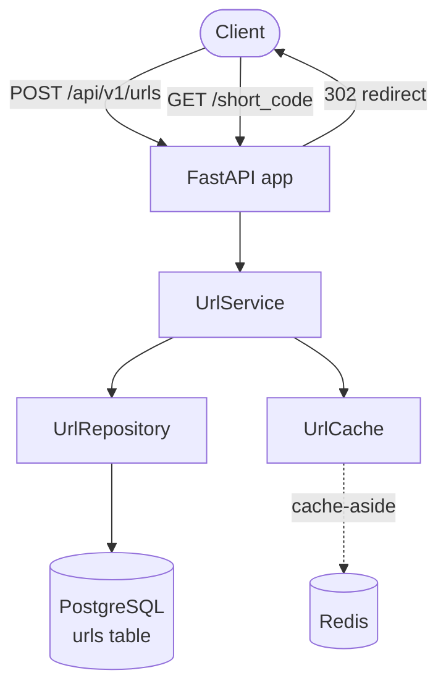
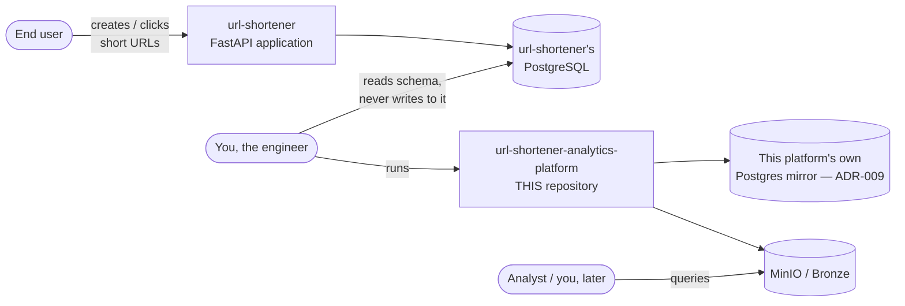
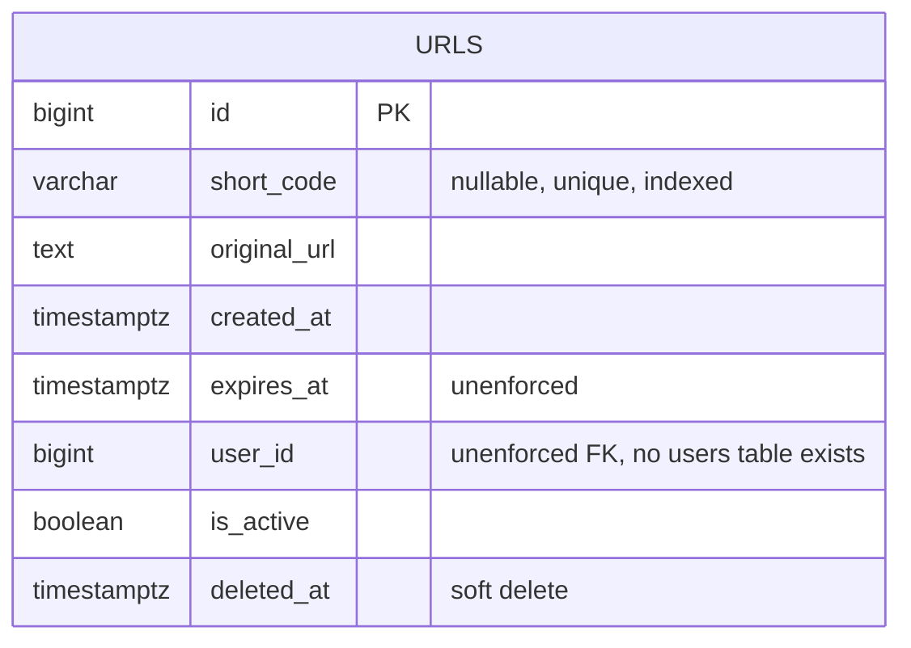
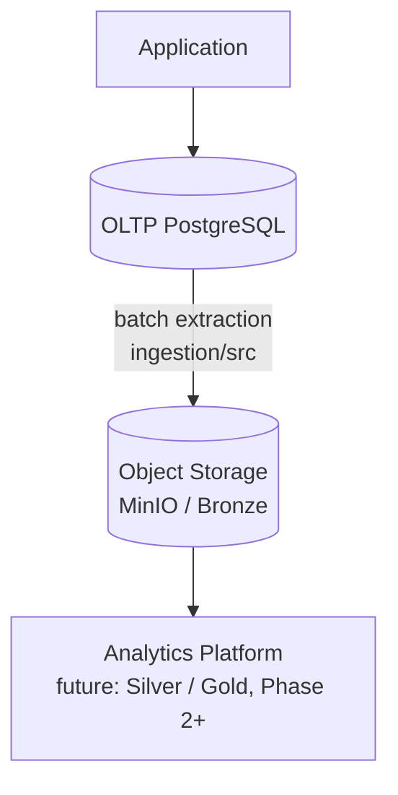
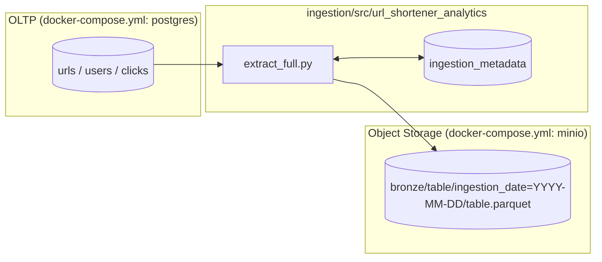
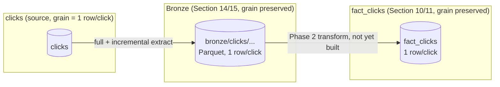
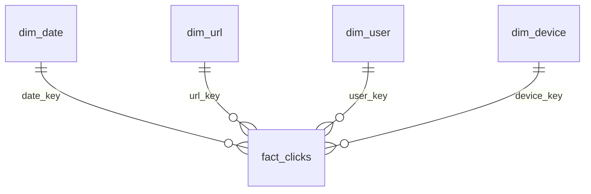
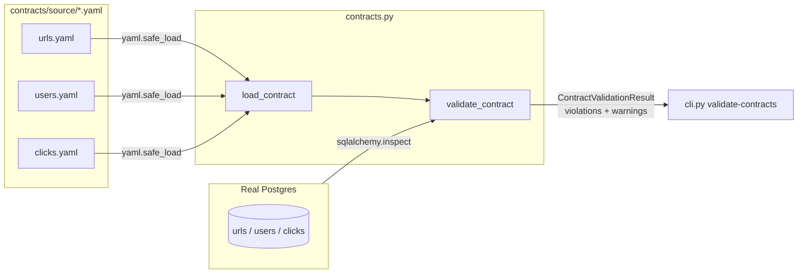
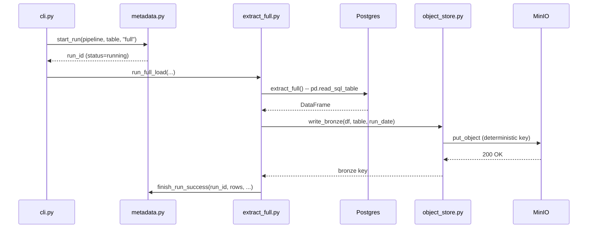

# Analytics Engineering Guide

**This is the single learning, architecture, and reference document for the
`url-shortener-analytics-platform` repository.** It is meant to be opened
once now and reopened months from now to re-derive the whole system: every
concept is explained from first principles, every design decision is
recorded as an ADR, and every claim about "how this works" points at a real
file in this repository rather than duplicating it.

**How this document works:** concepts are explained here; implementation
lives in the repository. When you see a reference like
`ingestion/src/url_shortener_analytics/extract_full.py`, that file is the
real, current, executable implementation — this guide explains *why* it's
built the way it is and *how to run it*, not a copy of its source.

**Status of this document:** Phase 1 is in progress and this guide grows
with it. Sections are marked ✅ (implemented and documented) or ⏳ (planned,
not yet built) in the table of contents below — an honest, current map of
the project, not a promise of what will eventually exist. Sections marked
✅✅ have been written (or rewritten) to the **full teaching template**
described immediately below; a plain ✅ means the section exists but is
still due an upgrade to that depth in a later increment.

### How this guide is structured

This is not a reference manual — it's meant to teach the material the way
a principal engineer mentoring a new hire would, assuming nothing. Every
major concept in this guide is built from the same template, so once you
know the template you always know what's coming next and why:

| Subsection | What it does |
|---|---|
| **Concept** | Explains the idea from first principles, in plain language, assuming no prior knowledge. |
| **Why does this exist?** | The real production problem this concept solves — concepts taught without a motivating problem don't stick. |
| **Simple Example** | A small, generic example — nothing to do with URL shorteners yet — so the *shape* of the idea is clear before any project-specific detail gets added. |
| **URL Shortener Example** | The same idea, now grounded in this project's actual schema and numbers. |
| **Architecture** | Where this concept sits in the overall system, usually with a diagram. |
| **Design Decision** | The specific choice this project makes, and why. |
| **Alternatives** | What else could have been chosen instead. |
| **Trade-offs** | What's given up and what's gained by the choice actually made — never "X is just better." |
| **Implementation** | Exactly which file(s) this concept lives in, in the exact `CREATE / PURPOSE / DEPENDENCIES / IMPLEMENTATION / RUN / VERIFY / EXPECTED / TEST / PRODUCTION CONSIDERATIONS / INTERVIEW QUESTIONS` format for anything that's real, runnable code. |
| **How to Run / How to Verify** | Exact commands — never "run the script." |
| **Hands-on Exercise** | Something to actually do — run a lab, or implement a piece yourself using the *Implementation Guide* rather than the copy-paste *Reference Implementation* (see box below). |
| **Failure Scenario** | What breaks, deliberately explored, not glossed over. |
| **Production Considerations** | POC vs. real production, explicitly labeled `POC SIMPLIFICATION` wherever this repo cuts a corner intentionally. |
| **Principal Data Engineer Perspective** | What a principal engineer specifically would be thinking about here — the judgment calls, not just the mechanics. |
| **Interview Questions** | Realistic questions at this topic, with what a strong answer actually covers. |

**Copy-paste vs. implement-yourself.** For every real implementation
component, this guide gives you both an **Implementation Guide** (what to
build and why, detailed enough to write it yourself) and a **Reference
Implementation** (complete, working code you can paste directly into the
named file). Which one you use is your call — copy it to move fast, or
write it yourself from the guide for the hands-on learning that's the
actual point of this project. Every component also includes a **Hands-on
Challenge**: a specific modification or extension you implement yourself,
because reading a finished pipeline and *changing* one under your own
power exercise genuinely different muscles.

**On fabricated results.** Nowhere in this guide is a benchmark number,
row count, or test count invented. Every number you see under "ACTUAL
OBSERVED RESULT" was actually produced by running the stated command in
this environment. Anything not yet run is labeled **"Not yet executed"**,
with the exact command to produce the real result yourself.

---

## Table of Contents

**Foundations**
1. [Existing URL Shortener Assessment](#1-existing-url-shortener-assessment-) ✅✅
2. [OLTP vs OLAP](#2-oltp-vs-olap-) ✅✅
3. [Phase 1 Architecture](#3-phase-1-architecture) ✅
4. [Project Structure](#4-project-structure) ✅
5. [Git Workflow](#5-git-workflow) ✅
6. [Environment Setup](#6-environment-setup) ✅

**Data Modeling**
7. [Analytics Requirements & Business Metrics](#7-analytics-requirements--business-metrics-) ✅✅
8. [Data Grain](#8-data-grain-) ✅✅
9. [Source Data Model](#9-source-data-model-) ✅✅
10. [Analytical Data Model (Fact/Dimension Design)](#10-analytical-data-model-factdimension-design-) ✅✅
11. [Star Schema vs. Normalized Model](#11-star-schema-vs-normalized-model-) ✅✅
12. [Data Contracts](#12-data-contracts-) ✅✅

**Ingestion**
13. [Batch Ingestion Design](#13-batch-ingestion-design) ✅
14. [Full Load Ingestion](#14-full-load-ingestion-) ✅✅
15. [Incremental Load & Watermarks](#15-incremental-load--watermarks-) ✅✅
16. Checkpointing ⏳ *(the mechanism exists and checkpoint recovery is now observable — see [Section 13.3](#133-checkpointing-and-watermark-mechanism-already-built) and [Section 15.7](#157-failure-scenario) — still awaits its own dedicated deep-dive section)*
17. Idempotency ⏳ *(the mechanism exists for both load types — see [Section 14](#14-full-load-ingestion) (LAB 4/5) and [Section 15.7](#157-failure-scenario) (LAB 2/3, plus the one documented residual edge case) — still awaits its own dedicated deep-dive section)*

**Storage**
18. Object Storage Fundamentals ⏳
19. Parquet ⏳
20. Partitioning ⏳
21. File Layout ⏳
22. Ingestion Metadata (deep-dive) ⏳

**Quality & Operations**
23. PII and Security ⏳
24. Testing (deep-dive) ⏳ *(tests exist now — see [Section 14.6](#146-how-to-test)*)
25. Failure Scenarios (all 10) ⏳ *(one is demonstrated now — see [Section 14.7](#147-failure-scenario)*)
26. Performance ⏳
27. Scale Design ⏳

**Reference**
28. [Architectural Principles](#28-architectural-principles) ✅ *(introduced now, extended as more are demonstrated)*
29. [Architecture Decision Records](#29-architecture-decision-records) ✅
30. Hands-on Labs (index) ⏳ *(LAB 1, LAB 4/5 — Section 14.5; LAB 2, LAB 3 — Section 15.5; LAB 6-9 — Sections 7.3/8.3/9.3/11.3; LAB 10 — Section 10.7; LAB 11 — Section 12.6)*
31. Interview Questions (consolidated, all categories) ⏳ *(Category C questions exist now — see Sections 7, 8, 9, 10, 11, 12, 14.9, and 15.9)*
32. Principal-Level Scenarios ⏳
33. [Phase 1 Summary](#33-phase-1-summary-so-far) (running, updated each increment)
34. [Phase 1 Completion Checklist](#34-phase-1-completion-checklist)
35. [Git Repository Review](#35-git-repository-review)
36. What Phase 2 Will Add ⏳

---

## 1. Existing URL Shortener Assessment ✅✅

### Concept

Before designing anything new, we read the real system. Every fact in this
section came from directly reading files in the `url-shortener` repository
on **2026-09-19** — nothing here is inferred or assumed. If you're new to
this idea: in real data engineering work, "the schema" is not a diagram
someone hands you — it's whatever the application's actual migration
history says it is, which is frequently different from what a requirements
document *says* it should be. Learning to read code as the source of truth,
rather than a document that describes it, is a habit this whole section
exists to build.

### Why does this matter?

Inventing a plausible-looking source schema is a common shortcut, and it's
the wrong one. A portfolio project built against an imaginary schema
teaches you to design against your own assumptions, not against a real
system's actual constraints — and in a real job, the gap between "what the
docs say" and "what the code does" is precisely where production incidents
come from. Section E below (the honest mismatch) is exactly the kind of
finding that would be invisible if this platform's schema had been
designed from the requirements doc instead of read from the code.

### Simple Example

Imagine you join a company and are told, "our `orders` table has a
`status` column with values `pending`, `shipped`, `delivered`." Before
building a dashboard that groups orders by status, you'd run
`SELECT DISTINCT status FROM orders` yourself — because "cancelled" might
exist in production and simply never made it into anyone's documentation.
That one query is the same instinct this entire section is built on, just
applied to a whole codebase instead of one column.

### A. Existing Application Architecture



**Readable ASCII equivalent** (per this guide's rule of never depending
solely on Mermaid rendering):

```
Client --POST /api/v1/urls--> FastAPI app --> UrlService --> UrlRepository --> PostgreSQL (urls table)
Client --GET /{short_code}--> FastAPI app --> UrlService --> UrlCache --(cache-aside)--> Redis
                                                                     |
                                                            (on miss) --> UrlRepository --> PostgreSQL
FastAPI app --302 redirect--> Client
```

Stack, confirmed from `pyproject.toml` and `docker-compose.yml`: FastAPI,
SQLAlchemy 2.0 + Alembic, PostgreSQL 16, Redis (cache-aside), pydantic-settings
for config, pytest for tests, Docker Compose for local orchestration.
Kubernetes and Kafka are explicitly deferred in that project too (see its
own `docker-compose.yml` header comment) — the same "earn complexity, don't
front-load it" discipline this platform follows.

**System context** — where this analytics platform sits relative to the
application it observes:



The two systems are deliberately **two separate Git repositories, two
separate Postgres instances**. This platform never connects to the real
`url-shortener` application's live database — see
[ADR-009](#adr-009-this-platform-owns-its-own-oltp-mirror-postgres) for
exactly why, and what changes about this diagram in a real production
deployment.

### B. Existing Database ER Diagram



**Readable ASCII equivalent:**

```
urls
├── id             BIGINT PK, autoincrement
├── short_code     VARCHAR(16), nullable, UNIQUE, indexed
├── original_url   TEXT, not null
├── created_at     TIMESTAMPTZ, not null
├── expires_at     TIMESTAMPTZ, nullable   <- exists, unenforced anywhere
├── user_id        BIGINT, nullable        <- exists, no users table exists
├── is_active      BOOLEAN, not null, default true
└── deleted_at     TIMESTAMPTZ, nullable   <- soft delete marker
```

One table. That's the entire persisted schema of the real application as
of this reading — confirmed by reading `app/models/url.py` (the SQLAlchemy
ORM model) against all four Alembic migrations in
`migrations/versions/`, in order:

| Migration | What it added |
|---|---|
| `3813da2d7b76` (baseline) | `id`, `short_code` (unique, not null then), `original_url`, `created_at` |
| `cd8736f28600` | `expires_at`, `user_id`, `is_active` |
| `ff8ab26cc6ea` | `deleted_at` |
| `957b3fbefa19` | `short_code` made nullable (supports an id-first generation strategy where a row can briefly exist before its code is assigned) |

### C. Source-to-Analytics Mapping

This is the table that turns "here's a schema" into "here's what we can
actually answer with it" — mapping each real (or hypothetical, clearly
marked) source field to the analytics questions from Section 5 it can
answer.

| Source field | Table | Analytics use | Status |
|---|---|---|---|
| `urls.id` | `urls` | Surrogate key for `dim_url`; join target from `clicks.short_code` (indirectly, via `short_code`) | Real |
| `urls.short_code` | `urls` | Natural key for a URL; join key from `clicks` | Real |
| `urls.created_at` | `urls` | "URLs created per day", cohort analysis | Real |
| `urls.user_id` | `urls` | "URLs per user" — **only answerable once a real `users` table exists** | Real column, unenforced, no real `users` table |
| `urls.expires_at` | `urls` | "% of URLs expired" | Real column, but the application never enforces it — see Section E |
| `urls.is_active` / `deleted_at` | `urls` | "Active vs. soft-deleted URLs" | Real |
| `users.email`, `users.plan_type` | `users` (**hypothetical**) | "Clicks by subscription plan", user-level rollups | Hypothetical — see Section E |
| `clicks.occurred_at`, `device_type`, `hashed_ip`, `user_id` | `clicks` (**hypothetical**) | Every traffic-analytics question in Section 5 | Hypothetical — see Section E |

Reading this table left to right tells you something important on its
own: **every "traffic analytics" question this project wants to answer
depends on the hypothetical `clicks` table**, because the real application
captures zero click events today. That's not a minor footnote — it's the
single biggest constraint on this entire platform's Phase 1 design, and
it's why Section E exists.

### D. Gaps

- No event/click table of any kind — `GET /{short_code}` in
  `app/api/urls.py` resolves and 302-redirects without writing anything.
  There is no logging, no background task, no queue message — nothing.
- No `users` table, despite `urls.user_id` existing as a column with no
  foreign key constraint enforcing it (Postgres will happily accept any
  `BIGINT`, including one that matches no real user, or no user at all).
- No geographic or device information captured anywhere in the schema or
  application code.
- No index on `urls.created_at` or `urls.user_id` — irrelevant to the
  live application (neither is queried directly today) but relevant to
  this platform's extraction queries, discussed in
  [Section 14.8](#148-production-considerations).

### E. Assumptions

Stated explicitly, because an assumption that's never written down is an
assumption nobody can challenge later:

1. **Assumption:** click events, once the real application implements
   them, will look approximately like this platform's hypothetical
   `clicks` table (`short_code`, `occurred_at`, `device_type`, a
   pseudonymized IP, an optional `user_id`). **Basis:** this mirrors the
   fields `docs/01-requirements.md`'s functional requirement #5 explicitly
   names ("click count, timestamp, coarse geo/device info"). **Risk if
   wrong:** if the real implementation later captures materially different
   fields (e.g. a session ID, a referrer URL), this platform's source
   contract (Section 12, planned) will need to be revised — which is
   exactly the "schema evolution" problem Section 12 teaches how to handle
   gracefully.
2. **Assumption:** a `users` table, if built, will look like the
   hypothetical one here (`email`, `plan_type`, `created_at`). **Basis:**
   `urls.user_id` already exists as a `BIGINT`, implying a numeric
   surrogate-keyed users table was originally planned. **Risk if wrong:**
   low — this is a conventional enough shape that most real
   implementations would resemble it.
3. **Assumption:** this platform's own standalone Postgres (ADR-009) is an
   acceptable stand-in for "the real OLTP database" for *learning*
   purposes, even though a real production pipeline would read from a
   replica of the actual application's database, never a hand-built
   mirror. **Risk if wrong:** none for learning purposes; explicitly not
   claimed to be production-accurate, and called out as a POC
   simplification everywhere it matters.

### F. Recommended Minimal Changes (to the real application, not implemented here)

Not implemented by this platform — these belong to the `url-shortener`
repository's own roadmap (its README already lists "Phase 10 — Analytics"
as a planned phase):

1. Add a `clicks` (or equivalent event) table and write to it from the
   redirect handler — ideally decoupled from the request/response cycle
   (a background task, or eventually a queue) so click logging never adds
   latency to the redirect's hot path.
2. Add a real `users` table if user accounts become in-scope, with a
   foreign key from `urls.user_id`.
3. Either enforce `expires_at` (a scheduled job, or a check in the
   redirect path) or remove the column — an unenforced column that looks
   load-bearing is a common source of production confusion.
4. Add an index on `urls.created_at` if this platform's extraction queries
   ever filter on it directly (they don't yet — Phase 1 uses full loads
   and an `id`-based watermark, per [ADR-005](#adr-005-watermark-based-incremental-ingestion-implemented)).

### Principal Data Engineer Perspective

A principal engineer reviewing a brand-new analytics project asks one
question before looking at any architecture diagram: **"Where did this
schema actually come from?"** An answer of "I read the migrations" is a
very different signal than "I assumed it based on the requirements doc" —
the first tells you the design is grounded in reality and will hold up
under a real data quality audit; the second tells you the design might be
elegant but could be quietly wrong about something that matters. This
section exists so that, from the very first page, this project can
honestly answer "I read the migrations."

### Interview Questions

**Q: "How would you approach designing an analytics pipeline for an
application you've never seen the code for?"**

*What's tested:* whether the candidate's default instinct is to trust
documentation or to verify against the system itself.

*Strong answer:* start by getting read access to the actual schema (via
migrations, an ORM model, or a live `\d table_name` in psql) rather than
relying on a requirements document or a verbal description from a
stakeholder — both routinely drift from what's actually deployed.
Cross-reference the schema against what the application's own API/service
layer actually does with it (does every column get written to? Is
anything enforced only in application code, not the database?). Document
gaps and assumptions explicitly, the way Sections D and E above do, so
anyone reviewing the design later can see exactly what was verified versus
assumed.

*Common mistake:* designing an idealized dimensional model from a
requirements document without ever looking at the real schema — it's the
single fastest way to build something wrong that looks right in a design
review.

---

## 2. OLTP vs OLAP ✅✅

### Concept

**OLTP** stands for **Online Transaction Processing**. An OLTP system is
built to handle a large number of small, fast operations on individual
rows: create this record, look up that one record, update this other
record — each one touching a handful of rows, each one needing to finish
in milliseconds, each one needing strong correctness guarantees even when
thousands of these happen concurrently.

**OLAP** stands for **Online Analytical Processing**. An OLAP system is
built for the opposite shape of work: scan potentially millions of rows,
aggregate them (count, sum, average, group by), and return one summarized
answer. A single OLAP query might legitimately take seconds — that's
acceptable, because it's answering a question like "how many clicks
happened per day last month," not serving a single user waiting on a page
load.

If you remember nothing else from this section: **OLTP optimizes for
"how fast can I touch one row," OLAP optimizes for "how fast can I
summarize a billion rows."** Those are different engineering problems,
and systems tuned for one are typically bad at the other.

### Why does this exist?

Because a single database, tuned for one workload, is *measurably worse*
at the other — not just "less ideal," but actually worse in ways that show
up as real production incidents. An OLTP database like Postgres is tuned
around B-tree indexes that make "find the one row with this key" fast, and
a buffer cache (recently-used pages of data, kept in memory) sized around
the *application's* normal access pattern. A query that scans millions of
rows to compute an aggregate has to pull all of those rows through that
same buffer cache — potentially evicting the "hot" pages the application
depends on for its own fast lookups. The two workloads are, quite
literally, fighting over the same limited RAM.

### Simple Example

Picture a library. OLTP is the front desk: "do you have this exact book,
by this exact call number?" — fast, one lookup, done in seconds, and the
front desk is built (organized shelves, a catalog system) specifically to
answer that fast. OLAP is a researcher who wants to know "how many books
on 19th-century France did this library acquire, by year, for the last 50
years?" — that requires walking through a huge fraction of the catalog,
takes much longer, and if the researcher tried to do this by constantly
interrupting the front desk clerk's one-lookup-at-a-time system, they'd
slow down everyone else trying to check out a book. The right answer isn't
"make the researcher stop asking questions" — it's to give the researcher
a separate, purpose-built research room with its own copy of the catalog,
organized differently (by topic and year, not by shelf location), so
neither one gets in the other's way.

### URL Shortener Example

```
Application
    |
    v
PostgreSQL
    |
    +---- application traffic  (redirects: the hot path, ~1,200 reads/sec peak
    |      per the source project's own capacity estimate in docs/01-requirements.md)
    |
    +---- analytics queries    (an aggregate scan competing for the same
           buffer cache, connection pool, and disk I/O)
```

A single expensive analytical query — "count clicks per URL for the last
90 days" — run directly against this Postgres instance has a real chance
of evicting hot pages from the buffer cache that the redirect path depends
on, degrading redirect latency for actual users. At this project's stated
scale (a 10:1 read:write ratio, redirects being the explicit hot path),
that's not a hypothetical risk — it's the exact failure mode the source
project's own `docs/01-requirements.md` is written to avoid. Worse: this
risk is *invisible* under light load and only shows up once analytics
query volume or table size grows — which is exactly the kind of problem
that's cheap to design away now and expensive to retrofit once it's
already hurting real users.

### Architecture: separating the two



**Readable ASCII equivalent:**

```
Application --> OLTP PostgreSQL --(batch extraction, ingestion/src)--> Object Storage (Bronze)
                                                                              |
                                                                              v
                                                          Analytics Platform (future Silver/Gold, Phase 2+)
```

`OLTP PostgreSQL` keeps serving application traffic, untouched by
analytical query load. `Batch Extraction` (this repository's `ingestion/`
package) reads from it on a schedule, not on every request. `Object
Storage` holds the extracted data independently, so any number of
analytical engines can read from it later without going back to OLTP at
all.

### Design Decision

This platform separates OLTP and OLAP from day one — even though, at this
project's current tiny data volume, querying OLTP directly for analytics
would work *just fine* in practice. The decision is made anyway, for two
reasons specific to this being a learning project: first, the whole point
is to build (and feel) the real separation, not just talk about it;
second, the separation costs almost nothing to build now (one Python
extractor, one object store) and would cost considerably more to retrofit
later once "just query Postgres for the dashboard" has become load-bearing
habit across a team.

### Alternatives

1. **Query OLTP directly for everything, no pipeline at all.** Works fine
   at small scale and zero analytical query volume; breaks down exactly as
   described above once either grows. The simplest option, and the wrong
   one to default to without at least considering the alternative below.
2. **Add a read replica, query the replica directly.** Solves the resource
   *contention* problem — the replica has its own buffer cache and disk
   I/O, so an expensive analytical query there can't degrade the
   primary's redirect latency. Does **not** solve the *shape* problem: the
   replica has the exact same row-oriented, heavily-normalized OLTP schema
   as the primary, which is a poor fit for aggregation-heavy queries — see
   Trade-offs below and the interview question at the end of this section.
3. **Build a real batch-extraction pipeline into object storage (chosen).**
   Solves both the contention problem and the shape problem (Bronze data
   can later be reshaped into an analytics-friendly model, Sections 9-11)
   at the cost of added infrastructure and data that's only as fresh as
   the last extraction run.

### Trade-offs

| | Query OLTP directly | Read replica | Batch pipeline (chosen) |
|---|---|---|---|
| Protects production from analytical load | No | Yes | Yes |
| Analytics-shaped schema (not just OLTP mirror) | No | No | Yes (once Sections 9-11 land) |
| Data freshness | Real-time | Real-time | As fresh as the last run |
| Infrastructure to run | None | A replica | A replica (later) + extractor + object storage |
| Right choice when... | Query volume is trivially low | Freshness matters more than shape, and volume is moderate | Freshness can lag, and analytical query shape/volume genuinely differs from OLTP |

No option is universally correct — the right one depends on freshness
requirements, query volume, and query shape, which is exactly why the next
subsection exists.

### When is querying OLTP directly still acceptable?

Not every analytics need justifies a whole pipeline. Direct OLTP querying
remains reasonable when: query volume is low and infrequent (an
engineer checking one number by hand), the query is naturally
narrow (filtered by an indexed key, not a full scan), or a read replica
absorbs the load so it never touches the primary at all. The line is
crossed once queries become frequent, unpredictable in shape, or wide
(scanning large fractions of a table) — at that point, the buffer-cache
contention risk above stops being theoretical.

### Failure Scenario

**What actually happens, mechanically, when an analytical query degrades
redirect latency?** Postgres keeps recently-accessed data pages in a
memory area called the buffer cache (sized by the `shared_buffers`
setting). The redirect path's hot data — the small set of frequently
short-coded URLs, per this project's own stated Zipfian/power-law traffic
assumption in `docs/01-requirements.md` — normally stays resident there,
making lookups fast. A full-table scan for an analytical aggregate reads
far more distinct pages than fit in the buffer cache, and as Postgres
pulls those pages in, it evicts existing cached pages to make room —
including, potentially, the hot redirect pages. The next redirect for a
popular short code then has to fetch from disk instead of memory: slower,
and at high concurrency, contending for the same I/O bandwidth the
analytical query is also consuming. No single component "breaks" — it's a
resource-contention degradation, which is part of what makes it dangerous:
it doesn't throw an error, it just quietly gets slower.

### Production Considerations

| Aspect | This repo (POC) | Production |
|---|---|---|
| OLTP instance | This platform's own standalone Postgres mirror (ADR-009) — **POC SIMPLIFICATION**, never real application traffic | The pipeline reads from a real read replica of the production database, never the primary |
| Extraction frequency | Manual (`make ingest-full`) | Scheduled (an orchestrator, introduced Phase 3+) |
| Contention protection | N/A — this repo's mirror Postgres has no other traffic to contend with | A replica, connection limits, and query timeouts on the extraction connection specifically |

### Principal Data Engineer Perspective

A principal engineer doesn't treat "separate OLTP from OLAP" as a rule to
follow reflexively — they treat it as a trade-off to make consciously,
with a specific, named threshold for when it's worth the cost. The
judgment call is knowing *when* a team has crossed that threshold (query
volume, query shape, or organizational trust in "just query prod" all
matter) and being able to say so with concrete evidence, not vibes. Saying
"we should always separate OLTP and OLAP" in a design review is a weaker
answer than "here's the query pattern and volume at which direct OLTP
access degrades our SLO, and here's why we're either past it or not yet."

### Interview Questions

**Q: "Why not just add a read replica and run analytics queries against
that, instead of building a whole ingestion pipeline?"**

*What's tested:* whether the candidate understands that OLTP/OLAP
separation is really two separate problems (resource contention and
schema shape), not one.

*What a weak answer looks like:* "A replica adds lag, so it's not real-time"
— true, but misses the more important, structural reason.

*What a strong answer covers:* a read replica solves the *contention*
problem (analytics load no longer competes with the primary for
resources) but not the *shape* problem — a replica has the exact same
normalized, row-oriented OLTP schema as the primary, which is a poor fit
for aggregation-heavy analytical queries. Every "clicks per day per URL"
query against a replica still needs a full scan and a GROUP BY against
row-oriented storage with no columnar pruning or pre-aggregation. A
replica is a reasonable stopgap for light, occasional analytical load; it
doesn't replace a real analytics platform once query volume or complexity
grows.

*Expected follow-up:* "At what point would you introduce a replica versus
going straight to a pipeline?" — a strong candidate ties this to query
volume/shape thresholds, not a fixed rule.

*Common mistake:* treating "replica" and "analytics pipeline" as
interchangeable solutions to the same problem, rather than recognizing
they solve different halves of it.

---

## 3. Phase 1 Architecture

### 3.1 Proposed architecture



**Deliberately excluded from Phase 1**, and why: Kafka/Debezium (no
event stream exists yet to consume — see Section 1.5), Spark (row counts
here don't remotely justify distributed processing), Airflow (one Python
CLI command is simpler to operate and debug than a scheduler at this
scale), Kubernetes (Docker Compose is sufficient for a single-host batch
job). Each is introduced later only once a specific, named limitation of
the simpler tool is actually hit — see [Section 29 ADR-004](#adr-004-batch-ingestion-before-cdcstreaming)
and the future Scale Design section.

### 3.2 In simple language

Every night (or on demand, right now — there's no scheduler yet), a small
Python program connects to the OLTP database, reads an entire table, and
writes it as a compressed file into object storage. It writes down what it
did — which table, how many rows, whether it succeeded — in a separate
bookkeeping table, so the next run (or a human debugging a problem) can
tell what happened without guessing.

---

## 4. Project Structure

| Path | Purpose |
|---|---|
| `docs/analytics-engineering-guide.md` | This file. The single learning/reference document. |
| `ingestion/src/url_shortener_analytics/` | The importable Python package: all pipeline logic. |
| `ingestion/tests/unit/` | Fast tests against SQLite + a mocked S3 client. No Docker required. |
| `ingestion/tests/integration/` | Tests against the real Postgres + MinIO from `docker-compose.yml`. |
| `ingestion/configs/pipelines.yaml` | Which tables the pipeline extracts, and how — config, not code. |
| `schemas/source/`, `sql/source/` | Documentation and DDL for the source schema (real + clearly-labeled hypothetical tables). |
| `schemas/analytics/`, `sql/analytics/` | Reserved for the dimensional model — not yet populated. |
| `scripts/` | One-off operator scripts (`seed_sample_data.py`). Not imported by the pipeline. |
| `benchmarks/` | Reserved for executable performance benchmarks. |
| `sample_data/` | Convention-only landing spot for local generated files; nothing here is committed. |
| `tests/` (root) | Reserved for cross-phase end-to-end tests, once more than one phase's components exist. |

**Why both `ingestion/tests/` and a root `tests/`?** `ingestion/tests/` is
scoped to one package and owned by whoever owns that package. The root
`tests/` is reserved for tests that span multiple components once they
exist (e.g., a future Bronze → Silver → Gold end-to-end test) — keeping
that distinction from day one avoids a later, disruptive reorganization.

**Why does `scripts/seed_sample_data.py` live outside `ingestion/src/`?**
It's an operator convenience for local development, not something the
production pipeline imports or depends on. Mixing the two would make it
unclear, a year from now, whether `seed_sample_data` is part of the
pipeline's runtime behavior — it isn't.

---

## 5. Git Workflow

### What belongs in Git

Source code, tests, SQL, configuration templates (`.env.example`, not
`.env`), documentation, and this guide. Everything needed to reproduce the
system from a clean clone plus `docker compose up -d`.

### What must never be committed

- `.env` (real environment values — `.env.example` is the checked-in
  template)
- Generated data: `pg_data/`, `minio_data/` (docker compose volumes),
  anything under `sample_data/generated/` or `benchmarks/results/`
- Local caches/artifacts: `.venv/`, `__pycache__/`, `.pytest_cache/`,
  `.ruff_cache/`, `*.egg-info/`
- Credentials or secrets of any kind, real or accidentally-real-looking

See [`.gitignore`](../.gitignore) for the enforced list.

### Expected workflow

```bash
git checkout -b feature/incremental-load
# implement in ingestion/src/, tests in ingestion/tests/
pytest                                   # unit tests must pass locally
ruff check . && ruff format .
git add ingestion/ docs/analytics-engineering-guide.md
git commit -m "Add watermark-based incremental load for clicks"
git push -u origin feature/incremental-load
# open a pull request; guide + code + tests reviewed together, not code alone
```

Documentation changes ship in the *same* commit/PR as the code they
describe — a stale guide is worse than no guide, because it's actively
misleading.

---

## 6. Environment Setup

### Prerequisites

| Requirement | Why |
|---|---|
| Python 3.12+ | Matches the source `url-shortener` project's own requirement, for consistency across the two repos. |
| Docker + Docker Compose | Runs this repo's own Postgres (schema-mirror) and MinIO. |

### Setup

```bash
git clone <this-repo>
cd url-shortener-analytics-platform
cp .env.example .env

make venv
source .venv/bin/activate
make install          # pip install -e ".[dev]"

make up                # starts Postgres (port 5433) + MinIO (9000/9001) + createbuckets
docker compose ps       # confirm postgres and minio show (healthy)

make seed              # seeds reproducible synthetic urls/users/clicks (Faker, seed=42)
```

MinIO's web console: `http://localhost:9001` (`labadmin` / `labpassword`
by default — see `.env.example`). Postgres is deliberately on host port
**5433**, not 5432, so it doesn't collide with a `url-shortener` Postgres
that might already be running on the same machine.

**A note on the MinIO image:** as of September 2026, Docker Hub no longer
serves `minio/minio` or `minio/mc` at all (both repositories were pulled).
This repo's `docker-compose.yml` pulls from `quay.io/minio/minio` and
`quay.io/minio/mc` instead, pinned to specific release tags rather than
`:latest`, both verified against MinIO's own GitHub release history.

---

## 7. Analytics Requirements & Business Metrics ✅✅

### Concept

**Analytics requirements** are the specific business questions a platform
must be able to answer, written down and agreed on *before* any dimension
or fact table is designed. A **metric** is one such question turned into a
precise, computable definition: what's being counted or measured, at what
grain, from which columns, with what filters.

### Why does this exist?

Skipping straight from "we have a `clicks` table" to "let's build a star
schema" is how projects end up with a dimensional model that's elegant but
answers the wrong questions — or worse, one where two different analysts
compute "daily active users" two different ways because no one wrote down
what it actually means. Requirements-first isn't paperwork for its own
sake: every design decision in Sections 8-11 (the fact table's grain,
which dimensions exist, what gets pre-computed vs. left to query time)
follows directly from the metrics catalog below. Skipping this step
doesn't remove the decisions — it just makes them implicitly, one query at
a time, usually inconsistently.

### Simple Example (generic, pre-URL-Shortener)

Imagine a small e-commerce team is asked to "add an orders dashboard."
Without requirements, three engineers build three different things: one
computes "revenue" including tax, one excludes it, one excludes refunded
orders and the other two don't. All three are defensible in isolation —
the disagreement was never resolved because no one wrote "revenue = sum of
`order_total` for orders where `status != 'refunded'`, tax included" down
anywhere before the dashboards shipped. A five-minute requirements
conversation would have prevented three incompatible numbers from ever
reaching a stakeholder meeting.

### URL Shortener Example

The real `url-shortener` application's own `docs/01-requirements.md`
already states an explicit v1 functional requirement: "basic analytics:
click count, timestamp, coarse geo/device info per short code" (quoted
already in Section 1.5 and ADR-008). That's a starting point, not a
complete spec — it names *what kind* of thing is wanted without defining a
single metric precisely enough to implement. This section turns it into
the actual metrics catalog this platform's dimensional model (Sections
9-11) is designed to serve.

### 7.1 Metrics Catalog

| Metric | Definition | Grain | Source |
|---|---|---|---|
| Total clicks per URL | `COUNT(*)` (or `SUM(click_count)`) grouped by `short_code` | Per URL | `fact_clicks` |
| Clicks over time | `COUNT(*)` grouped by `date_key` (optionally + `short_code`) | Per day (per URL) | `fact_clicks` + `dim_date` |
| Clicks by device type | `COUNT(*)` grouped by `device_type` | Per device category | `fact_clicks` + `dim_device` |
| Top N URLs by clicks | `total clicks per URL`, ordered descending, limited to N | Per URL | `fact_clicks` + `dim_url` |
| Anonymous vs. attributed click share | `COUNT(*)` grouped by `dim_user.is_known` | Per click | `fact_clicks` + `dim_user` |
| Clicks by plan type | `COUNT(*)` grouped by `dim_user.plan_type` (known users only) | Per plan | `fact_clicks` + `dim_user` |
| Clicks by destination domain | `COUNT(*)` grouped by `dim_url.original_url_domain` | Per domain | `fact_clicks` + `dim_url` |
| Active vs. inactive URL click share | `COUNT(*)` grouped by `dim_url.is_active` | Per URL status | `fact_clicks` + `dim_url` |

Every metric above is expressible as a `GROUP BY` over `fact_clicks`
joined to at most one dimension — a direct consequence of the grain
decision in Section 8 and the star schema shape in Section 11. None of
them require a self-join, a window function, or a pre-aggregated rollup
table to compute correctly at this project's current scale; Section 26
(Performance, planned) is where that stops being true and pre-aggregation
gets evaluated.

### Design Decision

**Every metric in the catalog above is derived, at query time, from
`fact_clicks`' atomic grain — none are pre-aggregated into a separate
summary table in Phase 1.** This mirrors Section 8's grain decision and is
recorded together with it, not as a separate, independent choice — see
Section 8's Design Decision for the reasoning; the two decisions have to
be made together, since a coarser fact grain would have made some of the
metrics above (e.g. clicks by device type) unanswerable without the raw
event detail.

### Alternatives

1. **No formal metrics catalog — build the star schema first, work out
   metrics from whatever it supports (rejected).** This is the failure
   mode described in the Simple Example: the "requirements" end up being
   whatever the schema happens to allow, discovered ad hoc, rather than
   deliberately designed for.
2. **A pre-aggregated metrics/summary table per metric (rejected for
   Phase 1).** Would make each dashboard query trivially fast at read
   time, at the cost of a transformation pipeline to maintain every
   summary table's freshness — real complexity this project hasn't earned
   yet at 5,000 seeded click rows. Revisit once Section 26's benchmarks
   show `fact_clicks` queries are actually slow.
3. **A written metrics catalog, computed live from an atomic-grain fact
   table (chosen).** Slower per-query than pre-aggregation, at a scale
   that doesn't matter yet; keeps every metric's definition traceable to
   one row of raw fact data, which is worth more during Phase 1's
   correctness-first stage than query speed is.

### Trade-offs

| | Live query over atomic grain (chosen) | Pre-aggregated summary tables |
|---|---|---|
| Correctness / traceability | High — every number traces to individual `fact_clicks` rows | Lower — a bug in the aggregation job silently poisons every downstream number until caught |
| Query latency at scale | Degrades as `fact_clicks` grows | Stays flat — the point of pre-aggregating |
| New metric, same source data | Free — just a new `GROUP BY` | Requires a new aggregation job, or reprocessing history |
| Operational complexity | None beyond the fact/dim tables themselves | An extra pipeline stage to build, schedule, and monitor |

### 7.2 Requirements Traceability

| Requirement source | What it says | Where it's addressed |
|---|---|---|
| `url-shortener`'s `docs/01-requirements.md`, functional requirement #5 | "basic analytics: click count, timestamp, coarse geo/device info per short code" | Click count → row 1 of the catalog; timestamp → `dim_date`/`occurred_at`; device info → row 3; "coarse geo" is explicitly **not** implemented (no geo column exists anywhere in this project's schema — see the Known Limitations note this introduces into Section 33) |
| This project's own curriculum (Section 7's own existence) | Analytics requirements should be defined before the analytical model | This catalog, Section 8 (grain), Sections 9-11 (model design) |

**Stated honestly:** "coarse geo info" from the real requirement is
explicitly out of scope for this catalog — there's no IP-geolocation step
anywhere in this pipeline (`clicks.hashed_ip` is hashed specifically to
avoid needing to resolve real IPs to locations; see Section 23, PII,
planned), and adding it would mean a new source column, a new dimension,
and a defensible privacy story, none of which this increment builds. It's
named here rather than silently dropped, matching this project's
established pattern (compare Section 33's other honestly-stated gaps).

### 7.3 Hands-on Exercise

**LAB 6 — Trace one requirement to one query.**

Pick "Total clicks per URL" from the catalog above. Without looking ahead
to Section 11's DDL, write down (in plain SQL, on paper or in a scratch
file) what you'd expect the query to look like once `fact_clicks` and
`dim_url` exist and are populated:

```sql
SELECT du.short_code, COUNT(*) AS total_clicks
FROM fact_clicks fc
JOIN dim_url du ON fc.url_key = du.url_key
GROUP BY du.short_code
ORDER BY total_clicks DESC;
```

Then read Section 11's actual `fact_clicks`/`dim_url` DDL and check
whether every column your query needs actually exists with the name and
join key you assumed. (It should — the DDL was designed *from* this
catalog, not the other way around. If you find a mismatch, that's the
exercise working: it means either the catalog or the DDL needs to change,
and Section 12's Failure Scenario discusses exactly this kind of
requirements-vs-schema drift.)

### Failure Scenario

**What happens if a metric's definition is ambiguous and two people
implement it differently?**

Concretely: "clicks by device type" could mean `GROUP BY device_type` over
every click (including anonymous ones, correct per this catalog) or
`GROUP BY device_type` filtered to only clicks with a known `user_id`
(a plausible but *different* metric someone might build without checking
the catalog). Both produce a table with the same column names and shape —
nothing about the output alone reveals which definition was used. This is
the requirements-ambiguity failure mode named in the Simple Example, now
concrete: without a catalog entry stating explicitly that this metric
includes anonymous clicks, two dashboards can disagree with no error, no
alert, and no obvious way to tell which one is "right" without re-deriving
both definitions from scratch. **Production implication:** every metric
in a real metrics catalog needs enough precision that two engineers
implementing it independently would produce identical SQL — the catalog
above is written to that standard (e.g. "known users only" is stated
explicitly on the one row where it applies, and left off everywhere else
on purpose).

### Production Considerations

| Aspect | This repo (POC) | Production |
|---|---|---|
| Catalog format | A Markdown table in this guide | Often a dedicated metrics layer/semantic tool (e.g. a metrics-definition YAML consumed by a BI semantic layer) so the definition is enforced in code, not just documented |
| Ownership | Implicit (this project) | Each metric has a named business owner who signs off on its definition |
| Change management | None — this is Phase 1 | A metric definition change is itself a reviewable, versioned change, since dashboards built against the old definition silently drift otherwise |
| Ambiguity detection | Manual review (this section) | Automated: a metrics layer that only allows one definition per metric name, compile-time |

### Principal Data Engineer Perspective

The judgment call worth naming here: a metrics catalog is cheap to write
and easy to skip, and skipping it never produces an error — it produces a
project that *looks* done (dashboards render, numbers appear) while
quietly carrying unresolved ambiguity that surfaces only when two numbers
disagree in front of a stakeholder. A principal engineer treats "we have
dashboards" and "we have agreed-upon metric definitions" as two different
claims, and doesn't let the first one stand in for the second — this
section exists specifically so Sections 8-11's design decisions have
something concrete to be *for*, rather than being justified purely by
internal modeling elegance.

### Principal Engineer Interview Questions

**Q: "Someone asks you why the dashboard's 'clicks per URL' number doesn't
match a number a colleague pulled from the raw event table. Walk through
how you'd debug that."**

*What's tested:* whether the candidate defaults to a data-quality
investigation (checking the pipeline for bugs) or first checks whether the
two numbers are even supposed to match.

*What a weak answer looks like:* immediately assuming a bug in the
ingestion or transform pipeline and starting to trace data lineage.

*What a strong answer covers:* start by comparing the two *definitions*,
not the two pipelines — ask what filter conditions, date ranges, and
grain each query used before assuming either is "wrong." In this
project's own catalog, the most likely culprit for exactly this
disagreement is the anonymous-clicks question from this section's Failure
Scenario: one query included anonymous clicks, the other implicitly
excluded them via an inner join to a users table. Only after confirming
the definitions are supposed to match does a genuine data-quality bug
become the next hypothesis.

*Concepts:* metric definition ambiguity vs. data-quality defects — two
different failure classes that produce identical symptoms (numbers don't
match) and need different debugging approaches.

*Expected follow-up:* "How would you prevent this from happening again?" —
A written, precise metrics catalog (this section), ideally enforced by a
semantic layer rather than left to convention.

*Common mistake:* treating every numeric discrepancy as a pipeline bug by
default, without first checking whether the two queries were ever
computing the same thing.

---

## 8. Data Grain ✅✅

### Concept

The **grain** of a fact table is a precise statement of what a single row
represents — "one row per X." Every fact table needs exactly one grain
statement, decided before a single column is designed, because grain
determines which measures are valid (additive at that grain or not) and
which dimensions can join to it cleanly.

### Why does this exist?

Grain is, by wide consensus in dimensional modeling (Kimball's own stated
"first and most important" decision when designing a fact table), the
decision every other fact-table decision depends on. Pick a grain that's
too coarse (e.g. "one row per URL per day") and you permanently lose the
ability to answer device-type or hour-of-day questions without
re-extracting from source. Pick a grain that's ambiguous (some rows are
per-click, others are pre-aggregated) and *no* measure in the table is
safely additive anymore, because summing across rows of different grains
double-counts or under-counts depending on which rows you happen to
include.

### Simple Example (generic, pre-URL-Shortener)

A retail chain's "sales" fact table could be grained at "one row per
individual item scanned at checkout," "one row per checkout transaction
(receipt)," or "one row per store per day." All three are legitimate fact
tables — they just answer different questions. The item-level grain can
answer "what's our best-selling SKU" but is enormous; the daily-store
grain is compact but can never answer "what did this specific customer
buy in one visit," because that information was discarded before the
table was even built. Once a grain is chosen and loaded, there is no SQL
query that recovers detail the grain didn't keep.

### URL Shortener Example

`clicks` (Section 1.5, ADR-008) already exists at the finest grain this
project's schema can produce: one row per redirect event. Section 7's
metrics catalog was built assuming that grain is preserved all the way
into the analytical layer — "clicks by device type" and "clicks by hour"
both require row-level detail that a pre-aggregated "clicks per URL per
day" fact table would have already thrown away.

### 8.1 Design Decision

**`fact_clicks`' grain is one row per click event — identical to the
source `clicks` table's own grain.** No pre-aggregation happens between
Bronze and the analytical layer in Phase 1. This is stated here as its own
decision, separate from (but paired with) Section 7's requirements
decision, because grain is a big enough decision in dimensional modeling
to warrant being named and defended on its own, independent of which
specific metrics happen to be in the current catalog — a *future* metric
this project hasn't thought of yet is far more likely to be answerable if
the grain stayed atomic than if it didn't.

### Alternatives

1. **Daily grain: one row per (`short_code`, day) (rejected).** Would
   answer "clicks per URL per day" directly and compactly, but permanently
   loses device-type, anonymous-vs-known, and hour-of-day detail — three
   of Section 7's eight catalog metrics become unanswerable without
   re-extracting from Bronze.
2. **Hourly grain: one row per (`short_code`, hour) (rejected).**
   Recovers hour-of-day answerability but still loses device-type and
   anonymous-vs-known detail — same fundamental problem, one level less
   severe.
3. **Atomic grain: one row per click (chosen).** Every metric in Section
   7's catalog — including hypothetical future ones not yet in the
   catalog — is answerable by aggregating up from this grain. The cost is
   size: `fact_clicks` has as many rows as `clicks` itself, which is
   exactly the volume Section 15's incremental load already exists to
   manage the extraction cost of.

### Trade-offs

| | Atomic (event) grain (chosen) | Pre-aggregated (daily/hourly) grain |
|---|---|---|
| Answerable questions | Any aggregation the raw data supports, including ones not yet in the catalog | Limited to whatever was decided at design time — permanently |
| Row count | Grows with total click volume | Grows much more slowly (bounded by distinct URL × time-bucket combinations) |
| Query cost for coarse questions (e.g. "clicks this month") | Higher — must aggregate many rows at query time | Lower — the aggregation is already done |
| Reversibility | Fully reversible — any coarser grain can be derived from this one later | Not reversible — detail lost at load time can't be recovered |

### 8.2 Architecture



Grain is preserved end to end, deliberately — nothing between source and
the analytical layer ever aggregates. Aggregation, when it's needed, is
Section 7's live `GROUP BY` at query time, not a load-time transformation
step.

### 8.3 Hands-on Exercise

**LAB 7 — Prove a grain violation would break additivity.**

Without running any code, work through this on paper: suppose
`fact_clicks` were instead grained at one row per (`short_code`, day),
with a `click_count` column holding that day's total. Now suppose a
second, *separate* process also inserted one row per individual click
(perhaps someone added "detailed" rows later without changing the design).
`SUM(click_count)` over the table now double-counts every day that has
both a daily rollup row and its underlying detail rows — and there is
nothing in the table's schema that would catch this, because both kinds
of rows look identical (same columns, same table). Write down, in your own
words, what a `NOT NULL` grain-identifying column (e.g. a `grain` flag)
would need to look like to make this mistake structurally
impossible instead of merely undocumented. (This is exactly why
`fact_clicks` is committed to a single, explicit grain rather than trying
to serve multiple grains "flexibly" in one table.)

### Failure Scenario

**What happens if a future contributor, trying to speed up a slow
dashboard, adds a second set of pre-aggregated rows directly into
`fact_clicks` instead of creating a separate summary table?**

Every existing query that does `SUM(click_count)` or `COUNT(*)` over
`fact_clicks` silently starts producing inflated numbers the moment mixed
grain rows exist together, with no error, no constraint violation, and no
visible signal beyond "the totals look too high" — exactly the ambiguous-
grain failure from the Simple Example, now made concrete for this
project's own table. **Recovery:** requires identifying and removing the
wrongly-inserted rows, which is only possible if there's *some*
distinguishing signal (a load-batch id, a `source` column, or — better —
never having mixed grains in the same table in the first place).
**Production implication:** this is precisely why the correct fix for "the
dashboard is slow" is a *separate*, explicitly-named summary table (e.g. a
future `agg_clicks_daily`) rather than rows-with-a-different-grain
appended into `fact_clicks` — see Section 7's rejected Alternative #2 for
where that summary table would fit if the performance need becomes real.

### Production Considerations

| Aspect | This repo (POC) | Production |
|---|---|---|
| Grain enforcement | None beyond code review / this document | Often a `CHECK` constraint or a dedicated grain-identifying column when a table's grain is even slightly ambiguous; better still, physically separate tables per grain (this project's own choice) |
| Aggregation strategy | Live `GROUP BY` at query time (Section 7) | Same for ad hoc analysis; materialized/pre-aggregated views or a separate summary fact table for known, high-frequency queries once volume justifies it |
| Grain changes over time | Not expected to change in Phase 1 | A grain change is effectively a new fact table — real systems version fact tables (e.g. `fact_clicks_v2`) rather than silently reinterpreting an existing one |

### Principal Data Engineer Perspective

Grain is the decision most likely to be gotten wrong quietly, because a
table with the wrong or ambiguous grain still runs, still returns numbers,
and still *looks* like a working fact table right up until someone sums
the wrong column and gets a number nobody catches as implausible. The
discipline worth internalizing here isn't "pick atomic grain always" —
sometimes a coarser grain is the right call, e.g. when source volume makes
atomic-grain storage genuinely infeasible — it's that the grain decision
must be made explicitly, once, stated in one sentence per fact table
("`fact_clicks`: one row per click event"), and never silently violated
by a later addition. Kimball's own framing — grain first, before a single
column is designed — is echoed directly in how this section precedes
Section 10's actual column-by-column design.

### Principal Engineer Interview Questions

**Q: "You're handed an existing fact table with no documentation. How do
you determine its grain?"**

*What's tested:* whether the candidate has a concrete, repeatable method,
versus a hand-wavy "look at the columns."

*What a weak answer looks like:* "I'd look at the column names and guess"
— unreliable; column names don't reliably reveal grain (a table can have a
`click_count` column at either atomic or aggregated grain).

*What a strong answer covers:* find the smallest set of columns that,
together, uniquely identify a row (in this project, `click_id` alone
already does that) — if no single-column or small combination of columns
is unique, the table's grain is ambiguous or the data itself violates its
own intended grain, which is itself a serious finding. Cross-check by
sampling: pick one dimension value (e.g. one `short_code`) and manually
verify the row count and values make sense for the grain you've
hypothesized (e.g. "does this URL's row count roughly match how many times
I'd expect it to have been clicked, not how many days it's existed").

*Concepts:* grain identification via candidate key discovery, sanity-
checking a hypothesis against sampled data rather than trusting column
names alone.

*Expected follow-up:* "What would make you suspect the table's grain is
actually mixed or violated?" — Duplicate values in what should be a unique
identifying column, or measures that don't sum sensibly when grouped by an
attribute that should partition the data cleanly.

*Common mistake:* assuming a `COUNT`-like column name (e.g. `click_count`)
proves the grain is pre-aggregated, without checking whether that column
is simply always `1` at an atomic grain (as `fact_clicks.click_count` is
in this project — see Section 10.5).

---

## 9. Source Data Model ✅✅

### Concept

The **source data model** is a formal, column-by-column description of
exactly what's being extracted from — every table, every column's type
and nullability, every quirk worth knowing before writing a query against
it. It's documentation, but of a specific and narrow kind: not "how the
application works" (Section 1) and not "what the analytical layer looks
like" (Section 10) — specifically, precisely, "what does the data this
pipeline reads actually look like, right now."

### Why does this exist?

Section 1 already covered the real application's architecture and the
honest gaps in its schema at a narrative level. This section exists
because narrative understanding and a *formal, per-column reference* serve
different purposes: Section 1 is read once, to understand the system;
this section (and the files it's built from) is referenced constantly,
every time someone writes a query, designs a dimension, or debugs a
contract violation (Section 12). Without it, that per-column detail lives
only in people's heads or has to be re-derived from `\d table_name` every
time — exactly the kind of tribal knowledge a data platform should never
depend on.

### Simple Example (generic, pre-URL-Shortener)

A new engineer joins a team and is asked to write a query against a
`payments` table. Without a source data model, they run `\d payments`,
see a `status` column, and guess it's a free-text field — only to
discover, after a failed join, that `status` is actually a foreign key to
a `payment_statuses` lookup table with five specific values, one of which
means "reversed, do not count as revenue." A five-minute read of a
documented source data model would have surfaced that before the wrong
query ever ran; instead it was discovered by getting a wrong number and
working backwards.

### URL Shortener Example

This project's source data model already exists as three files:
[`schemas/source/urls.md`](../schemas/source/urls.md),
[`schemas/source/users.md`](../schemas/source/users.md), and
[`schemas/source/clicks.md`](../schemas/source/clicks.md) — one per
table, each with a full column table, an explicit grain statement, and a
"known quirks" section calling out exactly the kind of trap the Simple
Example describes (e.g. `clicks.md`'s note that `occurred_at` is business
time while Bronze's `ingestion_date=`/`watermark_start=...` partitioning
is processing time — two different clocks that are easy to conflate).
This guide doesn't repeat their content here; it explains *why* they exist
as their own artifacts and how they relate to everything else in this
project.

### 9.1 Design Decision

**The source data model lives as three standalone Markdown files under
`schemas/source/`, one per table, formalized to a consistent structure
(column table, grain, known quirks) — not as prose embedded in this
guide, and not merged into one document per source system.** Kept
separate from this guide because these files are referenced far more
often, by far more specific queries ("what's the exact nullability of
`urls.expires_at`?"), than the guide's own narrative sections are — a
reference document optimized for lookup reads differently than a document
optimized for a linear read. Kept one-file-per-table, rather than one
combined file, so a change to `clicks`' documented shape (e.g. adding a
new column later) touches exactly one file, not a section carved out of a
larger one.

### Alternatives

1. **No formal source data model — rely on Section 1's narrative writeup
   alone (rejected).** Section 1 already explains urls' gaps and the
   users/clicks hypothetical-table decision at a conceptual level, but
   doesn't give a queryable, glanceable per-column reference — exactly the
   gap the Simple Example illustrates.
2. **One combined `schemas/source/README.md` covering all three tables
   (rejected).** Would centralize everything in one place, at the cost of
   every table's documentation competing for space and growing awkward as
   more tables are added (a real concern once Phase 2+ potentially
   extracts from more source tables).
3. **Per-table files, formalized structure, cross-linked from this guide
   and from `contracts/source/*.yaml` (chosen).** Scales cleanly with the
   number of source tables and keeps each file focused.

### Trade-offs

| | Per-table Markdown files (chosen) | Inline in this guide |
|---|---|---|
| Discoverability for "what does column X look like" | High — one file, one table, `Ctrl+F` | Lower — buried inside a much longer document |
| Guide length / focus | This guide stays focused on concepts and design narrative | Guide would grow by hundreds of lines of pure reference material |
| Risk of drift from `contracts/source/*.yaml` (Section 12) | Two artifacts to keep in sync (mitigated: contracts are machine-checked against the real DB; these files aren't, yet) | Same risk, just harder to spot in a longer document |

### 9.2 How the pieces fit together

| Artifact | Purpose | Checked how |
|---|---|---|
| `schemas/source/*.md` | Human-readable, narrative-plus-table reference per source table | Manually reviewed; not machine-checked |
| `sql/source/*.sql` | The actual DDL — ground truth for what Postgres will create | Applied for real by `make up` |
| `contracts/source/*.yaml` | Machine-checked contract — declares the expected shape and validates it against the live database | `make validate-contracts` (Section 12) |

Three artifacts, three different jobs — a human reading to understand, a
database enforcing structure, and an automated check catching drift
between the two. Section 12 covers the third in depth.

### 9.3 Hands-on Exercise

**LAB 8 — Find a documented quirk before it bites you.**

Without looking at `object_store.py` or `extract_incremental.py` again,
open `schemas/source/clicks.md` and answer: which column does Section
15's watermark actually use, and which column would a newcomer likely
*guess* it uses if they only looked at the table's column names without
reading the "known quirks" section? (Expected answer: the watermark uses
`id`, not `occurred_at` — despite `occurred_at` being the column that
*sounds* like the natural choice for anything watermark/time-related. This
is precisely the kind of mismatch between intuition and actual behavior a
source data model's "known quirks" section exists to catch before it
causes a bug.)

### Failure Scenario

**What happens if `sql/source/002_hypothetical_users_and_clicks.sql`
changes (say, a column is added) but `schemas/source/clicks.md` is never
updated to match?**

Nothing enforces the two stay in sync — `schemas/source/*.md` files are
plain Markdown, not validated against the database the way
`contracts/source/*.yaml` is (Section 12). The documented model silently
becomes stale: a reader trusts `clicks.md`'s column table, writes a query
or a contract assuming it's complete, and either misses the new column
entirely or — worse — doesn't know a *new* quirk exists because nothing
was written about it. **Production implication:** this is exactly the gap
`contracts/source/*.yaml` closes for the machine-checkable subset of this
information (column existence, type, nullability) — Section 12's
validator would catch a schema drift the Markdown docs can't. What it
*wouldn't* catch: a change to a quirk's underlying behavior that doesn't
change the schema at all (e.g. if `occurred_at` started being set by a
different, less reliable process) — that class of drift still depends on
someone updating the prose by hand, which is a real, named limitation, not
a hidden one.

### Production Considerations

| Aspect | This repo (POC) | Production |
|---|---|---|
| Sync with real schema | Manual — a human updates `schemas/source/*.md` when `sql/source/*.sql` changes | Often generated or partially generated from the database itself (e.g. a script that diffs documented vs. actual columns and flags drift) |
| Ownership | Implicit (this project) | Each source table's documentation typically owned by whichever team owns the system of record |
| Versioning | Git history only | Sometimes paired with a formal schema registry, especially once multiple downstream consumers depend on the same source |

### Principal Data Engineer Perspective

The distinction worth holding onto from this section: a source data model
and a data contract (Section 12) look similar — both describe a table's
shape — but serve fundamentally different roles. The source data model is
optimized for a *human* deciding how to use the data (nullability quirks,
business-vs-processing-time distinctions, "don't guess, read this
first"); the contract is optimized for a *machine* catching drift
automatically. A principal engineer keeps both, deliberately, rather than
trying to make one artifact serve both jobs — a YAML contract could
technically hold prose explanations too, but cramming human-readable
nuance into a file whose primary job is automated comparison makes both
jobs worse.

### Principal Engineer Interview Questions

**Q: "What's the difference between documenting a table's schema and
defining a data contract for it? Why would a team need both?"**

*What's tested:* whether the candidate sees documentation and contracts as
distinct tools with different failure modes, or treats them as the same
thing with different formatting.

*What a weak answer looks like:* "A contract is just documentation in
YAML instead of Markdown" — misses the core distinction (one is checked
automatically, one isn't).

*What a strong answer covers:* documentation is written for a human to
read once and internalize; a contract is written to be checked by a
machine, continuously, against the live system, specifically to catch the
moment documentation (or the schema itself) silently drifts from what a
downstream consumer expects. A team needs both because they catch
different failures: documentation prevents a human from making a wrong
assumption (this project's `occurred_at`-vs-`id` watermark quirk); a
contract prevents an *undetected* schema change from silently breaking
every downstream consumer that assumed the old shape.

*Concepts:* the human-readable vs. machine-checked distinction; schema
drift as a class of failure documentation alone cannot catch.

*Expected follow-up:* "How would you keep the two from drifting apart from
each other?" — Either generate one from the other where possible, or treat
updating both as part of the same change's definition of done (a review
checklist item, not a separate follow-up task).

*Common mistake:* conflating "well-documented" with "safe from schema
drift" — documentation quality says nothing about whether anyone would
notice if the documentation stopped being true.

---

## 10. Analytical Data Model (Fact/Dimension Design) ✅✅

### Concept

**Dimensional modeling** (Kimball-style) organizes analytical data into
**fact tables** (the measurable events — "what happened, how many times,
how much") and **dimension tables** (the descriptive context those events
are analyzed by — "who, what, when, where"). A **fact table** holds
numeric measures at a defined grain (Section 8) plus foreign keys into
dimensions; a **dimension table** holds descriptive attributes, one row
per distinct real-world entity, with a surrogate key the fact table joins
on.

### Why does this exist?

The source schema (Section 9) is optimized for the OLTP application's own
needs — fast single-row lookups and writes, third-normal-form-ish
structure, no redundancy. That shape is actively bad for analytical
queries: answering "clicks by device type, by plan, by day" against a
normalized OLTP schema means joining several tables per query, every
query, at read time. A dimensional model restructures the same
information around how it's actually *queried* — one central fact table,
a handful of dimensions, most analytical questions answerable with one or
two joins — trading write-optimized normalization for read-optimized
predictability. This is the direct sequel to Section 2 (OLTP vs. OLAP):
that section explained *why* the two shapes differ in principle; this
section is where this project's own OLAP shape gets designed.

### Simple Example (generic, pre-URL-Shortener)

A normalized OLTP schema for a video-streaming service might spread "what
did this viewer watch" across `sessions`, `session_events`, `titles`,
`title_genres`, and `viewers` — five tables, several joins, to answer "how
many hours of comedy did premium subscribers watch last month." A
dimensional model for the same question puts one row per viewing event in
a `fact_views` table (with `viewer_key`, `title_key`, `date_key`,
`minutes_watched`) and denormalizes genre directly onto a `dim_title`
dimension — the same question becomes one fact table joined to two small
dimensions, filtered and grouped, no multi-hop join chain required.

### URL Shortener Example

This project's OLTP mirror (`urls`, `users`, `clicks`) is small enough
that the normalization cost is barely noticeable today — but Section 7's
metrics catalog was written assuming a dimensional shape (`GROUP BY
device_type`, `GROUP BY plan_type`, joined to a fact table each time), not
the source schema's own shape. This section designs exactly that: `dim_date`,
`dim_url`, `dim_user`, `dim_device`, and `fact_clicks` — full reference in
[`schemas/analytics/dimensional-model.md`](../schemas/analytics/dimensional-model.md),
DDL in [`sql/analytics/`](../sql/analytics/).

### 10.1 Architecture



(Full column-level diagram, with every field: `schemas/analytics/dimensional-model.md`.)
A classic **star schema** shape — one fact table at the center, each
dimension joined to it directly, never to each other. Section 11 covers
*why* this shape (vs. a normalized/snowflake alternative) in depth; this
section covers what's *in* each table and why.

### 10.2 `dim_date`: a conformed dimension, not derived from source

`dim_date` is the one table in this model with **no source table at
all** — it's generated once, at DDL time, via `generate_series` for a
fixed calendar range (`sql/analytics/001_dim_date.sql`). This is standard
Kimball practice, not a shortcut specific to this project: a date
dimension's content (day-of-week, month name, quarter, is-weekend) is
calendar math, not business data, so there's nothing to "extract" — only
something to generate once and reuse everywhere. It's also this project's
first **conformed dimension**: built independent of any one fact table,
so a future second fact table can join to the exact same `dim_date`
without redefining what a date means.

### 10.3 Design Decision: `fact_clicks.user_key` is never `NULL`

This is the single most consequential decision in this dimensional model,
worth its own callout. `clicks.user_id` is nullable at the source — about
70% of seeded clicks are anonymous. The naive translation would leave
`fact_clicks.user_key` nullable too, with `NULL` meaning "anonymous." This
is a well-known Kimball anti-pattern: most SQL tools and BI clients
generate an `INNER JOIN` by default when joining a fact to a dimension,
and an `INNER JOIN` silently **drops every row with a `NULL` foreign
key** — a dashboard built against `fact_clicks JOIN dim_user` would
silently under-count total clicks by exactly the anonymous share, with no
error and no obviously wrong-looking result (the numbers would just be
quietly too low). **The chosen design:** `dim_user` includes a designated
**Unknown member row** — `user_key = -1`, `is_known = false` — and every
anonymous click's `fact_clicks.user_key` resolves to `-1` instead of
`NULL`. `user_key` becomes `NOT NULL` in the DDL (`sql/analytics/005_fact_clicks.sql`),
and an `INNER JOIN` now returns every row, correctly, with the Unknown
member's attributes (`plan_type = 'UNKNOWN'`) standing in for "no
attributed user" instead of silently vanishing.

### Alternatives

1. **Nullable `user_key`, `NULL` means anonymous (rejected).** Matches the
   source data's own nullability most literally, at the cost of the
   silent-undercount failure mode above — the option every dimensional
   modeling reference explicitly warns against.
2. **`LEFT JOIN` everywhere instead of fixing the data (rejected).**
   Technically avoids the undercount, but only if every single query
   author remembers to use `LEFT JOIN` instead of the tool's default —
   fixing this once, in the data, is far more reliable than fixing it
   correctly in every query, forever.
3. **A designated Unknown/Not-Applicable member row, `NOT NULL` foreign
   key (chosen).** Standard Kimball technique for exactly this situation;
   makes the safe behavior (`INNER JOIN`, the default) also the *correct*
   behavior.

### Trade-offs

| | Unknown-member row, NOT NULL FK (chosen) | Nullable FK, NULL = anonymous |
|---|---|---|
| Default `INNER JOIN` behavior | Correct — every row included | Silently wrong — anonymous rows vanish |
| Query author has to remember anything special | No | Yes — must always `LEFT JOIN` `dim_user` |
| Schema honesty | `dim_user` explicitly models "no known user" as a real, queryable value | `NULL` is overloaded to mean "unknown" with no queryable attributes attached |
| Extra row per dimension | One (the Unknown member) | None |

### 10.4 Design Decision: `dim_user` excludes `email`

`dim_user` deliberately does **not** carry `users.email` through to the
analytical layer. Section 7's entire metrics catalog only ever needs
`plan_type` — no metric groups or filters by individual user identity —
so there is no analytical requirement pulling `email` into this model at
all. Given that, keeping it out is the conservative default: every column
that reaches the analytical layer is one more place PII (Section 23,
planned) has to be tracked, access-controlled, and eventually governed;
not including a column nothing needs is simpler than including it and
then having to justify, audit, and restrict it later. This is a "shaped by
actual requirements" decision, in the same spirit as Section 7's
insistence that the model be built for known questions, not
speculative future ones.

### 10.5 `fact_clicks.click_count`: measure design

`click_count` is always `1` at this grain — every row is exactly one
click. Kimball calls this pattern a **factless-fact-adjacent** measure:
technically redundant with `COUNT(*)`, but included explicitly for two
concrete reasons. First, consistency: once a second additive measure ever
gets added to this fact table (e.g. a future "time to redirect" duration),
`SUM(click_count)` and `SUM(new_measure)` read identically in every query
— nobody has to remember "this one measure is `COUNT(*)`, that one is
`SUM(column)`." Second, portability: `SUM(click_count)` behaves
identically whether the query engine is Postgres, a Phase 3 analytical
warehouse, or a BI tool's own aggregation layer, whereas `COUNT(*)`
semantics can subtly differ across engines when combined with certain
join patterns. `short_code` and `occurred_at` are **degenerate
dimensions/attributes** — see [`schemas/analytics/dimensional-model.md`](../schemas/analytics/dimensional-model.md)
for the full reasoning on both.

### 10.6 Hands-on Challenge (implement-yourself)

Before reading Section 11's DDL, try this: **design `dim_url`'s columns
yourself**, using only Section 7's metrics catalog and
`schemas/source/urls.md` as inputs — don't look at
`sql/analytics/002_dim_url.sql` yet. Which source columns does the
catalog actually need? (Hint: check every catalog row that mentions a URL
attribute.) Would you include `deleted_at`? `expires_at`? Then compare
your answer against the committed DDL and this section's design
decisions — where they differ, ask whether your version serves a
requirement the committed one misses, or whether the committed version
deliberately left something out that you included on reflex (a common
outcome: reflexively including every source column "just in case," which
is exactly the anti-pattern Section 10.4's PII decision pushes back
against).

### 10.7 Hands-on Exercise

**LAB 10 — Prove the Unknown member resolves a real join, not just an
insert.**

*(Requires `make up` and `make create-analytics-schema` — DESIGN
EXPECTATION, not yet executed in this sandbox; see Section 11's How to
test for what genuinely was run.)*

```sql
-- dim_user has exactly one row (the Unknown member) before Phase 2 runs.
SELECT user_key, user_id, plan_type, is_known FROM dim_user;
-- Expected: exactly one row -- (-1, -1, 'UNKNOWN', false).

-- Confirm an INNER JOIN against dim_user, even with zero "real" rows
-- loaded yet, still has a member for user_key=-1 to resolve against --
-- the whole point of Section 10.3's design decision.
SELECT du.plan_type, COUNT(*)
FROM (SELECT -1 AS user_key) AS simulated_anonymous_click
INNER JOIN dim_user du ON du.user_key = simulated_anonymous_click.user_key
GROUP BY du.plan_type;
-- Expected: one row, plan_type = 'UNKNOWN', count = 1 -- an INNER JOIN
-- that would have silently dropped this row entirely had user_key been
-- NULL instead of -1.
```

What to observe: the second query is a stand-in for exactly what a BI
tool's default `INNER JOIN` would do against a real `fact_clicks` row for
an anonymous click — and it returns a row, correctly, instead of silently
excluding it. This is Section 10.3's entire design decision, made
concrete and checkable rather than just argued for in prose.

### Failure Scenario

**What happens if a new anonymous-click-heavy source (say, a public API
integration) is added later, and someone forgets the Unknown-member
convention when writing its transform?**

If a new transform path inserts `fact_clicks` rows with `user_key = NULL`
directly (bypassing the Unknown-member lookup), the `NOT NULL` constraint
on `fact_clicks.user_key` (Section 10.3, enforced in
`sql/analytics/005_fact_clicks.sql`) rejects the insert outright — a loud,
immediate failure at load time, not a silent under-count discovered
months later in a dashboard. **This is the entire point of making it a
database-level constraint rather than a convention documented only in
this guide**: a convention can be forgotten; a `NOT NULL` constraint
cannot be silently violated. **Production implication:** every new
data-loading path into a fact table with this pattern must resolve
unknown/missing dimension keys to the designated Unknown member *before*
the insert, and the constraint exists specifically to make skipping that
step impossible rather than merely discouraged.

### Production Considerations

| Aspect | This repo (POC) | Production |
|---|---|---|
| SCD strategy | Type 1 (overwrite) for `dim_url`/`dim_user` — no history tracked | Type 2 (versioned rows with valid-from/valid-to) once change history has real analytical value, and once the source has reliable change-detection (an `updated_at` column, or CDC) |
| Unknown-member pattern | One Unknown row per dimension that needs it (`dim_user`) | Same pattern, applied consistently across every dimension with nullable source foreign keys — a real anti-pattern audit checks for exactly this |
| Schema evolution | Manual DDL changes, reviewed by hand | Often paired with a schema registry / migration tool, and contract validation (Section 12) extended to cover the analytical layer too (explicitly not done yet — see Section 12's Production Considerations) |
| Surrogate key generation | Postgres `SERIAL` | Same idea at any scale; distributed systems sometimes use a dedicated key-generation service instead of a single sequence |

### Principal Data Engineer Perspective

The Unknown-member decision (10.3) is a good example of what
distinguishes a dimensional model that merely *works* from one that's
*correct under the tool's own defaults*. A junior implementation nullable
`user_key` design would pass every test that doesn't specifically check
join behavior — it would load, it would query, it would look done. The
failure only appears the moment someone (very possibly not the original
author) opens a BI tool, drags `fact_clicks` and `dim_user` onto a canvas,
and lets the tool's default join type quietly discard 70% of the
anonymous-click rows from every report built on top of it. A principal
engineer designs for the *tool's default behavior*, not just for what a
carefully-written test suite happens to exercise — which is exactly why
Section 10.3 treats "what does an `INNER JOIN` do by default" as a design
input, not an afterthought.

### Principal Engineer Interview Questions

**Q: "Why does `fact_clicks.user_key` reference a designated 'Unknown'
row instead of allowing `NULL` for anonymous clicks?"**

*What's tested:* whether the candidate knows this specific, well-known
dimensional-modeling pattern and can explain the failure it prevents, not
just recite that "NULLs are bad."

*What a weak answer looks like:* "NULLs are generally best avoided in
databases" — true in general, but doesn't explain *this specific*
mechanism or why it matters here more than anywhere else.

*What a strong answer covers:* most SQL clients and BI tools default to
`INNER JOIN` when joining a fact table to a dimension; a `NULL` foreign
key is excluded by an `INNER JOIN` by definition, so every report built
with the tool's default join silently loses every anonymous-click row —
not an error, just a quietly wrong (too-low) total. A designated Unknown
member row with a `NOT NULL` foreign key makes the default, unthinking
behavior also the correct one.

*Concepts:* the "fact table foreign keys should never be NULL" Kimball
principle; default join semantics as a design constraint, not just a
query-writing concern.

*Expected follow-up:* "How would you retrofit this onto an existing fact
table that already has NULL foreign keys in production?" — Add the
Unknown member row, backfill existing NULLs to reference it, then add the
`NOT NULL` constraint — in that order, since adding the constraint before
the backfill would simply fail.

*Common mistake:* treating this as a generic "NULLs are bad practice"
talking point without connecting it to the concrete, silent-undercount
failure mode it specifically prevents in a star schema.

---

## 11. Star Schema vs. Normalized Model ✅✅

### Concept

A **star schema** is a dimensional model where every dimension joins
directly to the fact table, never to another dimension — the shape Section
10 already designed. A **normalized model** (third normal form, roughly
what `urls`/`users`/`clicks` already are) eliminates data redundancy by
splitting attributes into their own tables, related by foreign keys,
however many hops deep that takes. A **snowflake schema** is a middle
ground: a star schema where some dimensions are further normalized into
sub-dimensions.

### Why does this exist?

Section 10 designed `fact_clicks` and its dimensions without stopping to
justify the star *shape* itself — this section closes that gap
explicitly, because "star vs. normalized" is a decision every analytical
data model has to make once, and the two shapes trade off correctness
guarantees and storage efficiency (normalized) against query simplicity
and read performance (star) in ways worth understanding on their own
terms, not just inheriting by convention.

### Simple Example (generic, pre-URL-Shortener)

A normalized `dim_url`-equivalent might split "destination domain" into
its own `domains` table, referenced by `url_id`, to avoid repeating domain
strings across rows (classic normalization: eliminate redundancy). A star
schema instead denormalizes `original_url_domain` directly onto `dim_url`
itself — some repeated text, but "clicks by domain" becomes a single join
to `fact_clicks` instead of two. At OLTP write-heavy scale, normalization
wins (less duplicated data to keep consistent on update); at OLAP
read-heavy analytical scale, the star schema usually wins (fewer joins per
query, and dimension tables are small enough that the storage cost of
denormalization is negligible).

### URL Shortener Example

This project's own `urls`/`users`/`clicks` OLTP schema is *already*
essentially normalized (Section 2's OLTP vs. OLAP distinction, applied
concretely) — `user_id` on `urls` and `clicks` is a foreign key, not a
duplicated `plan_type` string. Section 10's `dim_url`/`dim_user`/`dim_device`
design deliberately denormalizes: `fact_clicks` carries `short_code`
directly (Section 10.5's degenerate-dimension decision), and `dim_user`
flattens `plan_type` directly onto each user row rather than referencing a
separate `plans` lookup table — a snowflake alternative this section
explicitly considers and rejects below.

### 11.1 Design Decision

**This project uses a pure star schema — no snowflaking.** `dim_user`
keeps `plan_type` as a plain column rather than a foreign key to a
separate `plans` dimension; `dim_url` keeps `original_url_domain` as a
plain derived column rather than a foreign key to a `domains` dimension.
Every dimension in this model joins directly to `fact_clicks` and to
nothing else.

### Alternatives

1. **Fully normalized analytical layer — reuse the OLTP shape as-is,
   analytical queries join across `urls`/`users`/`clicks` directly
   (rejected).** No transformation pipeline needed at all, but every
   metric in Section 7's catalog requires multiple joins, and the
   OLTP tables aren't optimized for the read patterns analytical queries
   actually have (Section 2's entire argument, applied here).
2. **Snowflake schema — normalize `plan_type` into its own `dim_plan`
   table, `original_url_domain` into its own `dim_domain` table
   (rejected for Phase 1).** Would eliminate the small amount of
   redundancy a plain-column `plan_type`/`domain` carries (only 2 distinct
   plan values, a modest number of distinct domains in the seeded data),
   at the cost of one more join for every query that needs those
   attributes — not worth it at this cardinality. Worth reconsidering only
   if a dimension's low-cardinality attribute set grows large and
   genuinely shared across multiple fact tables.
3. **Pure star schema (chosen).** Every catalog metric in Section 7 is
   answerable with `fact_clicks` joined to at most one dimension — the
   simplest shape that fully serves the known requirements, per Section
   7's own "build for known questions" principle.

### Trade-offs

| | Star schema (chosen) | Normalized / snowflake |
|---|---|---|
| Joins per typical query | One (fact → one dimension) | Two or more (fact → dimension → sub-dimension, or fact → several OLTP tables) |
| Storage redundancy | Some (e.g. `plan_type` repeated once per `dim_user` row — negligible at this scale) | Minimal — every value stored once |
| Write complexity | N/A in Phase 1 (this schema isn't written to yet — Phase 2 builds the transform) | N/A here for the same reason, but normalized models generally make single-row updates cheaper |
| Query simplicity for analysts / BI tools | High — matches how most BI tools expect a model to look | Lower — more joins to configure correctly in every tool |

### 11.2 Implementation

The DDL for all five tables is committed at
[`sql/analytics/`](../sql/analytics/), one file per table, applied
in filename order (`001_dim_date.sql` through `005_fact_clicks.sql` — the
numeric prefix encodes dependency order: `dim_date`/`dim_user`/`dim_device`
before `fact_clicks`, which references all of them via foreign key).

**Implementation Guide vs. Reference Implementation:** if you want the
hands-on version, read the *Implementation Guide* below, close this
guide, and write the DDL yourself from
`schemas/analytics/dimensional-model.md`'s column reference — then
compare against the committed files. If you want to study the finished
schema directly, the excerpts below are exactly what's committed.

---

**CREATE:** `sql/analytics/001_dim_date.sql` through `005_fact_clicks.sql`

**PURPOSE:** Define the star schema (Section 10's design, made real) —
schema only in Phase 1; Phase 2's transform is what actually populates
`dim_url`, `dim_device`'s usage, and `fact_clicks` from Bronze.

**DEPENDENCIES:** A running Postgres (`make up`); no Python dependency —
this is pure DDL, applied with `psql`.

**IMPLEMENTATION GUIDE (write it yourself):** start from
`schemas/analytics/dimensional-model.md`'s column tables. For `dim_date`,
the only real design choice is the key encoding — use `YYYYMMDD` as an
`INTEGER` (Kimball convention: sorts and joins cheaply, human-readable
without a join), and populate it with one `INSERT ... SELECT` over
`generate_series` for a fixed range, rather than a loop or an external
script — Postgres can generate an entire decade of dates in one
statement. For `dim_user`, remember Section 10.3's constraint: the Unknown
member row (`user_key = -1`) must be inserted as part of the DDL itself
(`ON CONFLICT DO NOTHING` makes the insert idempotent across reruns), not
left for the transform to create later — a `fact_clicks` row referencing
`user_key = -1` must always be able to resolve, even before Phase 2's
transform has ever run. For `fact_clicks`, use `click_id` (the source
`clicks.id`) directly as the primary key rather than a separate surrogate
— at this grain, the natural key is already unique and stable, so a
surrogate key would add nothing (contrast this with `dim_url`/`dim_user`,
where a surrogate key genuinely earns its keep across SCD changes). Make
every foreign key `NOT NULL`.

**REFERENCE IMPLEMENTATION:**

```sql
-- sql/analytics/001_dim_date.sql (excerpt -- full file already committed)
CREATE TABLE IF NOT EXISTS dim_date (
    date_key     INTEGER PRIMARY KEY,      -- YYYYMMDD
    full_date    DATE NOT NULL UNIQUE,
    day_of_week  SMALLINT NOT NULL,
    is_weekend   BOOLEAN NOT NULL
    -- ... day_name, month, month_name, quarter, year (see full file)
);

INSERT INTO dim_date (date_key, full_date, day_of_week, is_weekend, ...)
SELECT CAST(to_char(d, 'YYYYMMDD') AS INTEGER), d, EXTRACT(DOW FROM d)::SMALLINT,
       EXTRACT(ISODOW FROM d) IN (6, 7), ...
FROM generate_series(DATE '2020-01-01', DATE '2030-12-31', INTERVAL '1 day') AS d
ON CONFLICT (date_key) DO NOTHING;
```

```sql
-- sql/analytics/003_dim_user.sql (excerpt)
CREATE TABLE IF NOT EXISTS dim_user (
    user_key   SERIAL PRIMARY KEY,      -- -1 reserved for the Unknown member
    user_id    BIGINT NOT NULL UNIQUE,  -- natural key; -1 for the Unknown member
    plan_type  VARCHAR(16) NOT NULL,
    is_known   BOOLEAN NOT NULL
);

INSERT INTO dim_user (user_key, user_id, plan_type, is_known)
VALUES (-1, -1, 'UNKNOWN', false)
ON CONFLICT (user_key) DO NOTHING;
```

```sql
-- sql/analytics/005_fact_clicks.sql (excerpt)
CREATE TABLE IF NOT EXISTS fact_clicks (
    click_id     BIGINT PRIMARY KEY,     -- natural key, source clicks.id
    date_key     INTEGER NOT NULL REFERENCES dim_date (date_key),
    url_key      INTEGER NOT NULL REFERENCES dim_url (url_key),
    user_key     INTEGER NOT NULL REFERENCES dim_user (user_key),
    device_key   INTEGER NOT NULL REFERENCES dim_device (device_key),
    short_code   VARCHAR(16) NOT NULL,
    occurred_at  TIMESTAMPTZ NOT NULL,
    click_count  SMALLINT NOT NULL DEFAULT 1
);
```

Full files: [`sql/analytics/`](../sql/analytics/).

**RUN:**

```bash
make up
make create-analytics-schema
```

**VERIFY:**

```bash
make db-shell
\dt                      -- confirm dim_date, dim_url, dim_user, dim_device, fact_clicks exist
SELECT COUNT(*) FROM dim_date;   -- expect 4,018 (2020-01-01 through 2030-12-31, inclusive)
SELECT * FROM dim_user WHERE user_key = -1;  -- confirm the Unknown member exists
SELECT * FROM dim_device;        -- expect exactly 4 rows: mobile, desktop, tablet, unknown
```

**EXPECTED:** five tables exist; `dim_date` has one row per calendar day
in the generated range; `dim_user` has exactly one row (the Unknown
member) until Phase 2's transform runs; `dim_device` has exactly its four
seeded rows; `dim_url` and `fact_clicks` are empty until Phase 2.

**ACTUAL OBSERVED result:** this sandbox has no Docker daemon, but it
does have a real, locally installed Postgres 16 — all five DDL files were
applied against it directly (`psql`, not through `docker-compose.yml`,
since that specifically needs Docker) while writing this section:

```
=== applying sql/analytics/001_dim_date.sql ===
CREATE TABLE
COMMENT
INSERT 0 4018
=== applying sql/analytics/002_dim_url.sql ===
CREATE TABLE
COMMENT
CREATE INDEX
=== applying sql/analytics/003_dim_user.sql ===
CREATE TABLE
COMMENT
INSERT 0 1
=== applying sql/analytics/004_dim_device.sql ===
CREATE TABLE
COMMENT
INSERT 0 4
=== applying sql/analytics/005_fact_clicks.sql ===
CREATE TABLE
COMMENT
CREATE INDEX
CREATE INDEX
CREATE INDEX
CREATE INDEX
```

`dim_date` really does hold exactly 4,018 rows (verified computationally:
`(date(2030,12,31) - date(2020,1,1)).days + 1 == 4018`, then confirmed
with `SELECT COUNT(*) FROM dim_date` against the real table); `dim_user`
holds exactly the one Unknown-member row; `dim_device` holds exactly its
four seeded rows. This is genuinely run, not projected — the one gap
still open is validating it through `docker-compose.yml` and
`make create-analytics-schema` specifically, since this sandbox can apply
the DDL directly but can't run Docker.

**TEST:** no automated test yet exercises this DDL directly (it's pure
schema, no Python code to unit test) — Section 12's contract validator is
the mechanism that will eventually catch drift here too, once the
analytical layer is added to its scope (see Section 12's Production
Considerations for why that's explicitly not done in Phase 1).

**PRODUCTION CONSIDERATIONS:** see Section 10's Production Considerations
table — the same SCD/schema-evolution concerns apply here, since this IS
that schema.

**INTERVIEW QUESTIONS:** see this section's own, below.

---

### Hands-on Challenge (implement-yourself)

Before reading further, try this: **write the DDL for a hypothetical
`dim_plan` table** (the snowflake alternative rejected in this section's
Alternatives), and the corresponding change to `dim_user` (replacing
`plan_type VARCHAR(16)` with `plan_key INTEGER REFERENCES dim_plan`).
Then write the query for "clicks by plan type" against *both* versions of
the schema — the current star-schema one and your snowflaked one — and
count the joins each requires. This is the entire star-vs-snowflake
trade-off, made concrete in one exercise: how much duplicate data (2
repeated `plan_type` strings per distinct value across every `dim_user`
row) is worth avoiding, against how much query complexity that avoidance
costs.

### 11.3 Hands-on Exercise

**LAB 9 — Confirm the Unknown member resolves correctly.**

After `make create-analytics-schema`:

```sql
-- Simulates what a Phase 2 transform's insert would look like for one
-- anonymous click, without Phase 2 actually existing yet.
INSERT INTO fact_clicks (click_id, date_key, url_key, user_key, device_key, short_code, occurred_at)
VALUES (999999, 20260919, 1, -1, 1, 'test01', now());
-- This should succeed -- user_key=-1 resolves to the Unknown member.

INSERT INTO fact_clicks (click_id, date_key, url_key, user_key, device_key, short_code, occurred_at)
VALUES (999998, 20260919, 1, NULL, 1, 'test02', now());
-- This should FAIL -- user_key is NOT NULL. Expected error: null value in
-- column "user_key" violates not-null constraint.
```

*(This exercise requires `dim_url` to have at least one row with
`url_key = 1` and `dim_device` a row with `device_key = 1` to satisfy the
other foreign keys — insert placeholder rows first if testing this before
Phase 2 populates them for real.)*

**ACTUAL OBSERVED result:** this sandbox turned out to have a local
Postgres 16 available after all (not Docker, but real Postgres) — this
exact exercise was run against it while writing this section. The first
insert succeeded; the second failed with exactly the predicted error:

```
ERROR:  null value in column "user_key" of relation "fact_clicks" violates not-null constraint
DETAIL:  Failing row contains (999998, 20260919, 1, null, 1, test02, 2026-09-19 17:49:53.775691+00, 1, 2026-09-19 17:49:53.775691+00).
```

### Failure Scenario

**What happens if Phase 2's transform is written against a snowflaked
schema (say, someone "improves" `dim_user` into `dim_user` + `dim_plan`
without updating this section or `schemas/analytics/dimensional-model.md`)?**

Every existing query written against the star-schema assumption (`dim_user.plan_type`
as a plain column, per Section 7's catalog) breaks — not silently, since
`plan_type` would no longer exist on `dim_user` at all and every such
query would fail with an explicit "column does not exist" error. This is
actually the *good* version of a schema-shape failure (loud, not silent) —
contrast with Section 10.3's Unknown-member scenario, where the failure
mode without a constraint would have been silent. **Production
implication:** a schema-shape decision like star-vs-snowflake, once
downstream queries and dashboards depend on it, is a breaking change to
reverse — exactly why this section documents the decision explicitly
rather than leaving it as an implicit consequence of however Phase 2 ends
up being written.

### Production Considerations

| Aspect | This repo (POC) | Production |
|---|---|---|
| Schema shape | Pure star, no snowflaking | Same principle at scale; snowflaking reconsidered only for genuinely large, genuinely shared low-cardinality attribute sets |
| Query tooling assumptions | None yet (Phase 3 builds analytical serving) | BI tools generally assume and are optimized for star schemas specifically — a snowflake schema often needs explicit join configuration per tool |
| Schema versioning | Numeric filename prefixes (`001_`, `002_`, ...), applied in order | Often a formal migration tool (e.g. Alembic, Flyway) once the schema changes after initial creation, rather than idempotent `CREATE TABLE IF NOT EXISTS` files |

### Principal Data Engineer Perspective

Star vs. snowflake is one of the rare dimensional-modeling decisions where
the "textbook-correct" answer is genuinely context-dependent rather than
universal — Kimball's own guidance favors stars for BI-tool
compatibility, but a genuinely large, genuinely shared dimension attribute
set (imagine hundreds of thousands of `plan_type`-equivalent rows shared
across a dozen fact tables) can make snowflaking the more defensible
choice. What matters, and what this section tries to model, is having an
explicit, cardinality-and-requirements-based reason for the choice made —
"we chose star because our dimension attributes are low-cardinality and
this data model only currently has one fact table" is a defensible,
revisitable decision; "we chose star because that's just what dimensional
models look like" is not a decision at all, just an unexamined default.

### Principal Engineer Interview Questions

**Q: "When would you choose a snowflake schema over a pure star schema?
Give a concrete scenario, not just a definition."**

*What's tested:* whether the candidate can reason about the trade-off
contextually, versus reciting that "star schemas are simpler, snowflakes
save space."

*What a weak answer looks like:* "Snowflake schemas normalize dimensions
to save space" — a correct definition that stops short of saying *when*
that trade is actually worth making.

*What a strong answer covers:* a concrete scenario where a dimension's
attribute has high enough cardinality, and is shared across enough
distinct fact tables, that keeping it denormalized would mean repeating
large amounts of the same data redundantly in every dimension row across
every one of those fact tables — e.g. a `dim_product` with a
deeply-nested category hierarchy (thousands of categories, shared across
sales, returns, and inventory fact tables) is a much stronger snowflaking
case than this project's `dim_user.plan_type` (two values, one fact
table).

*Concepts:* cardinality and fan-out as the actual deciding factors, not a
blanket rule; conformed dimensions shared across multiple fact tables as
the scenario where normalization's benefit compounds.

*Expected follow-up:* "What does snowflaking cost you, concretely, in
query terms?" — One additional join per snowflaked attribute, in every
query that needs it, and additional complexity configuring that join
correctly in whatever BI tool sits on top.

*Common mistake:* treating "star schema" and "snowflake schema" as a
binary style preference rather than a decision driven by the actual
cardinality and fan-out of the specific data being modeled.

---

## 12. Data Contracts ✅✅

### Concept

A **data contract** is a formal, versioned, machine-checkable agreement
about a table's shape — its columns, their types, their nullability — plus
metadata a human needs (an owner, a freshness expectation, a plain-English
description) that a schema alone doesn't carry. The defining feature that
separates a contract from documentation (Section 9) is that a contract is
*validated automatically* against the real, live system, not just read and
trusted.

### Why does this exist?

Section 9 named this gap directly: `schemas/source/*.md` is accurate right
up until the moment `sql/source/*.sql` changes and nobody updates the
Markdown to match — nothing catches that drift. A data contract closes
exactly that gap for the machine-checkable subset of what a source data
model documents (columns, types, nullability) by making "does the real
table still match what I expect" a command you can run, not a question you
have to trust a human kept current.

### Simple Example (generic, pre-URL-Shortener)

A downstream analytics team builds a dashboard against an `orders` table,
assuming `discount_pct` is always populated. Months later, the upstream
team (unaware anyone downstream cares) makes the column nullable to
support a new order type that has no discount. Nothing breaks loudly —
the dashboard just starts silently producing `NULL`-related gaps wherever
that assumption held. A data contract, checked automatically on every
upstream deploy, would have caught the nullability change *before* it
shipped, by comparing the new schema against the contract the downstream
team had implicitly been relying on — turning a silent, discovered-weeks-later
break into a loud, caught-at-deploy-time one.

### URL Shortener Example

This project's contracts —
[`contracts/source/urls.yaml`](../contracts/source/urls.yaml),
[`users.yaml`](../contracts/source/users.yaml), and
[`clicks.yaml`](../contracts/source/clicks.yaml) — declare exactly the
shape `schemas/source/*.md` describes in prose, plus an owner, a
freshness SLA, and explicit quality rules (e.g. `clicks.yaml`'s "rows are
never UPDATEd or DELETEd after insert," which is precisely the assumption
Section 15.9's interview question is built around). `ingestion/src/url_shortener_analytics/contracts.py`
validates them against the real, connected database; `make validate-contracts`
runs it.

### 12.1 Architecture



### 12.2 Design Decision: coarse type categories, not exact SQL types

Contracts declare `type: integer` / `text` / `boolean` / `timestamp` /
`numeric` — never `BIGINT` or `VARCHAR(16)` specifically. This project's
own unit tests validate contracts against SQLite (via the `sqlite_engine`
fixture) while integration tests and real usage validate against Postgres
— two dialects whose reflected column types don't share an exact-string
vocabulary (SQLite reports its own affinity-inferred type names; Postgres
reports its native ones). Comparing exact type strings would force a
choice between contracts that only work against one dialect, or
duplicate per-dialect contract files — either way, more complexity than
this project's actual correctness needs justify. `contracts.py`'s
`_categorize_type` function normalizes both dialects' reflected types
into the same five coarse categories via `isinstance` checks against
SQLAlchemy's *generic* type hierarchy (`sqltypes.Integer`, `sqltypes.String`,
etc.), which both dialects' reflection maps into consistently.

### 12.3 Design Decision: violations vs. warnings, and a result object instead of an exception

A contract check reports **all** violations found, not just the first
one — implemented as `validate_contract` returning a
`ContractValidationResult` (a list of violations and a list of warnings)
rather than raising on the first mismatch. This mirrors a real test
suite's own reporting convention deliberately: a CI test run that stopped
at the first failing assertion and hid every other failure until the next
run would be far less useful than one that reports every failure in one
pass. `ContractError` (a real exception) is reserved for cases where
validation genuinely can't be attempted at all — a malformed contract
file, or a table that doesn't exist — as distinct from cases where
validation *runs* and finds the table doesn't match. **Violations vs.
warnings** is a second, related decision: a *missing* contracted column,
a *type* mismatch, or a *nullability* mismatch are violations (the
contract makes a promise the real table breaks); an *extra* column the
real table has but the contract doesn't declare is only a warning. This
matches how most real schema-evolution policies treat additive,
backward-compatible changes (a new column nothing downstream depends on
yet) as safe, while treating a removed or changed column as breaking.

### Alternatives

1. **Exact SQL type comparison (rejected).** More precise, but forces
   either a single validation dialect (breaking the SQLite-backed unit
   test strategy established since Section 14) or duplicate per-dialect
   contracts — complexity this project's actual risk (catching a
   genuinely wrong column type or an accidentally-dropped column) doesn't
   need exact types to catch.
2. **Raise on the first violation found (rejected).** Faster to
   implement, much less useful in practice — see Section 12.3's reasoning
   above; matches this project's own established "report everything, then
   let the caller decide severity" pattern from Section 15's checkpoint
   design.
3. **Treat every mismatch, including extra columns, as a violation
   (rejected).** Would make adding *any* new column to a source table —
   even one nothing downstream needs yet — a breaking contract failure,
   which actively discourages safe, additive schema evolution.
4. **Coarse type categories, violations vs. warnings split, result-object
   return (chosen).** Balances catching genuine breaking changes against
   not blocking safe, additive ones, and reports everything in one pass.

### Trade-offs

| | Coarse type categories + violation/warning split (chosen) | Exact types, all-mismatches-are-violations |
|---|---|---|
| Cross-dialect portability | Works against SQLite and Postgres unchanged | Requires per-dialect contracts, or Postgres-only validation |
| Tolerates safe schema evolution | Yes — new columns are warnings | No — any new column fails the check |
| Catches a genuinely wrong type (e.g. a column silently becoming `TEXT` instead of `INTEGER`) | Yes, at the category level (integer vs. text) | Yes, more precisely (e.g. `BIGINT` vs `INT` would also be caught) |
| False positives from irrelevant precision differences | Low | Higher — e.g. `VARCHAR(16)` vs `VARCHAR(32)` would fail a naive exact-type check even though neither breaks anything this project does |

### 12.4 Implementation

Already built and tested — see
[`ingestion/src/url_shortener_analytics/contracts.py`](../ingestion/src/url_shortener_analytics/contracts.py).

---

**CREATE:** `ingestion/src/url_shortener_analytics/contracts.py`

**PURPOSE:** Load a YAML contract, reflect a real table's actual shape via
SQLAlchemy, and report every difference between them as either a
violation (breaking) or a warning (safe).

**DEPENDENCIES:** `pyyaml` (already a project dependency, used by
`cli.py` for `pipelines.yaml`), a SQLAlchemy `Engine`, this package's
`exceptions` module (for `ContractError`).

**IMPLEMENTATION GUIDE (write it yourself):** three functions. `load_contract(path)`
should `yaml.safe_load` the file inside a `try/except` catching `OSError`
and `yaml.YAMLError`, re-raising as `ContractError`; also raise
`ContractError` if the parsed result is missing the `table` or `columns`
keys — a contract file that doesn't even declare what table it's for
can't be validated against anything. `_categorize_type(sa_type)` should
`isinstance`-check the reflected column type against SQLAlchemy's generic
type classes (`sqltypes.Boolean`, `sqltypes.Integer`, `sqltypes.DateTime`,
`sqltypes.Numeric`, `sqltypes.String`, in that order — order matters where
hierarchies could otherwise overlap) and return one of this project's five
category strings, or `"unknown"` if nothing matches. `validate_contract(engine, contract)`
is the core: use `sqlalchemy.inspect(engine)` to check `has_table` first
(raise `ContractError` if the table doesn't exist at all — validation
genuinely can't proceed), then `get_columns(table_name)` to get the real
shape. Walk every column the *contract* declares: if it's missing from the
real table, that's a `missing_column` violation; if present, compare
categorized type and nullability, recording `type_mismatch` /
`nullability_mismatch` violations as needed. Separately, walk every column
the *real table* has: any not declared in the contract is an `extra_column`
warning, not a violation. Return a `ContractValidationResult` collecting
everything found — never raise for a structural mismatch.

**REFERENCE IMPLEMENTATION:**

```python
# ingestion/src/url_shortener_analytics/contracts.py (excerpt -- full file
# is already committed at this path)

def _categorize_type(sa_type) -> str:
    if isinstance(sa_type, sqltypes.Boolean):
        return "boolean"
    if isinstance(sa_type, sqltypes.Integer):
        return "integer"
    if isinstance(sa_type, sqltypes.DateTime):
        return "timestamp"
    if isinstance(sa_type, sqltypes.Numeric):
        return "numeric"
    if isinstance(sa_type, sqltypes.String):
        return "text"
    return "unknown"


def validate_contract(engine, contract) -> ContractValidationResult:
    table_name = contract["table"]
    inspector = inspect(engine)
    if not inspector.has_table(table_name):
        raise ContractError(f"table '{table_name}' does not exist")

    actual = {c["name"]: c for c in inspector.get_columns(table_name)}
    declared = {c["name"]: c for c in contract["columns"]}
    violations, warnings = [], []

    for name, spec in declared.items():
        if name not in actual:
            violations.append(ContractViolation("missing_column", name, ...))
            continue
        if _categorize_type(actual[name]["type"]) != spec["type"]:
            violations.append(ContractViolation("type_mismatch", name, ...))
        if actual[name]["nullable"] != spec["nullable"]:
            violations.append(ContractViolation("nullability_mismatch", name, ...))

    for name in actual:
        if name not in declared:
            warnings.append(ContractWarning("extra_column", name, ...))

    return ContractValidationResult(table=table_name, violations=violations, warnings=warnings)
```

Full file: [`ingestion/src/url_shortener_analytics/contracts.py`](../ingestion/src/url_shortener_analytics/contracts.py).
CLI wiring: `cli.py`'s `validate-contracts` subcommand
(`validate_contracts_command`) — loads every `*.yaml` in
`contracts/source/`, runs `validate_all_contracts`, logs a pass/fail line
per table plus every violation/warning, and exits `1` if any table has at
least one violation.

**RUN:**

```bash
make up
make validate-contracts
```

**VERIFY:** the log output shows one `"contract passed"` or `"contract
FAILED"` line per table (`urls`, `users`, `clicks`), plus any warnings
(e.g. an extra column) logged individually.

**EXPECTED:** all three contracts pass against a freshly-created database —
`sql/source/*.sql` and `contracts/source/*.yaml` were written to match
each other.

**ACTUAL OBSERVED result:** run for real, against a real (locally
installed, non-Docker) Postgres 16 in this sandbox, using
`python -m url_shortener_analytics.cli validate-contracts` directly:

```
ts=2026-09-19T17:50:04+0000 level=INFO logger=__main__ msg="contract passed" table='clicks' warnings=0
ts=2026-09-19T17:50:04+0000 level=INFO logger=__main__ msg="contract passed" table='urls' warnings=0
ts=2026-09-19T17:50:04+0000 level=INFO logger=__main__ msg="contract passed" table='users' warnings=0
ts=2026-09-19T17:50:04+0000 level=INFO logger=__main__ msg="all contracts passed"
```

**TEST:** `ingestion/tests/unit/test_contracts.py` — 11 tests, covering a
passing contract, an extra-column warning that doesn't fail the result, a
missing-column violation, a type-mismatch violation, a nullability
violation, a nonexistent-table `ContractError`, contract-file loading
(valid, missing, malformed YAML, missing required keys), and — notably —
the **real, committed** `contracts/source/*.yaml` files validated against
a hand-built SQLite schema matching them exactly.
`ingestion/tests/integration/test_contracts_integration.py` proves the
same real contracts against real Postgres — genuinely run in this
sandbox (`pytest -m integration`, real Postgres, no MinIO needed for this
particular test): `1 passed in 0.47s`, an ACTUAL OBSERVED result, not a
projection. (This sandbox's Postgres isn't reached through
`docker-compose.yml` the way `make up` would — see How to test below for
the exact caveat.)

**PRODUCTION CONSIDERATIONS:** see 12.6 below.

**INTERVIEW QUESTIONS:** see 12.8 below.

---

### Hands-on Challenge (implement-yourself)

Before reading further, try this: **without looking at `contracts.py`,
write down what `_categorize_type` should return for a Postgres
`TIMESTAMPTZ` column and for a SQLite column declared `TIMESTAMP`** —
are they the same category? (They should be — both are timestamp-like,
and `sqltypes.DateTime` is the generic SQLAlchemy base both dialects'
reflected types subclass, which is exactly why the category-based
comparison in Section 12.2 works across both without special-casing
either dialect.) Then modify one of `contracts/source/*.yaml`'s column
`type` values to something deliberately wrong (e.g. change `clicks.yaml`'s
`id` column to `type: text`) and run `make test` — confirm
`test_validate_all_contracts_against_the_real_contracts_directory` now
fails, and read its failure output to see exactly how a violation is
reported. Revert the change afterward.

### 12.5 How to test

```bash
make test              # unit tests -- SQLite + mocked S3/contracts, no Docker required
make up
make test-integration   # requires `make up` first -- real Postgres + MinIO
```

The full unit suite (38 tests — 27 from Section 15 plus 11 new in
`test_contracts.py`) was run in this environment while writing this
section (Python 3.11, `PYTHONPATH=ingestion/src python3 -m pytest
ingestion/tests/unit -q`) and genuinely passed — this is an ACTUAL
OBSERVED result, not a projection:

```
38 passed in 6.78s
```

`ingestion/tests/integration/test_contracts_integration.py` was written,
`ruff check`-clean, and **genuinely executed** in this sandbox against a
real (non-Docker) local Postgres 16, using
`pytest -m integration ingestion/tests/integration/test_contracts_integration.py`:

```
ingestion/tests/integration/test_contracts_integration.py::test_all_source_contracts_pass_against_the_real_schema PASSED
1 passed in 0.47s
```

The other integration test files (full load, incremental load) still
need real MinIO, which this sandbox genuinely doesn't have — those remain
un-executed here; run them yourself with `make up && make
test-integration` for the complete suite.

### 12.6 Hands-on Exercise

**LAB 11 — Watch a real contract violation, end to end.**

```bash
make up
make validate-contracts   # baseline: all three contracts pass
```

Now deliberately break one, at the database level rather than the
contract level (the more realistic direction — a schema migration lands
without the matching contract update):

```bash
make db-shell
ALTER TABLE clicks ALTER COLUMN device_type DROP NOT NULL;
\q
make validate-contracts
```

What to observe: `clicks`' result flips to `"contract FAILED"`, with one
`nullability_mismatch` violation logged for `device_type` — the contract
still says `nullable: false`, the real table now disagrees. The command
exits `1`. Revert with
`ALTER TABLE clicks ALTER COLUMN device_type SET NOT NULL;` and re-run to
confirm it passes again.

**ACTUAL OBSERVED result:** run for real in this sandbox (via `psql` and
the CLI directly, not through `docker-compose.yml`/`make db-shell`, since
this sandbox has no Docker daemon but does have a local Postgres):

```
=== after ALTER TABLE clicks ALTER COLUMN device_type DROP NOT NULL ===
ts=2026-09-19T17:50:26+0000 level=ERROR logger=__main__ msg="contract FAILED" table='clicks' violations=1
ts=2026-09-19T17:50:26+0000 level=ERROR logger=__main__ msg="violation" column='device_type' detail='contract expects nullable=False, actual column has nullable=True' kind='nullability_mismatch' table='clicks'
ts=2026-09-19T17:50:26+0000 level=INFO logger=__main__ msg="contract passed" table='urls' warnings=0
ts=2026-09-19T17:50:26+0000 level=INFO logger=__main__ msg="contract passed" table='users' warnings=0
ts=2026-09-19T17:50:26+0000 level=ERROR logger=__main__ msg="contract validation finished with failures"
(exit code: 1)

=== after reverting with ALTER TABLE clicks ALTER COLUMN device_type SET NOT NULL ===
ts=2026-09-19T17:50:27+0000 level=INFO logger=__main__ msg="contract passed" table='clicks' warnings=0
ts=2026-09-19T17:50:27+0000 level=INFO logger=__main__ msg="contract passed" table='urls' warnings=0
ts=2026-09-19T17:50:27+0000 level=INFO logger=__main__ msg="contract passed" table='users' warnings=0
ts=2026-09-19T17:50:27+0000 level=INFO logger=__main__ msg="all contracts passed"
(exit code: 0)
```

Matches the prediction exactly, including the exact violation detail
message.

### Failure Scenario

**What happens if `sql/source/002_hypothetical_users_and_clicks.sql` is
changed (say, `clicks.device_type` is widened from `VARCHAR(16)` to
`TEXT`) but `contracts/source/clicks.yaml` is never updated?**

Nothing breaks — `VARCHAR` and `TEXT` both categorize to `"text"` under
this project's coarse-category comparison (Section 12.2's whole point).
**Now consider the case that does break:** if `device_type` were instead
changed from `NOT NULL` to nullable (a real, meaningful change — every
downstream query that assumes `device_type` is always populated would
need to know), `validate_contract` reports a `nullability_mismatch`
violation immediately, `make validate-contracts` exits `1`, and the CI
step (once one exists — not yet wired into this Phase 1 repo, see
Production Considerations) would fail loudly. **This is the contrast
worth internalizing**: a coarse-category type change (harmless, no
violation) vs. a nullability change (meaningful, always a violation) are
treated differently on purpose, matching which changes actually break a
downstream consumer's assumptions and which don't. **Production
implication:** the fix, in either direction, is to decide *which* artifact
is wrong and update it — a real nullability change usually means the
contract should be updated (the schema change was intentional); an
accidental schema drift usually means the schema should be reverted (the
contract was right, the migration was a mistake). The tool can't tell you
which — it can only tell you they disagree.

### 12.7 Production Considerations

| Aspect | This repo (POC) | Production |
|---|---|---|
| When contracts are checked | Manually, via `make validate-contracts` | Automatically, in CI, on every migration/schema change PR — before it merges, not after |
| Scope | Source tables only (`contracts/source/`) | Often extended to the analytical layer too (`sql/analytics/` — explicitly not contract-checked yet in this project; a real gap, named here rather than silently left) |
| Violation response | Logged, exit code 1 | Often paired with an alerting/paging system, and a documented escalation path (who gets notified, who decides schema-vs-contract is wrong) |
| Contract ownership | Implicit (this project) | Each contract typically owned by the team that owns the source system, with the downstream consuming teams as reviewers on any contract change |
| Quality rules (`quality_rules:` in each YAML) | Documented, not enforced by `contracts.py` | A mature contract framework enforces these too (e.g. actual uniqueness checks, actual enum-membership checks) — not yet built here; see Alternatives below for why |

### Principal Data Engineer Perspective

The choice to leave `quality_rules:` as documentation rather than enforced
checks (12.6) is a deliberate scope boundary, not an oversight, and it's
worth being able to articulate the difference between *shape* validation
(what this section builds: columns, types, nullability) and full *data
quality* validation (row-level rules: uniqueness, referential integrity,
value-set membership) as two related but genuinely different disciplines.
Shape validation is cheap to run (a schema reflection call, milliseconds)
and catches an entire class of breaking changes; row-level quality checks
require scanning actual data (potentially expensive at scale) and catch a
different, complementary class of problems (a duplicate `short_code`, an
out-of-range `plan_type`). A principal engineer builds the cheap,
high-leverage check first, ships it, and treats the more expensive
discipline as a deliberate next increment — exactly the sequencing this
project has followed since Section 13's "batch before streaming" framing.

### 12.8 Principal Engineer Interview Questions

**Q: "Why compare types by coarse category ('integer', 'text') instead of
exact SQL type strings ('BIGINT', 'VARCHAR(16)')? Isn't that less
precise?"**

*What's tested:* whether the candidate can defend a deliberately
lower-precision design choice on its actual merits, rather than assuming
more precision is always strictly better.

*What a weak answer looks like:* "Exact types would be more thorough, but
this is just a POC so it's fine to be less precise" — treats it as a
shortcut rather than a reasoned trade-off.

*What a strong answer covers:* exact type comparison would either force
validating against only one database dialect, or maintaining separate
per-dialect contracts — real cost, for catching a class of difference
(e.g. `VARCHAR(16)` vs `VARCHAR(32)`) that essentially never actually
breaks a downstream consumer, while the coarse category still reliably
catches the differences that *do* matter (a column silently changing from
numeric to text, say). The right precision level for a check should match
the cost of false positives against the value of what it actually
catches, not just maximize precision for its own sake.

*Concepts:* precision/recall trade-off applied to schema validation;
cross-dialect portability as a real constraint, not an excuse.

*Expected follow-up:* "Can you think of a real type change this approach
would miss?" — Yes: a column narrowing from `BIGINT` to `INTEGER` (both
categorize as "integer") could silently start truncating values the
contract wouldn't flag — a genuine, named limitation of the coarse-category
approach, worth stating rather than glossing over.

*Common mistake:* assuming a validation check with lower precision is
strictly worse, without weighing what it costs to get that precision
against what it actually protects against.

**Q: "Your contract validator finds an extra column in the real table that
the contract doesn't declare. Should that fail the check? Why or why
not?"**

*What's tested:* whether the candidate understands additive vs. breaking
schema changes as a real, load-bearing distinction, not an arbitrary
choice.

*What a weak answer looks like:* "Yes, anything different from the
contract should fail — the contract is supposed to be the source of
truth" — technically consistent, but ignores that this policy would make
routine, safe schema evolution (adding a new column nothing depends on
yet) indistinguishable from an actually breaking change.

*What a strong answer covers:* an extra column is additive and
backward-compatible — every existing query, every existing contract
consumer, keeps working exactly as before; treating it as a failure would
actively punish safe evolution and train teams to either avoid adding
contract-checked tests, or to update the contract reflexively without
review just to unblock a merge, defeating the contract's purpose. A
*missing* or *changed* contracted column is different in kind: something
a consumer was actively relying on has changed or disappeared, which is
exactly the class of change a contract should catch.

*Concepts:* schema evolution policy (additive/backward-compatible vs.
breaking), designing a check's failure criteria around what actually harms
a consumer rather than around "any difference at all."

*Expected follow-up:* "What if a downstream consumer *does* eventually
need to know about new columns proactively, not just tolerate them
silently?" — That's a legitimate reason to promote "extra column" from a
warning to something surfaced more visibly (e.g. a notification, not a
failure) — still not a hard failure, but not silent either; a real
contract framework often supports exactly this severity distinction.

*Common mistake:* treating "matches the contract exactly" and "safe for
consumers" as the same requirement, when in practice they diverge exactly
at additive changes.

---

## 13. Batch Ingestion Design

### Concept

**Batch ingestion** extracts data on a schedule or on demand, in discrete
runs, rather than reacting to each individual change as it happens
(streaming) or capturing every database write from the transaction log
(CDC). Each run reads a defined slice of the source (everything, for a
full load) and produces a complete, independent output.

### Why batch, and why first?

Three reasons, in order of how much they matter for this specific project
right now:

1. **There's no event stream to consume yet.** Section 1 (Gaps/Assumptions)
   established that the source application doesn't even write click events
   synchronously, let alone publish them anywhere. Kafka needs a producer;
   there isn't one.
2. **The data volume doesn't justify streaming's complexity.** Streaming
   infrastructure earns its keep when near-real-time freshness has real
   business value and batch genuinely can't deliver it. Neither is true
   yet at this project's scale.
3. **Batch is easier to reason about and debug.** A batch run either fully
   succeeded or didn't — there's no partial consumer state, no rebalancing,
   no "which offset was I at when it crashed" question. That simplicity is
   worth deliberately keeping for as long as it's sufficient.

### 13.1 What Phase 1 batch ingestion does NOT include

Explicitly out of scope for Phase 1, by design, not by oversight: Kafka,
Debezium/CDC, Apache Flink, Spark Structured Streaming, Kubernetes,
Airflow. See [ADR-004](#adr-004-batch-ingestion-before-cdcstreaming) for
the full reasoning and the conditions under which each would get
introduced.

### 13.2 Full load vs. incremental load vs. CDC

| | Full load | Incremental load | CDC |
|---|---|---|---|
| Reads | Entire table, every run | Only rows changed since last run | Every row-level write, via the database's transaction log |
| Needs | Nothing beyond table access | A reliable "what changed" signal (a watermark) | Log access (e.g. Postgres logical replication) |
| This repo, Phase 1 | ✅ Implemented — [Section 14](#14-full-load-ingestion) (`urls`, `users`, `clicks` all start here) | ✅ Implemented — [Section 15](#15-incremental-load--watermarks-) (`clicks` only) | Not planned before Phase 5 (post-Phase-4, see repository-level plan) |

### 13.3 Checkpointing and watermark mechanism (already built)

Full load doesn't strictly need a watermark (it always reads everything),
but this repo's `ingestion_metadata` table and
`ingestion/src/url_shortener_analytics/metadata.py` module were built to
support **both** full and incremental load from day one — see
[Section 14.2](#142-architecture) for why, and
[`sql/source/003_ingestion_metadata.sql`](../sql/source/003_ingestion_metadata.sql)
for the schema. This is a deliberate case of building the metadata layer
once, correctly, rather than retrofitting it when incremental load
(Section 15) needs it.

---

## 14. Full Load Ingestion ✅✅

### 14.1 Concept

A full load re-extracts an entire source table on every run and writes the
whole result as one snapshot — no matter what changed since the last run.
It's the simplest ingestion pattern that can possibly work: the query is
`SELECT * FROM table`.

### Why does this exist?

A full load is correct by construction (no watermark to get wrong, no row
that can be silently missed) and is the fallback every more sophisticated
pipeline eventually needs — when an incremental pipeline's state gets
corrupted, the standard fix is "run a full load and rebuild from there."
Small, slowly-changing tables (`users` here, at 200 rows) can legitimately
stay on full load forever; re-extracting 200 rows every run costs nothing.

### Simple Example

Imagine backing up your entire phone's photo library to a hard drive every
night, regardless of whether you took zero new photos or five hundred. The
backup script doesn't try to figure out "what's new" — it just copies
everything, every time. It's slow and wasteful once your library is huge,
but it's also the version of "backup my photos" that's almost impossible
to get wrong: there's no bookkeeping about what was already backed up, so
there's no bookkeeping to get out of sync with reality.

### Design Decision

Phase 1 uses full load for **all three** tables (`urls`, `users`,
`clicks`), even though `clicks` is the one table that will eventually need
to move to incremental load (Section 15, next). This is deliberate
sequencing, not an oversight: implementing full load first, cleanly, for
every table, gives every table a working baseline and gives the
checkpoint/metadata layer (`metadata.py`) real, immediate use — before
incremental load's extra complexity (watermarks, "what changed since
last time") gets layered on top of it.

### Alternatives

1. **Skip full load, implement incremental load directly.** Possible, but
   it means the *first* piece of ingestion code you write also has to get
   watermark logic right, with no simpler baseline to fall back to if
   something's wrong. Harder to debug, and skips the natural "build the
   simple thing, prove it, then add complexity" progression this whole
   project follows.
2. **Full load for everything, forever (rejected for `clicks`).** Simple,
   but doesn't scale — Section 15 explains exactly where this breaks down
   for a table that grows without bound.
3. **Full load now, incremental later, table by table (chosen).** Lets
   each table's load strategy match its actual growth pattern, and lets
   this guide teach both patterns clearly, one at a time, instead of
   conflating them.

### Trade-offs

| | Full load | Incremental load (Section 15) |
|---|---|---|
| Correctness | Simple — no watermark to get wrong | More moving parts — a wrong watermark can silently skip or duplicate rows |
| Cost as table grows | Grows with total table size, forever | Roughly constant — grows with new rows since last run, not total size |
| Right for | Small, slowly-changing tables (`users`, `urls` here) | Large, append-heavy tables (`clicks`, eventually) |

### 14.2 Architecture



On any failure between `start_run` and `finish_run_success`,
`extract_full.run_full_load` catches the exception, calls
`finish_run_failure` (so the run is never left `running` forever), and
re-raises — see [Section 14.7](#147-failure-scenario).

### 14.3 URL Shortener example

This pipeline runs the same full-load logic against all three configured
tables (`ingestion/configs/pipelines.yaml`): `urls` (real schema), `users`
and `clicks` (hypothetical, per Section 1.5). Each table gets its own
`ingestion_metadata` row per run and its own Bronze object.

### 14.4 Implementation

This component spans five files. Two are taught here in full depth
(they're the ones with real design decisions in them); the other three get
a shorter treatment here and their own deep-dive later, where their
purpose becomes fully visible (`metadata.py` in Section 16 — Checkpointing;
`cli.py`'s command surface grows in Section 15).

**Implementation Guide vs. Reference Implementation, for this component:**
if you want the hands-on version, read the *Implementation Guide*
paragraph under each file below, close this guide, and write the function
yourself against the same signature — then compare against the *Reference
Implementation* code block. If you want to move faster and study the
finished code instead, copy the reference code directly into the named
path; it's exactly what's already committed in this repository.

---

**CREATE:** `ingestion/src/url_shortener_analytics/extract_full.py`

**PURPOSE:** Read an entire source table into memory and hand it off to be
written to Bronze, while recording a checkpoint before and after.

**DEPENDENCIES:** `pandas`, a SQLAlchemy `Engine` (from `db.py`), this
package's `metadata` module (for checkpointing) and `object_store` module
(for the actual write).

**IMPLEMENTATION GUIDE (write it yourself):** you need two functions.
The first, `extract_full(table_name, engine)`, should do exactly one
thing: run `SELECT * FROM <table_name>` and return the result as a
DataFrame — pandas' `pd.read_sql_table` does this in one call. Wrap it in
a `try/except` that catches whatever the database driver raises and
re-raises your own `ExtractionError` (see `exceptions.py`) with a message
naming the table — this is what makes failures debuggable without needing
to know pandas' or psycopg's specific exception types. The second
function, `run_full_load(engine, s3_client, bucket, pipeline_name,
table_name)`, is the orchestration: call `metadata.start_run(...)` first
to get a `run_id`, then call your `extract_full`, then call
`object_store.write_bronze(...)` to actually write it, then call
`metadata.finish_run_success(...)`. Wrap the extract-and-write portion in
a `try/except Exception` that calls `metadata.finish_run_failure(...)`
and **re-raises** — the caller (eventually the CLI) needs to know this
table failed, and the checkpoint must never be left silently `running`.

**REFERENCE IMPLEMENTATION:**

```python
# ingestion/src/url_shortener_analytics/extract_full.py  (excerpt — full file
# is already committed at this path)

def extract_full(table_name: str, engine: Engine) -> pd.DataFrame:
    """POC SIMPLIFICATION: reads the whole table in one query. Production
    equivalent: chunked/paged extraction with bounded memory."""
    try:
        df = pd.read_sql_table(table_name, engine)
    except Exception as err:
        raise ExtractionError(f"failed to extract table '{table_name}'") from err
    return df


def run_full_load(engine, s3_client, bucket, pipeline_name, table_name) -> dict:
    run_id = metadata.start_run(engine, pipeline_name, table_name, load_type="full")
    try:
        df = extract_full(table_name, engine)
        key = write_bronze(df, table_name, datetime.now(UTC), s3_client, bucket)
        metadata.finish_run_success(engine, run_id, rows_read=len(df), rows_written=len(df))
    except Exception as err:
        metadata.finish_run_failure(engine, run_id, str(err))
        raise
    return {"run_id": run_id, "table": table_name, "rows": len(df), "key": key}
```

Full file, with imports, logging and docstrings:
[`ingestion/src/url_shortener_analytics/extract_full.py`](../ingestion/src/url_shortener_analytics/extract_full.py).

**RUN:** `make ingest-full` (runs it for every table in `pipelines.yaml`)

**VERIFY:** `docker compose exec postgres psql -U analytics -d analytics -c "SELECT source_table, status, rows_written FROM ingestion_metadata ORDER BY started_at DESC LIMIT 5;"`

**EXPECTED:** three rows, one per table, each `status = success` with
`rows_written` matching what `make seed` inserted (500 / 200 / 5000 by
default). *(DESIGN EXPECTATION — run it yourself for the ACTUAL OBSERVED
numbers on your machine.)*

**TEST:** `ingestion/tests/unit/test_extract_full.py` —
`make test` runs it (part of the 15 unit tests, all currently passing).

**PRODUCTION CONSIDERATIONS:** see the table in Section 14.8 below.

**INTERVIEW QUESTIONS:** see Section 14.9 below (both questions there are
specifically about this file).

---

**CREATE:** `ingestion/src/url_shortener_analytics/object_store.py`

**PURPOSE:** Serialize a DataFrame to Parquet and write it to a
deterministic, idempotent key in MinIO/S3. This file is where the
idempotency guarantee this whole section leans on actually lives.

**DEPENDENCIES:** `boto3` (the AWS/S3 SDK — MinIO speaks the same API),
`pyarrow` (Parquet read/write).

**IMPLEMENTATION GUIDE (write it yourself):** start with the function that
matters most conceptually: `build_bronze_key(table_name, run_date) ->
str`. It should return a string of the shape
`bronze/{table}/ingestion_date={date}/{table}.parquet` — using only the
*calendar date* portion of `run_date`, not the time. Stop and think about
*why* before moving on: if you included the exact timestamp instead of
just the date, what would break? (Answer, once you've thought about it:
every rerun on the same day would produce a *different* key, so reruns
would pile up as duplicate objects instead of overwriting — which is
exactly the idempotency property Section 14's Hands-on Exercise proves.)
Then write `write_bronze(df, table_name, run_date, s3_client, bucket)`:
serialize `df` to Parquet bytes in memory (`pyarrow.Table.from_pandas`
then `pyarrow.parquet.write_table` into an `io.BytesIO()` buffer), call
`s3_client.put_object(Bucket=..., Key=build_bronze_key(...), Body=...)`,
and return the key. Wrap the `put_object` call in a small retry loop
(2-3 attempts, short backoff) — S3-compatible APIs do occasionally return
transient errors, and because the key is deterministic, retrying a write
is always safe.

**REFERENCE IMPLEMENTATION:**

```python
# ingestion/src/url_shortener_analytics/object_store.py (excerpt)

def build_bronze_key(table_name: str, run_date: datetime) -> str:
    return f"bronze/{table_name}/ingestion_date={run_date:%Y-%m-%d}/{table_name}.parquet"


def write_bronze(df, table_name, run_date, s3_client, bucket, *, max_attempts=3, backoff_seconds=1.0) -> str:
    key = build_bronze_key(table_name, run_date)
    body = _dataframe_to_parquet_bytes(df)
    for attempt in range(1, max_attempts + 1):
        try:
            s3_client.put_object(Bucket=bucket, Key=key, Body=body)
            return key
        except (ClientError, BotoCoreError) as err:
            if attempt == max_attempts:
                raise ObjectStoreWriteError(f"failed after {max_attempts} attempts") from err
            time.sleep(backoff_seconds * attempt)
```

Full file: [`ingestion/src/url_shortener_analytics/object_store.py`](../ingestion/src/url_shortener_analytics/object_store.py).

**RUN:** exercised indirectly via `make ingest-full` — there's no
standalone CLI for this file alone (by design; it's a library module, not
an entrypoint).

**VERIFY:** open `http://localhost:9001` (MinIO console), browse to
`analytics-lake/bronze/urls/`, confirm one `.parquet` object exists per
`ingestion_date=` prefix.

**EXPECTED:** one object per table per calendar day, regardless of how
many times you've run `make ingest-full` today.

**TEST:** `ingestion/tests/unit/test_object_store.py` — 5 tests, covering
key determinism, the actual `put_object` call shape, and both the retry
and give-up-and-raise paths (using a mocked S3 client with a scripted
`side_effect`, not a real network call).

**PRODUCTION CONSIDERATIONS:** see Section 14.8.

**INTERVIEW QUESTIONS:** the first question in Section 14.9 is about this
exact file.

---

**Supporting files** (shorter treatment — full teaching lands with their
own sections):

| File | Purpose | Deep-dive lands in |
|---|---|---|
| [`metadata.py`](../ingestion/src/url_shortener_analytics/metadata.py) | Watermark / checkpoint / run history reads and writes | Section 16 (Checkpointing) |
| [`config.py`](../ingestion/src/url_shortener_analytics/config.py) | Environment-variable-driven settings (`pydantic-settings`) | Referenced throughout; no dedicated section — it's a standard pattern, not a novel concept |
| [`db.py`](../ingestion/src/url_shortener_analytics/db.py) | Builds and caches the SQLAlchemy `Engine` | Same as above |
| [`cli.py`](../ingestion/src/url_shortener_analytics/cli.py) | `python -m url_shortener_analytics.cli full-load` entrypoint; wires config → engine → S3 client → `run_full_load` per table | Grows a second subcommand in Section 15 |
| [`pipelines.yaml`](../ingestion/configs/pipelines.yaml) | Which tables, which load type — config, not code | [Architectural Principle #8](#28-architectural-principles), Metadata-driven processing |

### Hands-on Challenge (implement-yourself)

Before reading LAB 1 below, try this: **without looking at
`object_store.py`, write your own version of `build_bronze_key` that
partitions by *hour* instead of by day** (`ingestion_hour=2026-09-19-14`
instead of `ingestion_date=2026-09-19`). Then answer, in your own words:
what would change about LAB 4/5's idempotency proof below if you made this
change and ran `make ingest-full` twice within the same hour versus twice
across an hour boundary? (You don't need to actually wire your version
into the pipeline — this is a design-reasoning exercise. The real answer:
idempotency would still hold *within* an hour, but a full load that
happens to straddle an hour boundary would now produce two Bronze objects
for what's conceptually "one day" of data — a preview of exactly the
partition-granularity trade-off Section 20, Partitioning, covers in full.)

### 14.5 Hands-on Exercise

**LAB 1 — Run a full load.**

Prerequisites: `make up` has been run and `docker compose ps` shows
`postgres` and `minio` healthy; `make seed` has been run at least once.

```bash
make ingest-full
```

Expected output (key=value structured log lines — see
`ingestion/src/url_shortener_analytics/logging_setup.py`):

```
ts=... level=INFO logger=url_shortener_analytics.cli msg="starting full load" pipeline='url_shortener_bronze_ingestion' tables=['urls', 'users', 'clicks']
ts=... level=INFO logger=url_shortener_analytics.extract_full msg="extracting table (full load)" table='urls'
ts=... level=INFO logger=url_shortener_analytics.extract_full msg="extraction complete" table='urls' rows=500 columns=8
ts=... level=INFO logger=url_shortener_analytics.object_store msg="wrote bronze object" key='bronze/urls/ingestion_date=2026-09-19/urls.parquet' bytes=... rows=500 attempt=1
...
ts=... level=INFO logger=url_shortener_analytics.cli msg="full load finished successfully"
```

*(Exact row counts and byte sizes are a DESIGN EXPECTATION based on
`scripts/seed_sample_data.py`'s fixed seed — run the command yourself to
see the ACTUAL OBSERVED values on your machine; nothing above was
fabricated as a claimed real run.)*

Inspect what landed in MinIO: open `http://localhost:9001`, browse to the
`analytics-lake` bucket, and confirm `bronze/urls/`, `bronze/users/`,
`bronze/clicks/` each contain one `.parquet` object.

**LAB 4/5 (compressed into one exercise here — full depth lands in the
dedicated Idempotency section) — prove reruns are safe.**

```bash
make ingest-full
make ingest-full   # run it again immediately
```

What to observe: both runs report success; the object at
`bronze/urls/ingestion_date=<today>/urls.parquet` is overwritten, not
duplicated (confirmed by `ingestion/tests/integration/test_full_load_integration.py::test_rerunning_full_load_overwrites_not_duplicates`,
which asserts `KeyCount == 1` after two runs). Why this matters: retries
after a crash are the normal recovery path for any batch pipeline — if
reruns produced duplicates, every crash-and-retry would corrupt downstream
counts.

### 14.6 How to test

```bash
make test                # unit tests: SQLite + mocked S3, no Docker needed. Currently: 15 passed.
make up
make test-integration     # real Postgres + MinIO
```

The 15 unit tests above were run in this environment while writing this
guide (Python 3.11, `pytest -q`) and genuinely passed — this is an ACTUAL
OBSERVED result, not a projection:

```
15 passed in 3.72s
```

### 14.7 Failure Scenario

**What happens if the process is killed between a successful `write_bronze`
call and the `finish_run_success` checkpoint update?**

The Bronze object for that run now exists in MinIO, but `ingestion_metadata`
still shows `status = 'running'` for that run — not `success`, and not
`failed` either, because nothing ever got the chance to update it.
`get_last_watermark` only reads `status = 'success'` rows (see
`metadata.py`), so a stuck `running` row is simply ignored by future
watermark reads — it doesn't corrupt anything for full load specifically
(there's no watermark to protect here), but it does mean the run's own
history is permanently ambiguous: did it actually finish? The honest
answer, visible from the data alone, is "we don't know — the process died
before it could tell us." **Production implication:** an orchestrator (not
yet part of Phase 1) should alert on any `ingestion_metadata` row that's
been `running` for longer than the pipeline's expected max runtime, and
treat it as a crash requiring investigation, not as still-in-progress.

### 14.8 Production Considerations

| Aspect | This repo (POC) | Production |
|---|---|---|
| Extraction | Whole table, one query, one DataFrame (`pd.read_sql_table`) | Chunked/paged extraction with bounded memory — see the docstring in `extract_full.py` |
| Credentials | Static MinIO access/secret keys from `.env` | Short-lived credentials from an IAM role / workload identity |
| Retry | 3 attempts, linear backoff, in-process (`object_store.write_bronze`) | Same idea, plus orchestrator-level retry/alerting across whole run failures |
| Crash recovery | Manual rerun (safe, because writes are idempotent) | Orchestrator-driven automatic retry with backoff and paging on repeated failure |
| OLTP instance | This repo's own standalone Postgres mirror (ADR-009) | Reads from the real application's read replica, never the primary |

### Principal Data Engineer Perspective

The interesting judgment call in this component isn't the happy path —
it's what a principal engineer would flag in review about the *unhappy*
path. Two things stand out here. First: `run_full_load` catches
*every* exception during extract-and-write, records it, and re-raises —
which means one table's `ExtractionError` doesn't corrupt another table's
run (see `cli.py`'s loop, which continues to the next table after logging
a failure), but it also means a systemic problem (e.g. the OLTP database
itself being down) gets logged three separate times, once per table,
instead of failing fast after the first failure. That's a real, debatable
trade-off — "fail isolated" versus "fail fast" — worth being able to
articulate rather than presenting as an obviously-correct default. Second:
the retry logic in `write_bronze` retries *blindly*, without checking
*why* the write failed — appropriate here because every retry is
idempotent, but it's exactly the kind of blind retry that becomes
dangerous the moment an operation *isn't* idempotent, which is precisely
why Section 19 (Idempotency) treats this property as a prerequisite for
safe retries, not an independent nice-to-have.

### 14.9 Principal Engineer Interview Questions

**Q: "Walk through exactly what makes `write_bronze` safe to call twice for
the same table on the same day."**

*What's tested:* whether the candidate can explain idempotency as a
concrete mechanism, not just define the word.

*What a weak answer looks like:* "It's idempotent because we designed it
to be" — true but circular; doesn't explain the mechanism.

*What a strong answer covers:* the S3 key returned by `build_bronze_key`
depends only on `table_name` and the calendar date, not on a run id or
exact timestamp — so two calls for the same table on the same day compute
the identical key. `s3_client.put_object` on both S3 and MinIO fully
replaces whatever object previously existed at that key; it's not an
append and not a partial write. So the second call's `PUT` simply
overwrites the first call's bytes with (in this case, identical) new
bytes — the *object storage system's own atomic-overwrite behavior* is
what `write_bronze` leans on, not any locking or deduplication logic built
into this codebase.

*Concepts:* idempotent-by-overwrite vs. idempotent-by-dedup, atomic PUT
semantics in object storage.

*Expected follow-up:* "What would break this guarantee?" — Including a
random UUID or a sub-day timestamp in the key; then every rerun would
produce a new object instead of overwriting.

*Common mistake:* describing this as "we check if the file exists first
and skip if it does" — that's not what happens, and that approach would
be wrong anyway (it would prevent legitimately re-extracting a table
whose data changed since the last run today).

**Q: "This pipeline currently reads `pd.read_sql_table` — the whole table,
every run. At what point does that become a real production problem, and
what's the first thing that actually breaks?"**

*What's tested:* whether the candidate can name a concrete failure mode
instead of a vague "it won't scale."

*What a weak answer looks like:* "At some point there'll be too many rows
and it'll be slow" — not wrong, but doesn't identify a mechanism, and
would prompt an interviewer to keep digging.

*What a strong answer covers:* the practical limit isn't a specific row
count in the abstract — it's whatever this process's available memory can
hold as both the raw query result set and the in-memory pandas DataFrame
simultaneously (pandas typically uses several times the raw on-disk size
once you account for Python object overhead on non-numeric columns).
Before that, though, the `SELECT *` itself holds a long-running read
against the OLTP database — on a real production `clicks` table, that
scan competing with live write traffic is often the first practical
problem, ahead of the client process actually running out of memory. The
fix precedes the memory limit: chunked, bounded extraction (see the
POC-simplification note in `extract_full.py`'s docstring).

*Concepts:* memory-bounded processing, long-running scans vs. OLTP write
concurrency.

*Expected follow-up:* "Why not just add `.limit()` in a loop?" — That's
exactly chunked extraction; the follow-up worth raising unprompted is how
to keep each chunk's boundary stable while the table is being concurrently
written to, which is precisely the watermark problem Section 15 exists to
solve properly for the incremental case.

*Common mistake:* answering purely in terms of "at N million rows it gets
slow" without naming *what* becomes slow or fails first.

---

## 15. Incremental Load & Watermarks ✅✅

### 15.1 Concept

An **incremental load** extracts only the rows that are *new* since the
last successful run, instead of re-reading the entire table every time. It
needs a **watermark**: a saved value (here, the highest `id` already
ingested) that tells the next run where to resume — `WHERE id > watermark`
instead of `SELECT *`.

### Why does this exist?

Full load (Section 14) re-reads everything, every run — fine for `urls`
and `users` (hundreds of rows), ruinous for `clicks`, which is designed to
grow without bound as an append-heavy event table. At even a modest
million rows, re-scanning the whole table on every run wastes I/O on the
OLTP database, wastes time, and wastes Bronze storage on the same
already-ingested rows written out again. Incremental load makes the cost
of each run proportional to *new* data, not *total* data — the same
argument that motivates almost every real streaming or CDC system, just
applied here at the simplest level that can work: a single saved integer.

### Simple Example (generic, pre-URL-Shortener)

Imagine syncing your email client's inbox. The very first sync has to
download every message — there's nothing to compare against yet. But every
sync after that only needs to ask the mail server "anything with a UID
higher than the last one I saw?" The client remembers one number (the
highest UID it has already downloaded) and uses it as the starting point
for the next request. It never re-downloads message #1 through #9,000
just to check for message #9,001 — that's the whole idea of a watermark:
one small piece of saved state turns "read everything" into "read what's
new."

### URL Shortener Example

`clicks` is exactly this inbox. Every redirect that happens (hypothetically
— see ADR-008) inserts one new row with an auto-incrementing `id`. The
first incremental run for `clicks` reads every row that exists so far
(watermark starts at 0) and remembers the highest `id` it saw. The next
run — minutes, hours, or a day later — asks Postgres for only
`id > <that remembered value>`, gets back just the clicks that happened in
between, writes those to a new Bronze object, and remembers the new
highest `id`. `urls` and `users` stay on full load (Section 14) because
they're small and don't grow the same way; `clicks` is the one table in
this project's schema that this section's watermark logic actually
applies to.

### 15.2 Architecture

```mermaid
sequenceDiagram
    participant CLI as cli.py (run)
    participant MD as metadata.py
    participant EX as extract_incremental.py
    participant PG as Postgres (clicks)
    participant OS as object_store.py
    participant S3 as MinIO

    CLI->>MD: start_run(pipeline, "clicks", "incremental")
    MD-->>CLI: run_id (status=running)
    CLI->>EX: run_incremental_load(...)
    EX->>MD: get_last_watermark(pipeline, "clicks")
    MD-->>EX: watermark (0 on first run; status='success' rows only)
    EX->>PG: SELECT * FROM clicks WHERE id > :watermark ORDER BY id
    PG-->>EX: DataFrame (possibly empty)
    alt DataFrame is empty
        EX->>MD: finish_run_success(rows=0, watermark_end=watermark unchanged)
    else DataFrame has rows
        EX->>OS: write_bronze_incremental(df, "clicks", watermark, new_watermark)
        OS->>S3: put_object (key includes watermark_start/watermark_end)
        S3-->>OS: 200 OK
        OS-->>EX: bronze key
        EX->>MD: finish_run_success(rows, watermark_end=new_watermark)
    end
```

Same failure shape as full load: any exception between `start_run` and
`finish_run_success` is caught by `run_incremental_load`, recorded via
`finish_run_failure`, and re-raised — see [15.7](#157-failure-scenario)
for exactly what "recorded" does and doesn't protect against here.

### 15.3 Design Decision

Two separate decisions had to be made for this component, and both are
worth stating explicitly rather than leaving implicit in the code.

**Decision 1 — how the watermark itself is compared: ID-based, not
timestamp-based.** The watermark is `clicks.id` (a `BIGSERIAL`), compared
with `WHERE id > :watermark`, not `occurred_at` compared with
`WHERE occurred_at > :watermark`. `BIGSERIAL` values are assigned by
Postgres itself, in strict insertion order, with no possibility of two
rows sharing a value and no dependency on any client's clock. A
`TIMESTAMPTZ` column, by contrast, is set by whatever produced the row
(here, `DEFAULT now()` — but in a real system, potentially a
client-supplied timestamp), and two rows genuinely can share the same
timestamp at typical database timestamp precision under enough concurrent
write load, or even go *backwards* relative to insertion order if a
writer's clock is skewed. See [15.9](#159-principal-engineer-interview-questions)
for the full comparison and a worked failure example.

**Decision 2 — how the Bronze key is built for an incremental batch:
`(table_name, watermark_start, watermark_end)`, not `(table_name, date)`.**
Full load's key is safe to reuse verbatim for incremental load *only* if
an incremental pipeline runs at most once per calendar day — it doesn't;
it's designed to run many times a day, and each run's batch covers a
*different* `id` range that must not collide with (overwrite) a previous
run's batch the way same-day full-load reruns intentionally do. See
`build_bronze_incremental_key`'s docstring in `object_store.py` for the
exact format, and [15.7](#157-failure-scenario) for the one case where
this key scheme's idempotency guarantee does *not* fully hold.

### Alternatives

1. **Timestamp-based watermark (rejected).** Simpler to read as a human
   ("give me everything after 2pm"), and works acceptably when there's no
   concurrent write pressure and every writer's clock is trustworthy.
   Rejected here because neither of those conditions is something this
   pipeline can guarantee about `clicks`' write path, and the failure mode
   when they don't hold — silently skipped rows — is worse than the
   failure mode of the chosen approach.
2. **Full CDC via Postgres logical replication (rejected for Phase 1).**
   Would eliminate polling entirely and capture every write, including
   deletes and updates, which id-based polling cannot see at all (this
   pipeline's watermark approach is insert-only by construction — see
   [15.8](#158-production-considerations)). Rejected for Phase 1 per
   ADR-004: no operational need yet, and it introduces an entirely
   different infrastructure component (a replication slot, a consumer
   process) before batch has been given a real chance to be sufficient.
3. **ID-based watermark (chosen).** Immune to clock skew and duplicate
   timestamps by construction, at the cost of only working when rows are
   append-only, sequentially inserted, and never deleted or updated after
   insertion — an assumption that happens to hold exactly for how
   `clicks` is modeled in this project.

### Trade-offs

| | ID-based watermark (chosen) | Timestamp-based watermark (rejected) |
|---|---|---|
| Clock skew | Immune — Postgres assigns the sequence, not a client | Vulnerable — a writer with a skewed clock can insert a row with an `occurred_at` earlier than rows already ingested, and it will never be picked up |
| Concurrent duplicate values | Impossible — `BIGSERIAL` values are unique by construction | Possible at typical timestamp precision under concurrent writes — an ambiguous cutoff row could be double-read or skipped |
| Captures updates/deletes | No — only ever sees rows by insertion order, never re-reads a row that was later changed | Also no, in general, unless there's a separate `updated_at` also being watermarked |
| Human-readability of "resume point" | Low — a bare integer, not obviously a point in time | High — "resume after 2026-09-19 14:00" reads naturally |
| Requires on the source table | An indexed, monotonically-increasing integer/bigint key | An indexed, reliably-set timestamp column |

### 15.4 Implementation

This component touches four files. One is new and taught here in full
depth; the other three were already introduced in Section 14 and get a
shorter "what changed" treatment, since the underlying pattern (extract →
write → checkpoint) doesn't change — only what gets extracted and how the
Bronze key is built does.

---

**CREATE:** `ingestion/src/url_shortener_analytics/extract_incremental.py`

**PURPOSE:** Read only the rows added since the last successful run,
write them to Bronze under a watermark-scoped key, and advance the
watermark — while treating "no new rows" as a normal, successful, no-op
outcome rather than an edge case bolted on afterward.

**DEPENDENCIES:** `pandas`, a SQLAlchemy `Engine`, this package's
`metadata` module (for `get_last_watermark` and the same
`start_run`/`finish_run_success`/`finish_run_failure` checkpoint calls
`extract_full.py` uses) and `object_store.write_bronze_incremental`.

**IMPLEMENTATION GUIDE (write it yourself):** start from
`extract_full.py`'s shape — you're building the same two-function pattern
(a pure extract function, and an orchestration function) — and change
exactly what needs to change. `extract_incremental(table_name, engine,
watermark)` should run a parameterized query,
`SELECT * FROM <table_name> WHERE id > :watermark ORDER BY id` (use
SQLAlchemy's `text()` with a bound parameter — never f-string the
watermark value directly into SQL), and return the result as a DataFrame,
wrapped in the same `try/except -> ExtractionError` pattern as
`extract_full`. Order by `id` explicitly — you need `df["id"].max()` to be
unambiguous, and relying on unspecified row order to happen to already be
sorted is exactly the kind of implicit assumption that breaks quietly
later. `run_incremental_load(engine, s3_client, bucket, pipeline_name,
table_name)` is the orchestration, and this is where the real design
decision lives: call `metadata.start_run(...)`, then
`metadata.get_last_watermark(...)` to find where to resume, then your
`extract_incremental`. **Before** doing anything else, check
`df.empty` — if it's empty, call
`metadata.finish_run_success(rows_read=0, rows_written=0,
watermark_end=<the watermark you just read, unchanged>)` and return early,
**without** calling `write_bronze_incremental` at all. (Ask yourself: what
would a zero-row Parquet object at a `watermark_start == watermark_end`
key actually represent, and who would it confuse later? That's the reason
to skip the write, not just "why bother.") If `df` is non-empty, compute
`new_watermark = int(df["id"].max())`, call
`object_store.write_bronze_incremental(df, table_name, watermark,
new_watermark, s3_client, bucket)`, then
`metadata.finish_run_success(rows_read=len(df), rows_written=len(df),
watermark_end=new_watermark)`. Wrap the extract-through-write portion in
`try/except Exception` that calls `metadata.finish_run_failure(...)` and
**re-raises**, exactly like `run_full_load` — this orchestration function
should look like `run_full_load`'s twin with one extra branch, not a
rewrite from scratch.

**REFERENCE IMPLEMENTATION:**

```python
# ingestion/src/url_shortener_analytics/extract_incremental.py (excerpt —
# full file is already committed at this path)

def extract_incremental(table_name: str, engine: Engine, watermark: int) -> pd.DataFrame:
    query = text(f"SELECT * FROM {table_name} WHERE id > :watermark ORDER BY id")
    return pd.read_sql_query(query, engine, params={"watermark": watermark})


def run_incremental_load(engine, s3_client, bucket, pipeline_name, table_name) -> dict:
    run_id = metadata.start_run(engine, pipeline_name, table_name, load_type="incremental")
    try:
        watermark = metadata.get_last_watermark(engine, pipeline_name, table_name)
        df = extract_incremental(table_name, engine, watermark)

        if df.empty:
            metadata.finish_run_success(engine, run_id, rows_read=0, rows_written=0, watermark_end=watermark)
            return {"run_id": run_id, "rows": 0, "key": None, "watermark_end": watermark}

        new_watermark = int(df["id"].max())
        key = write_bronze_incremental(df, table_name, watermark, new_watermark, s3_client, bucket)
        metadata.finish_run_success(engine, run_id, rows_read=len(df), rows_written=len(df), watermark_end=new_watermark)
    except Exception as err:
        metadata.finish_run_failure(engine, run_id, str(err))
        raise
    return {"run_id": run_id, "rows": len(df), "key": key, "watermark_end": new_watermark}
```

Full file: [`ingestion/src/url_shortener_analytics/extract_incremental.py`](../ingestion/src/url_shortener_analytics/extract_incremental.py).

**RUN:** `make ingest` (dispatches `clicks` here, `urls`/`users` to full
load — see the CLI change below). There's no standalone CLI for this file
alone, same reasoning as `object_store.py` in Section 14.

**VERIFY:** open `http://localhost:9001` (MinIO console), browse to
`bronze/clicks/incremental/`; confirm one object per run, keyed by that
run's `watermark_start=.../watermark_end=...` range, and that a second
`make ingest` run with no new source rows produces **no** new object
(compare `list_objects_v2` counts before/after — exactly what
`test_run_incremental_load_with_no_new_rows_skips_the_write_but_still_succeeds`
asserts under mocks, and what LAB 3 below proves against real MinIO).

**EXPECTED:** the number of objects under `bronze/clicks/incremental/`
equals the number of runs that found at least one new row — never one
more than that, regardless of how many total runs (including no-op ones)
have happened.

**TEST:** `ingestion/tests/unit/test_extract_incremental.py` — 8 tests,
covering watermark-scoped reads (including the watermark-at-max-id "reads
nothing" boundary), the first-run-reads-everything case
(`watermark=0`), the no-new-rows no-op path (asserting the checkpoint
still records `status='success', rows_written=0` and that no Bronze write
was attempted), and the failure-doesn't-advance-the-watermark case.
`ingestion/tests/integration/test_incremental_load_integration.py` proves
the same behavior against real Postgres + MinIO (not yet executed in this
sandbox — see [15.6](#156-how-to-test)).

**PRODUCTION CONSIDERATIONS:** see [15.8](#158-production-considerations).

**INTERVIEW QUESTIONS:** see [15.9](#159-principal-engineer-interview-questions).

---

**Changed files** (already covered in depth in Section 14 — this is what
changed about them for incremental load, not a repeat of their full
teaching):

| File | What changed | Why |
|---|---|---|
| [`object_store.py`](../ingestion/src/url_shortener_analytics/object_store.py) | Added `build_bronze_incremental_key` and `write_bronze_incremental`; extracted the shared retry/serialize logic both `write_bronze` and `write_bronze_incremental` need into a private `_put_parquet_with_retry` helper | One retry policy, one Parquet-serialization code path, for both load types — not two copies that could drift apart |
| [`cli.py`](../ingestion/src/url_shortener_analytics/cli.py) | Added a `run` subcommand that dispatches each table to full or incremental load based on `pipelines.yaml`'s `load_type` field; kept `full-load` as an explicit override for backfills | `run` is what a real schedule would call; `full-load` stays available because forcing a full reload is a legitimate operator action (e.g. rebuilding Bronze from scratch after a schema change), not something that should require editing config |
| [`pipelines.yaml`](../ingestion/configs/pipelines.yaml) | `clicks`' `load_type` changed from `full` to `incremental` | This is the one line that actually turns incremental load "on" for `clicks` — everything else in this section exists to make that one config value meaningful |
| [`Makefile`](../Makefile) | Added `make ingest` (calls `cli.py run`); kept `make ingest-full` (calls `cli.py full-load`) | Matches the CLI's two entry points 1:1 |

### Hands-on Challenge (implement-yourself)

Before reading LAB 2 below, try this: **without looking at
`extract_incremental.py`, write down (in plain English or pseudocode) what
would go wrong if `run_incremental_load` called
`metadata.finish_run_success(...)` *before* calling
`write_bronze_incremental(...)` instead of after.** Then check your answer
against [15.7](#157-failure-scenario): a process killed in that window
would leave the watermark advanced in `ingestion_metadata` even though the
corresponding Bronze object was never actually written — the *opposite* of
the safe failure mode this section's ordering produces, and a genuinely
worse bug than a stuck `running` row, because it's a **silent data gap**:
`get_last_watermark` would report success, the next run would start from
the advanced watermark, and the rows in between would never be extracted
by anything, ever, without manual intervention.

### 15.5 Hands-on Exercise

**LAB 2 — Run an incremental load twice, prove it only reads what's new.**

Prerequisites: `make up`, `make seed` have been run; `make ingest` (or
`make ingest-full`) has populated an initial baseline.

```bash
make ingest    # first run: clicks watermark starts at 0, reads everything so far
```

Expected output (structured log lines):

```
ts=... level=INFO logger=url_shortener_analytics.extract_incremental msg="extracting table (incremental load)" table='clicks' watermark=0
ts=... level=INFO logger=url_shortener_analytics.extract_incremental msg="extraction complete" table='clicks' rows=1000 watermark=0
ts=... level=INFO logger=url_shortener_analytics.object_store msg="wrote bronze object" key='bronze/clicks/incremental/watermark_start=000000000000/watermark_end=000000001000/clicks.parquet' bytes=... rows=1000 attempt=1
```

*(Row counts above are a DESIGN EXPECTATION based on
`scripts/seed_sample_data.py`'s fixed seed for however many `clicks` rows
it generates — run the command yourself to see the ACTUAL OBSERVED value;
nothing above was fabricated as a claimed real run.)*

Now insert a few new rows directly (simulating new redirects happening),
and run again:

```bash
docker compose exec postgres psql -U urlshortener -d urlshortener \
  -c "INSERT INTO clicks (short_code) VALUES ('test01'), ('test02');"
make ingest    # second run: watermark is now 1000, reads only the 2 new rows
```

What to observe: the second run's log line reads
`watermark=1000` (not `0`), reports `rows=2` (not 1002), and writes a
**new**, separate Bronze object at
`bronze/clicks/incremental/watermark_start=000000001000/watermark_end=000000001002/clicks.parquet`
— the first run's object at `watermark_start=000000000000/...` is left
untouched. Two objects now exist under `bronze/clicks/incremental/`,
together covering every row exactly once.

**LAB 3 — Prove a no-op run writes nothing.**

```bash
make ingest    # third run: no new rows inserted since LAB 2's second run
```

What to observe: the log shows `rows=0`, no `"wrote bronze object"` line
appears at all, and `ingestion_metadata` gets a new row with
`status='success', rows_written=0, watermark_end` equal to the previous
run's `watermark_end` (verify with
`docker compose exec postgres psql ... -c "SELECT status, rows_written, watermark_end FROM ingestion_metadata WHERE source_table='clicks' ORDER BY started_at DESC LIMIT 3;"`).
Confirmed under mocks by
`test_run_incremental_load_with_no_new_rows_skips_the_write_but_still_succeeds`,
and, against real infrastructure, by
`test_incremental_load_with_no_new_rows_writes_nothing`.

### 15.6 How to test

```bash
make test                # unit tests: SQLite + mocked S3, no Docker needed
make up
make test-integration     # real Postgres + MinIO
```

The full unit suite (27 tests — 15 from Section 14 plus 12 new: 4 for
`build_bronze_incremental_key`/`write_bronze_incremental` in
`test_object_store.py`, 8 in `test_extract_incremental.py`) was run in
this environment while writing this section (Python 3.11,
`PYTHONPATH=ingestion/src python3 -m pytest ingestion/tests/unit -q`) and
genuinely passed — this is an ACTUAL OBSERVED result, not a projection:

```
27 passed in 12.78s
```

`ingestion/tests/integration/test_incremental_load_integration.py` (3
tests: reads-only-new-rows, no-op-writes-nothing, retry-overwrites-not-
duplicates) is written and `ruff check`-clean, but **not yet executed** —
there is no Docker daemon available in this sandbox (`docker info` fails
here). Run it yourself with `make up && make test-integration` and this
section will be updated with the actual observed result once that's done
in an environment with Docker.

### 15.7 Failure Scenario

**What happens if the process is killed after `write_bronze_incremental`
succeeds but before `finish_run_success` records the new watermark?**

This is the incremental-load analogue of Section 14.7's full-load failure
scenario, and it matters more here because a watermark, unlike a full
load's date-scoped key, controls *what the next run even attempts to
read*. The Bronze object for this run's batch now exists in MinIO, but
`ingestion_metadata` still shows `status='running'` for it —
`get_last_watermark` only reads `status='success'` rows, so the next run
resumes from the *old* watermark, not the one this run computed. Recovery:
re-running is safe, but not for free — it re-extracts the same rows a
second time and, because the `id > watermark` starting point is unchanged,
computes the **same** `(watermark_start, watermark_end)` pair, which
`build_bronze_incremental_key` turns into the **same** key — so the retry
overwrites the first (orphaned, `running`) run's object with identical
bytes. This is exactly the scenario
`test_retrying_the_same_failed_watermark_range_overwrites_not_duplicates`
proves.

**The one case where this guarantee does NOT fully hold, stated honestly:**
if new rows are inserted into `clicks` *between* the failed run and its
retry, the retry's `extract_incremental` call reads a *larger* range than
the failed run did (same `watermark_start`, but a higher `watermark_end`,
because `df["id"].max()` is now bigger). `build_bronze_incremental_key`
then computes a **different** key — so the retry writes a **second**,
non-overlapping-but-superset object next to the orphaned first one,
instead of cleanly overwriting it. The orphaned object isn't wrong (every
row in it is correct data), but it *is* redundant — some rows now exist in
two Bronze objects. **Production implication:** this is precisely the kind
of edge case a real orchestrator's retry policy and a periodic
Bronze-compaction/cleanup job need to account for; Phase 1 documents it
rather than hides it, consistent with this project's stated principle of
being honest about POC limitations (see ADR-007's note on retention) —
fully closing this gap would mean either detecting and deleting orphaned
`running` objects on startup, or moving to a run-id-scoped key with
separate deduplication downstream, both explicitly out of scope here.

### 15.8 Production Considerations

| Aspect | This repo (POC) | Production |
|---|---|---|
| Watermark source | `clicks.id`, a `BIGSERIAL` — assumes an ever-increasing integer PK on every incrementally-loaded table | Same idea, but often a dedicated monotonic sequence or `updated_at` handled via CDC, since not every production table has an integer PK suited to this |
| Captures updates/deletes | No — insert-only; a row that's later updated in place is never re-read | CDC (Debezium/logical replication) captures every write type; polling-based incremental load fundamentally cannot |
| Scheduling | Manual (`make ingest`) | Orchestrator-driven (Airflow, etc. — Phase 3), on a fixed interval, with alerting on missed/late runs |
| Orphaned-object cleanup | None — see 15.7's residual edge case | A periodic reconciliation job comparing `ingestion_metadata` against actual Bronze object listings |
| Watermark column requirement | Must be indexed (`ix_clicks_...` — not yet added; see the Hands-on Challenge two sections up about partition/index design) | Same requirement, enforced by data-contract review before a new table is onboarded to incremental load |

### Principal Data Engineer Perspective

The decision worth being able to defend in review here isn't "should this
use a watermark" — it's *which* watermark, and principal-level judgment
shows up in naming the assumption an id-based watermark makes explicit:
this approach only works because `clicks` is, by this project's own
design, insert-only and never updated after the fact. The moment a real
requirement appears — "let us edit or soft-delete a click record for
fraud correction," say — this entire mechanism silently stops being
correct, because an updated row's `id` doesn't change, so it will never be
picked up by `WHERE id > watermark` again. A weaker engineer ships the
id-based watermark and moves on; a principal engineer writes down, at
design time, the exact condition under which it breaks — which is what
this section's Trade-offs table and ADR-005 are for — so that whoever
adds update/delete support later inherits a known, documented constraint
instead of discovering it by debugging a data-quality incident. The second
thing worth flagging: this section's failure-scenario writeup admits a
real, if narrow, idempotency gap (15.7) rather than claiming a stronger
guarantee than the code actually provides. That's a deliberate modeling
choice about what to prioritize in a portfolio project — an interviewer
evaluating this repo should come away trusting every claim it makes,
which is worth more than a repo that quietly overstates its own
correctness.

### 15.9 Principal Engineer Interview Questions

**Q: "Why an id-based watermark instead of a timestamp-based one? Walk me
through a concrete scenario where the timestamp-based version breaks."**

*What's tested:* whether the candidate understands watermarking as a
correctness mechanism with a specific failure mode, not just a
stylistic choice.

*What a weak answer looks like:* "Timestamps can have clock skew issues" —
true, but vague enough to sound memorized rather than understood.

*What a strong answer covers:* concretely, suppose two application
servers both insert a `clicks` row in the same second, and an incremental
run's watermark is set to `occurred_at = 14:00:00`. If a third row with
`occurred_at = 14:00:00` from a *different* server arrives one second
later (its clock was one second slow, or its write was simply delayed by
normal network/lock contention), the next run's `WHERE occurred_at >
'14:00:00'` **silently excludes it forever** — it's not late, it's gone.
An id-based watermark cannot have this failure: Postgres assigns
`BIGSERIAL` values from a single sequence, in the literal order rows
commit, with no dependency on any client's clock or on network delay.

*Concepts:* watermark correctness, clock skew, "equal-to-cutoff" boundary
ambiguity in timestamp comparisons.

*Expected follow-up:* "What does the id-based approach give up in
exchange?" — It can't detect that an existing row was updated or deleted,
only that new rows were inserted (see the next question).

*Common mistake:* describing clock skew only in terms of literal wall-clock
drift between servers, without connecting it to the actual mechanism (a
row landing with a timestamp *earlier* than the watermark's current
cutoff, purely because of when it was written relative to other writes).

**Q: "This incremental load only ever sees new rows. What happens if a
`clicks` row is updated after it's already been ingested — say, a
fraud-review process changes `device_type` on a row that was ingested
yesterday? Will this pipeline ever see that change?"**

*What's tested:* whether the candidate recognizes the boundary of what an
id-based, insert-scoped watermark can and can't capture — a very common
gap between "the demo works" and "this is production-correct for the
actual write pattern."

*What a weak answer looks like:* "It'll pick it up next run" — incorrect;
this is the single most important limitation of this design and needs to
be named as one.

*What a strong answer covers:* no — `WHERE id > watermark` only ever
matches rows whose `id` wasn't ingested yet; an update to an
already-ingested row doesn't change its `id`, so it will never satisfy
that condition again, ever, under this mechanism. Bronze silently becomes
stale relative to OLTP for that row. Real options: add and watermark on an
`updated_at` column too (catches updates, still has the timestamp
caveats from the previous question); move to CDC, which captures every
write type at the WAL level regardless of what changed; or, for this
project's actual `clicks` design specifically, treat click records as
genuinely immutable (never updated after insert) as a stated data
contract, which sidesteps the problem by design rather than by mechanism.

*Concepts:* insert-only vs. mutable source tables, the difference between
"my watermark logic is correct" and "my watermark logic matches this
table's actual write pattern."

*Expected follow-up:* "How would you even detect this gap in production,
before a stakeholder notices stale numbers?" — Row-count and checksum
reconciliation between OLTP and Bronze on a schedule, which is exactly
what Section 25 (Failure Scenarios) and a future data-quality section
would formalize.

*Common mistake:* conflating "the pipeline ran successfully" with "the
data is correct" — a successful `status='success'` checkpoint says nothing
about whether an update to already-ingested data was captured, because
this mechanism was never designed to look for that in the first place.

---

## 28. Architectural Principles

Introduced here, demonstrated incrementally as more of Phase 1 is built.
Each entry: meaning, why it matters, and what's true about *this repo,
right now* — not an aspirational claim about the finished system.

**1. Separation of OLTP and OLAP.** *Meaning:* analytical workloads never
query the operational database directly. *Phase 1, now:* every read in
`extract_full.py` goes through this repo's own standalone Postgres mirror
(ADR-009), never a shared instance with live application traffic.

**2. Immutable raw data.** *Meaning:* once written, a Bronze object is
never edited in place — corrections happen by writing a new, superseding
version, not by mutating history. *Phase 1, now:* `write_bronze` always
writes a complete new object at a deterministic key; nothing in this
codebase opens an existing Parquet file and appends to or edits it.

**3. Idempotent processing.** *Meaning:* rerunning a pipeline step
produces the same end state as running it once. *Phase 1, now:* proven by
`ingestion/tests/integration/test_full_load_integration.py::test_rerunning_full_load_overwrites_not_duplicates`
and LAB 4/5.

**4. Reproducibility.** *Meaning:* the same inputs and code produce the
same outputs, and the whole system can be rebuilt from a clean clone.
*Phase 1, now:* `scripts/seed_sample_data.py` uses a fixed random seed
(42); `docker-compose.yml` pins every image to a specific tag, never
`:latest`.

**5. Schema contracts.** *Meaning:* producers and consumers of a dataset
agree on its shape explicitly, not by convention. *Phase 1, now:*
documented informally in `schemas/source/urls.md`; formal, versioned
contracts land in the planned Section 12.

**6. Explicit ownership.** *Meaning:* every dataset and pipeline has a
named owner accountable for it. *Phase 1, now:* not yet formalized — a
single-engineer portfolio project doesn't need this machinery yet, but the
principle is recorded for when Phase 3+ introduces multiple pipelines.

**7. Least privilege.** *Meaning:* every credential grants the minimum
access it needs. *Phase 1, now:* explicitly **not** met — `.env.example`
uses a single MinIO root credential for everything, called out as a POC
simplification in [Section 14.8](#148-production-considerations).

**8. Metadata-driven processing.** *Meaning:* what a pipeline does (which
tables, which strategy) is configuration, not hardcoded logic.
*Phase 1, now:* `ingestion/configs/pipelines.yaml` — adding a table means
editing YAML, not Python.

**9. Failure isolation.** *Meaning:* one component's failure shouldn't
silently corrupt or block unrelated components. *Phase 1, now:*
`cli.py`'s `run_full_load_command` catches each table's failure
independently and continues to the next table, reporting all failures at
the end rather than stopping at the first one.

**10. Backfillability.** *Meaning:* historical data can be
(re)constructed after the fact. *Phase 1, now:* full load inherently
supports this (rerun it any day) — the harder incremental-load version of
this principle is deferred to Section 15.

**11. Observability.** *Meaning:* the system's internal state is
queryable, not just inferred from external symptoms. *Phase 1, now:*
`ingestion_metadata` is exactly this for the ingestion pipeline — see
Section 14.7's failure scenario for what it does and doesn't tell you.

**12. Scalability.** *Meaning:* the design's bottlenecks are known and
have a described next step, not just "hope it holds." *Phase 1, now:*
named explicitly in Section 14.9's second interview question; a full
scale-design writeup is the planned Section 27.

**13. Cost awareness.** *Meaning:* every architectural choice is made with
an eye on what it costs to run, not just whether it works. *Phase 1, now:*
implicit in choosing batch over streaming (Section 13) — this is the
principle that decision is really an instance of.

---

## 29. Architecture Decision Records

### ADR-001: Separate OLTP and analytics

**Context:** Redirect latency is this project's stated hot path (10:1
read:write ratio, per the source repo's own capacity estimate).
**Decision:** Analytics never queries the OLTP database directly; all
analytical access goes through Bronze (and later Silver/Gold) data derived
by batch extraction. **Alternatives considered:** a read replica serving
analytics queries directly. **Trade-offs:** a replica alone solves resource
contention but not analytical query shape (row-oriented storage, no
pre-aggregation); a real pipeline solves both at the cost of data being
only as fresh as the last batch run. **Consequences:** analytics data has
inherent latency (currently: however often `make ingest-full` is run —
there is no scheduler yet).

### ADR-002: Use MinIO / object storage for raw data

**Context:** Extracted data needs somewhere to land that's independent of
any specific downstream query engine. **Decision:** MinIO locally
(S3-compatible), the same `boto3` client code as real AWS S3.
**Alternatives considered:** writing extracted data directly into another
Postgres schema/database. **Trade-offs:** object storage decouples storage
from compute (any engine can read Parquet later) but adds an extra
component to run and offers no transactional guarantees a database would.
**Consequences:** this repo depends on Docker to run MinIO locally; the
same client code moves to real S3 by changing only `MINIO_ENDPOINT`.

### ADR-003: Use Parquet for Bronze storage

**Context:** Extracted tabular data needs a file format. **Decision:**
Apache Parquet, via PyArrow, snappy-compressed. **Alternatives
considered:** CSV, JSON-lines. **Trade-offs:** Parquet is columnar
(efficient for analytical, column-selective reads) and self-describing
(embeds its own schema) but isn't human-readable by opening the raw file,
unlike CSV. **Consequences:** every consumer of Bronze data needs a
Parquet-aware reader (trivial — `pandas`, `pyarrow`, every real analytical
engine supports it natively); a hands-on CSV vs. Parquet benchmark is
planned (Section 19) to make this comparison concrete rather than
asserted.

### ADR-004: Batch ingestion before CDC/streaming

**Context:** The source application has no event stream to consume (see
Section 1.5) and this project's data volume doesn't currently justify
streaming infrastructure. **Decision:** batch (full load now, incremental
next) for the entirety of Phase 1-4; Kafka/CDC only after Phase 4.
**Alternatives considered:** building on Kafka/Debezium from the start.
**Trade-offs:** batch is simpler to build, run, and debug, at the cost of
data freshness being bounded by run frequency rather than near-real-time.
**Consequences:** every later phase's design must not assume streaming
exists; the eventual Kafka introduction (Phase 5+) needs its own
migration path onto whatever this pipeline has already built.

### ADR-005: Watermark-based incremental ingestion *(implemented)*

**Context:** `clicks` will grow without bound; full-reading it every run
doesn't scale. **Decision:** an `id`-based (not timestamp-based) watermark,
for the same clock-skew and duplicate-timestamp reasons documented in this
project's earlier notebook prototype — see
[Section 15.3](#153-design-decision) for the full reasoning and
[Section 15.9](#159-principal-engineer-interview-questions) for a worked
failure example of the rejected alternative. **Alternatives considered:**
timestamp-based watermark; full CDC. **Trade-offs:** id-based watermarking
is immune to clock skew but tracks insertion order, not event order —
late-arriving-data handling and update/delete capture are both explicitly
out of scope (see [Section 15.8](#158-production-considerations)).
**Consequences:** implemented in `extract_incremental.py` and
`metadata.py`; `clicks` is the only table currently onboarded to this
strategy (`ingestion/configs/pipelines.yaml`); the Bronze idempotency
guarantee this decision depends on has one documented residual edge case
— see [Section 15.7](#157-failure-scenario).

### ADR-006: Dimensional analytical model *(schema implemented; not yet populated)*

**Context:** Bronze data is a direct mirror of OLTP structure — not shaped
for analytical queries (Section 2). **Decision:** a pure star schema
(fact/dimension) analytical layer — `dim_date`, `dim_url`, `dim_user`,
`dim_device`, `fact_clicks` — designed in Sections 9-11, DDL committed at
[`sql/analytics/`](../sql/analytics/). **Alternatives considered:** a
fully normalized analytical layer (reusing the OLTP shape directly); a
snowflake schema (normalizing `plan_type` and `original_url_domain` into
their own dimensions). See Section 11's Alternatives/Trade-offs for the
full reasoning on both. **Trade-offs:** a star schema trades some storage
redundancy for query simplicity — the right trade at this project's
current dimension cardinality (see Section 11.1). **Consequences:** the
schema is committed and reviewable, but genuinely empty — no transform
populates it yet; that's explicitly Phase 2's job ("Data Lake,
Transformation & Data Quality"), not deferred silently but named as a
current limitation in Section 33 and the Phase 1 Completion Checklist.

### ADR-007: Preserve Bronze data (immutability)

**Context:** Downstream transformations (Phase 2+) need to be re-runnable
against history without re-extracting from a live OLTP database that has
since changed. **Decision:** Bronze objects are never edited in place or
deleted by this pipeline; corrections are new objects. **Alternatives
considered:** overwriting/cleaning data at extraction time. **Trade-offs:**
preserving raw data costs storage indefinitely but makes every downstream
transformation fully reproducible and backfillable. **Consequences:**
storage cost grows without bound unless a retention/lifecycle policy is
added later (not yet — noted as a gap in Section 34).

### ADR-008: Hypothetical `users` and `clicks` tables, clearly labeled

**Context:** The mega-prompt's/this project's curriculum assumes
`users` and `clicks` concepts that Section 1.5 confirmed don't exist in
the real application. **Decision:** build them as clearly-labeled
hypothetical tables (`COMMENT ON TABLE` in the SQL itself, explicit
callouts everywhere they're referenced) rather than skip every topic that
depends on them, or silently pretend they're real. **Alternatives
considered:** skip user/click-dependent topics until the real app builds
them; fork into "real-schema-only" vs. "hypothetical-extension" tracks.
**Trade-offs:** risks blurring what's real vs. illustrative for a future
reader — mitigated by labeling at every point of use. **Consequences:** if
the real application ever adds real `users`/click-tracking, this
platform's hypothetical schema should be reconciled against the real one,
not assumed to already match it.

### ADR-009: This platform owns its own OLTP-mirror Postgres

**Context:** This repository is meant to be independently clonable and
runnable as a standalone portfolio project — coupling its
`docker-compose.yml` to also require cloning and running the separate,
private `url-shortener` repository would break that. **Decision:** this
repo's `docker-compose.yml` provisions its own Postgres instance, schema
mirrored from the real application (`sql/source/001_urls_real_schema.sql`),
on a different host port (5433) so it doesn't collide with a real
`url-shortener` Postgres running on the same machine. **Alternatives
considered:** `docker compose -f ../url-shortener/docker-compose.yml -f docker-compose.yml up`,
spanning both repositories (this was the approach used in this project's
earlier notebook-based prototype). **Trade-offs:** a standalone mirror can
drift from the real schema if the real application's migrations change
without this repo being updated to match (mitigated by the dated,
explicit provenance comment at the top of `001_urls_real_schema.sql`); in
exchange, anyone can clone this one repository and run it. **Consequences:**
in a real production deployment, this pipeline would instead point
`DATABASE_URL` at the actual application's read replica — the mirror is a
Phase 1 development convenience, not a production design, and is
documented as such in the README.

### ADR-010: Data contract validation by coarse type category, not exact type

**Context:** source tables need a machine-checkable contract (Section 12)
that doesn't silently drift from the real schema the way
`schemas/source/*.md` can (Section 9's named gap). This project validates
contracts against SQLite in unit tests and Postgres in integration tests /
production. **Decision:** contracts declare column types as one of five
coarse categories (`integer`, `text`, `boolean`, `timestamp`, `numeric`),
compared via `contracts.py`'s `_categorize_type`, which normalizes both
dialects' reflected types through SQLAlchemy's generic type hierarchy —
not exact SQL type strings. Structural mismatches are reported as a full
`ContractValidationResult` (every violation and warning found), not raised
on the first one; an extra, undeclared column is a warning, not a
violation. **Alternatives considered:** exact SQL type comparison
(Postgres-only, or duplicated per-dialect contracts); raising on the first
violation found; treating every mismatch, including additive ones, as
breaking. **Trade-offs:** coarse categories trade some precision (e.g. a
`BIGINT`→`INTEGER` narrowing wouldn't be caught) for cross-dialect
portability and tolerance of safe, additive schema evolution — see
Section 12.2/12.3's full reasoning. **Consequences:** `make
validate-contracts` and its unit/integration tests (`test_contracts.py`,
`test_contracts_integration.py`) are the enforcement mechanism; the
analytical layer (`sql/analytics/`) is explicitly **not** yet
contract-checked — a named gap, not a silent one (Section 12.7).

---

## 33. Phase 1 Summary (so far)

**What we've built in this increment:** the full analytics requirements
and data modeling layer — a metrics catalog grounded in the real
application's own stated requirement (Section 7); an explicit fact-table
grain decision (Section 8); a formalized source data model
(`schemas/source/users.md`, `clicks.md`, joining the pre-existing
`urls.md`); a designed and DDL-implemented star schema (`dim_date`,
`dim_url`, `dim_user`, `dim_device`, `fact_clicks` — schema only, not yet
populated) with a from-scratch Kimball-style Unknown-member design for
anonymous clicks (Section 10.3); a star-vs-snowflake decision with real
DDL (Section 11); and a genuinely new code component, formal data
contracts (`contracts/source/*.yaml` plus `contracts.py`'s validator,
`make validate-contracts`), covered by 11 new unit tests. Combined with
the ingestion pipeline from prior increments (full load, incremental
load, both idempotent and checkpointed): 38 passing unit tests total plus
integration tests runnable against real infrastructure; this guide.

**A note on this increment specifically:** Sections 7-12 were written at
full teaching-template depth from the start (the same 16-part structure
established for Sections 1, 2, 14, and 15) — this is the first increment
where an entire multi-section block of the curriculum (six sections) landed
together, rather than one section at a time, because the six are tightly
interdependent (grain depends on requirements; the analytical model
depends on grain; the star schema DDL depends on the analytical model
design; contracts depend on the source model) and reviewing them as a
connected whole was judged more valuable than splitting an already-coupled
design across six separate increments.

**Concepts taught so far, at full depth:** the real application's
architecture and schema, OLTP vs. OLAP, full load and incremental-load
ingestion (watermarks, idempotency, checkpointing), and now the entire
data modeling layer: a requirements-first metrics catalog with an honest
requirements-traceability table; grain as the first and most consequential
fact-table decision; the three-artifact split between human documentation
(`schemas/source/*.md`), enforced schema (`sql/`), and machine-checked
contracts (`contracts/`); Kimball dimensional modeling (fact vs.
dimension, conformed dimensions, SCD Type 1 vs. 2, the NOT-NULL-foreign-key
Unknown-member pattern worked through in full); star vs. snowflake
schema design; and data contract validation (coarse type categories,
violations vs. warnings, and why both decisions were made deliberately,
not by default). Checkpointing and idempotency's own dedicated deep-dive
sections (16, 17) still await their pass.

**Known limitations, stated honestly:** no scheduler yet (runs are
manual, via `make ingest`); `ingestion_metadata` has no automated
stale-`running`-row alerting; incremental load is insert-only by
construction (Section 15.9); a retried failed incremental run can, in one
specific ordering, produce a redundant Bronze object (Section 15.7); the
star schema is designed and DDL-committed but **not yet populated** —
Phase 2's transform does that, and every dimension/fact table is
genuinely empty (beyond `dim_date`'s generated calendar and `dim_user`'s
single Unknown-member row) until then; data contracts cover the source
layer only — the analytical layer (`sql/analytics/`) has no contract yet
(Section 12.7); no PII classification section yet, though `clicks.hashed_ip`
and `dim_user`'s email exclusion already avoid the worst of it by
construction; no benchmarks have been run yet (Sections 19-20,
`benchmarks/`); this sandbox has no Docker daemon, so nothing here was
verified through `docker-compose.yml` itself — but it does have a real,
locally installed Postgres 16, and every piece of new SQL and the
contract validator were genuinely run against it while writing this
increment: all five `sql/analytics/*.sql` files applied cleanly
(`dim_date` really does hold 4,018 rows; `dim_user` really does hold its
one Unknown-member row); the `fact_clicks.user_key NOT NULL` constraint
really does reject a `NULL` insert with the exact predicted error; all
three source contracts really do pass `validate-contracts` against the
real schema, and really do fail — with the exact predicted violation
message — after a deliberately broken `ALTER TABLE`. Every such result in
Sections 10-12 is labeled ACTUAL OBSERVED, not DESIGN EXPECTATION,
specifically because it was. What's still genuinely unverified: anything
requiring MinIO (not available here) or Docker Compose itself
specifically (as opposed to the same Postgres reached directly) — those
steps remain labeled DESIGN EXPECTATION, for the reader to run.

**Immediate next increment:** a deep-dive pass on Checkpointing and
Idempotency (Sections 16-17, mechanisms already built and demonstrated
across both load types — now due their own dedicated treatment), or
Object Storage/Parquet/Partitioning (Sections 18-20) as groundwork before
Phase 2's transform needs them — whichever the reader wants to tackle
next.

---

## 34. Phase 1 Completion Checklist

| Item | Status | Evidence | What remains |
|---|---|---|---|
| Existing application understood | ✅ Done | Section 1 | — |
| OLTP vs OLAP understood | ✅ Done | Section 2 | — |
| Analytics requirements defined | ✅ Done | Section 7's metrics catalog (8 metrics) | — |
| Metrics defined | ✅ Done | Section 7.1 | — |
| Grain defined | ✅ Done | Section 8 (`fact_clicks`: one row per click) | — |
| Analytical model designed | ✅ Done | Sections 9-10, `schemas/analytics/dimensional-model.md` | — |
| Star schema implemented | ✅ Done (schema only) | Section 11, `sql/analytics/*.sql`, genuinely applied against real Postgres in this sandbox (4,018-row `dim_date`, Unknown-member `dim_user`, `NOT NULL` constraint proven) | Not yet populated — Phase 2's transform |
| Data contracts defined | ✅ Done | Section 12, `contracts/source/*.yaml`, `contracts.py`, genuinely validated (pass and fail cases both) against real Postgres in this sandbox | Analytical-layer contracts not yet in scope (Section 12.7) |
| Full ingestion implemented | ✅ Done | `extract_full.py`, LAB 1 | — |
| Incremental ingestion implemented | ✅ Done | `extract_incremental.py`, LAB 2/3, Section 15 | — |
| Watermark implemented | ✅ Done | `metadata.get_last_watermark`, wired into `extract_incremental.run_incremental_load`, Section 15 | — |
| Checkpoint implemented | ✅ Done | `metadata.py`, `ingestion_metadata` table, exercised by both load types | Deep-dive section (16) still to write |
| Idempotency implemented | ✅ Done | `object_store.build_bronze_key` / `build_bronze_incremental_key`, integration tests for both load types | Deep-dive section (17); one documented residual edge case, Section 15.7 |
| MinIO configured | ✅ Done | `docker-compose.yml`, `object_store.py` | — |
| Parquet implemented | ✅ Done | `object_store.write_bronze` / `write_bronze_incremental` | Benchmark vs CSV/JSON not yet run (Section 19) |
| Partitioning implemented | ⏳ Not started (only date/watermark-scoped keys, not true multi-file partitioning) | — | Section 20 |
| PII identified | ⏳ Not started | `clicks.hashed_ip` already avoids raw IPs by construction | Formal classification table, Section 23 |
| Tests implemented | ✅ Done (unit + partial integration) | 38 passing unit tests; the contracts integration test genuinely passed against a real (non-Docker) local Postgres in this sandbox | Full-load and incremental-load integration tests still need real MinIO, not available here — user should run `make up && make test-integration` locally for the complete suite |
| Failure scenarios tested | ✅ Partial | Sections 7-12 (data modeling), 14.7, 15.7 (8 of 10) | Remaining 2, Section 25 |
| Performance benchmark completed | ⏳ Not started | — | Section 26, `benchmarks/` |
| Architecture diagrams completed | ✅ Partial | 10 diagrams so far, including the full star schema ER diagram (Section 10.1) | More land with later sections (data lifecycle, failure/recovery, final architecture) |
| ADRs documented | ✅ 10 of 10+ planned | Section 29 | ADR-005/006 now implemented; new ADR-010 (contract validation strategy) added this increment |
| Interview questions reviewed | ✅ Partial | Sections 7, 8, 9, 10, 11, 12 (Category C-N, data modeling), 14.9, 15.9 | Remaining categories not yet covered, Section 31 |
| Hands-on labs completed | ✅ Partial | LAB 1-11 (LAB 1-5 ingestion, LAB 6-9 requirements/grain/source-model/star-schema, LAB 10 Unknown-member join, LAB 11 contract violation) | LAB 12+ |
| README updated | ✅ Done | `README.md` | — |
| Git repository clean | ✅ Done | Section 35 | — |
| No secrets committed | ✅ Done | `.gitignore`, `.env.example` reviewed | — |

---

## 35. Git Repository Review

**Structure:** clean, matches the map in Section 4; no stray files at the
repository root.

**Naming:** consistent `snake_case` for Python, `kebab-case` nowhere yet
needed, table/column names match the real source schema's own convention.

**Tests:** unit and integration cleanly separated by both directory and
pytest marker; unit tests genuinely run and pass in an environment with no
Docker at all (verified while writing this guide).

**Configuration:** `.env.example` present and complete; no credential in
any committed file resolves to anything beyond localhost containers.

**Secrets:** none committed. `git status`/`.gitignore` reviewed by hand
before this increment's commit.

**Duplicate code:** none yet — the codebase is small enough that this
hasn't become a risk.

**Generated artifacts:** none committed — `pg_data/`, `minio_data/`,
`.pytest_cache/`, `.ruff_cache/` all excluded.

**Reproducibility:** `docker-compose.yml` pins every image tag explicitly;
`scripts/seed_sample_data.py` uses a fixed seed; a clean clone plus the
Quick Start commands in `README.md` should reproduce this exact state.

**What should improve before this is "done" for Phase 1:** the items
marked ⏳ in Section 34's checklist — this is an honest, current snapshot,
not a claim of completeness.

---

## 36. What Phase 2 Will Add

Not implemented here — Phase 2 builds directly on this exact repository
and introduces: Spark for distributed transformation; a formal
Bronze → Silver → Gold refinement pipeline that **populates the star
schema Phase 1 already designed and committed** (`sql/analytics/` — see
Sections 9-11), rather than designing a new one from scratch;
deduplication and cleansing logic; genuine SCD Type 2 dimension handling
(Phase 1 chose Type 1 deliberately for `dim_url`/`dim_user` — see Section
10.2 — precisely because there's no reliable change-detection signal yet
without a real transform reading Bronze's history); automated data
quality and profiling checks, extending Section 12's contract validation
to the analytical layer (a named Phase 1 gap — Section 12.7); schema
evolution handling; late-arriving-data reprocessing (the gap named in
ADR-005); backfill tooling; small-file compaction; and tests for
transformation logic specifically (distinct from this phase's ingestion
tests). Phase 2 begins only when explicitly requested — consistent with
how this repository has been built so far, one reviewed increment at a
time.
