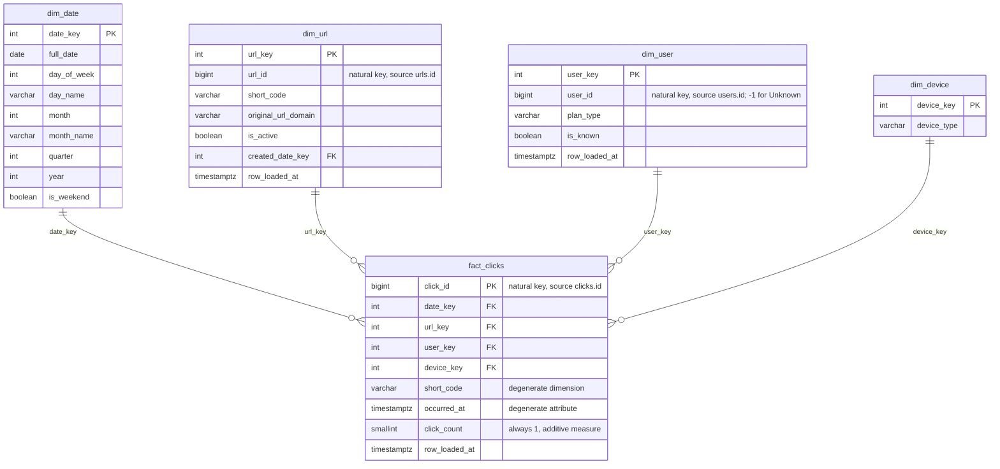

# Analytical data model: star schema

DDL: [`sql/analytics/`](../../sql/analytics/). Design narrative, alternatives,
and trade-offs: `docs/analytics-engineering-guide.md`, Sections 9-11.
Requirements this model exists to serve: Section 7's metrics catalog.
Grain decision: Section 8.

Not yet populated by any transform — Phase 2 ("Data Lake, Transformation &
Data Quality") writes the Bronze → this-star-schema logic. Phase 1 commits
the schema itself, reviewed and versioned, so Phase 2 has a stable target
to build against instead of designing the model and the transform code in
the same pass.

## Grain

**`fact_clicks`: one row per click event** (same grain as the source
`clicks` table — see Section 8 for why no pre-aggregation happens here).

## Star schema diagram

## Dimensions

### `dim_date`

A standard, fully conformed date dimension — not derived from any source
table. Populated once, at DDL time, via `generate_series` for a fixed
range (2020-01-01 through 2030-12-31 — see `sql/analytics/001_dim_date.sql`),
not by any ETL run. `date_key` is `YYYYMMDD` as an `INTEGER` (e.g.
`20260919`), the conventional Kimball date-key encoding: sorts correctly,
joins on a cheap integer comparison, and is human-readable in raw query
output without a join.

### `dim_url`

**SCD Type 1** (overwrite-on-change) for Phase 1 — deliberately, not by
oversight. `urls` in the real application schema has no `updated_at`
column at all (confirmed by re-reading `app/models/url.py` — see Section
1), so there is currently no reliable way to even *detect* a change to
attribute values like `is_active` without either polling the whole row on
every run (defeating the point of Section 15's incremental load) or
waiting for the real application to add change-tracking. SCD Type 2
(tracking `is_active`'s full history) is recorded as future work, not
silently dropped — see the Alternatives/Trade-offs discussion in Section
10.

`original_url_domain` is a derived attribute (the hostname parsed out of
`original_url`) — included because "clicks by destination domain" is one
of Section 7's catalog metrics, and computing it once at transform time is
cheaper than parsing the URL in every downstream query.

### `dim_user`

**SCD Type 1**, same reasoning as `dim_url`. Deliberately excludes `email`
— the analytical layer only ever needs `plan_type` (see Section 7's
metrics catalog: every metric that touches `users` groups by plan, none
needs to identify an individual person) — see the design decision in
Section 10.4 for the full PII reasoning.

**Includes a designated Unknown member row**: `user_key = -1`,
`user_id = -1`, `plan_type = 'UNKNOWN'`, `is_known = false`. This is the
single most important modeling decision in this dimension — see Section
10.3 for why `fact_clicks.user_key` must never be `NULL`, and what breaks
in a BI tool's default INNER JOIN if it is.

### `dim_device`

The simplest table in this model — one row per distinct `device_type`
value. Its `unknown` member is **not** a synthesized NULL-avoidance row
the way `dim_user`'s is: `clicks.device_type` is `NOT NULL` with
`DEFAULT 'unknown'` at the source (see `contracts/source/clicks.yaml`), so
"unknown" arrives as real, already-normalized source data, not something
the transform has to invent to avoid a `NULL` foreign key. The row exists
in `dim_device` for the same reason any other `device_type` value does —
it's just a value that happens to mean "we couldn't classify this one."
Small enough that it's sometimes modeled as part of a "junk dimension"
combining several low-cardinality flags; kept as its own table here
because there's currently only one such attribute — see the Alternatives
discussion in Section 10.

## Fact table

### `fact_clicks`

A **transaction fact table** (Kimball terminology) — one row per discrete
business event (a click), immutable once loaded, at the same grain the
source table already provides. `click_count` is included as an explicit
`1`-valued additive measure, rather than relying on `COUNT(*)`, because
it's the conventional pattern for a fact table whose only real "measure"
is the event's occurrence — see Section 10.5 for why this is preferred
over letting every downstream query do its own `COUNT(*)`.

`short_code` and `occurred_at` are **degenerate dimensions** — attributes
that belong conceptually to the fact but don't warrant their own dimension
table. `short_code` is kept directly on the fact row so "clicks for this
short code" doesn't require a join to `dim_url` at all; `occurred_at` is
kept alongside `date_key` because `date_key` alone (day granularity) can't
answer an hour-of-day question, and this project doesn't yet have a
separate `dim_time`-of-day dimension (recorded as a Section 10 Alternative,
not built — Phase 1's metrics catalog doesn't need it).

## Conformance

`dim_date` and `dim_device` are **conformed dimensions**: their meaning,
grain and keys are defined once, independent of any single fact table, so
a future second fact table (e.g. a Phase 2 `fact_url_created` event) could
reuse them directly rather than redefining "what is a date" a second time.
`dim_url` and `dim_user` are currently only referenced by `fact_clicks`,
but are built to the same conformance standard on purpose.
